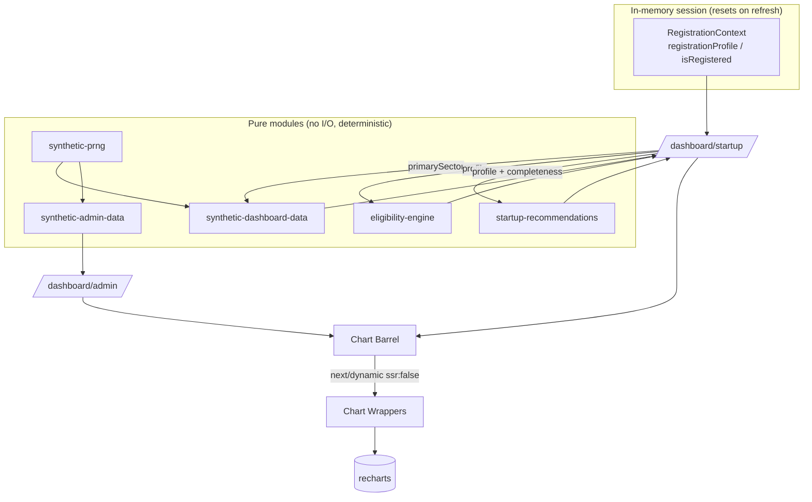
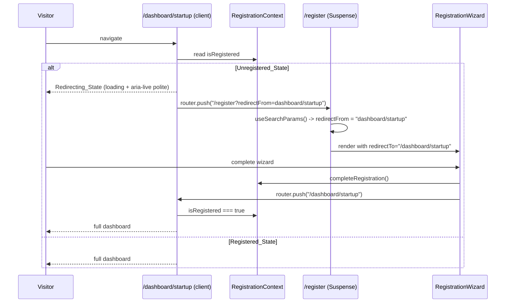
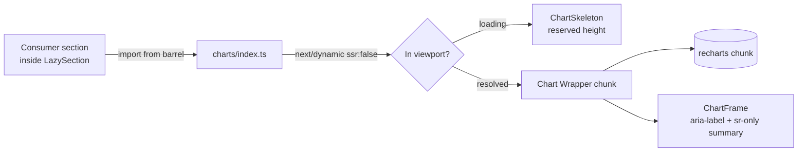

# Design Document — KITE Dashboards (Prompt 3)

## Overview

This feature adds two dashboard surfaces and the shared infrastructure they need, on top of the
existing KITE Next.js 14 (App Router, TS strict) application:

1. **Startup Dashboard** (`/dashboard/startup`) — a **client-gated** personalized surface. It reads
   the founder's session profile from the existing in-memory `RegistrationContext`, runs the existing
   pure `eligibility-engine`, and composes header, hero metrics, eligible schemes, an applications
   empty-state, deterministic sector-intelligence charts, recommended next steps, events, and resources.
   Unregistered visitors are redirected to `/register?redirectFrom=dashboard/startup`.

2. **Government Admin Dashboard** (`/dashboard/admin`) — a **public preview** (no auth gate) aggregate
   analytics surface. It renders KPIs, a funding-timeline area chart, a sortable scheme-performance
   table, regional/sector analysis charts, founder demographics pies, flagship program performance,
   international partnerships, a recent-activity feed, and client-only export controls. All non-canonical
   numbers come from a pure, deterministic, **hash-seeded** synthetic-data module and are clearly labelled
   illustrative.

The shared infrastructure is the centrepiece of the build discipline:

- A **chart-wrapper architecture** (`src/components/charts/`) that isolates *all* Recharts usage behind
  single-purpose wrappers, re-exported through a **barrel** that code-splits every chart via
  `next/dynamic` (`ssr: false`) with reserved-height skeletons — so no chart code enters a route's
  initial bundle and there is no cumulative layout shift.
- Two **deterministic synthetic-data modules** built on a shared pure PRNG (no `Math.random`, no time
  input) so the preview is byte-stable across renders and reloads.
- A pure **recommendations** module, a pure **profile-completeness** function, and a pure **table-sort**
  helper — all independently unit/property testable.
- Additive **navigation**, **footer**, and **home** integration.

### Operating constraints (carried from requirements)

- **Frontend-only, session-only.** No backend, DB, API, network I/O, or persistence beyond the in-memory
  `RegistrationContext`. State resets on refresh (Req 30).
- **Canonical data is authoritative.** 22 schemes, 20 sectors, 6 Beyond Bengaluru clusters, 6 flagship
  programs, 32 GIA countries — never fabricated or contradicted (Req 24.8).
- **Synthetic values are deterministic and labelled illustrative** (Req 24, plus per-section
  `Illustrative_Label` rules).
- **Additive types only** — no existing export removed or altered (Req 30.5).
- **WCAG AA**, **150 KB First Load JS per route** (Req 27, 28).
- **Visual discipline** — KITE tokens only; no gradients/blobs/emoji/glassmorphism/glow (Req 29).

### Reuse map (existing primitives this design builds on)

| Existing asset | Reused for |
| --- | --- |
| `useRegistration` / `useOptionalRegistration` | Startup gating, header, hero metrics, home card |
| `eligibility-engine` (`evaluateAllSchemes`, `totalEstimatedBenefit`) | Hero benefit total, eligible-schemes section |
| `LazySection` | Deferring below-the-fold sections on both dashboards |
| `StatCard` | Hero metrics + admin KPI grid tiles |
| `SectionHeading` | Every section header |
| `ConfidenceDot` | Eligible scheme cards |
| `FlagshipProgramCard` | Admin flagship programs (additive `performance` prop) |
| `formatNumber` / `formatStatValue` (`utils.ts`) | Rupee/number formatting in cards, tables, tooltips |
| `safeNavigate` | Card/CTA navigation |
| canonical data modules | Schemes, sectors, clusters, programs, GIA, events, footer |
| Tailwind tokens (`tailwind.config.ts`) | All color/typography/spacing |

> **Token note:** the font-size scale is `display / h1 / h2 / h3 / body / caption`. There is **no
> `text-h4`** — where an h4-sized slot is needed, use `text-lg` (matching existing
> `QuickActionCard` / `FlagshipProgramCard`).

---

## Architecture

### Route + component tree

```
src/app/dashboard/
  startup/page.tsx        "use client" — gated; composes startup sections
  admin/page.tsx          public preview; composes admin sections

src/components/dashboard/
  startup/
    StartupGate.tsx           gating + Redirecting_State (client)
    StartupHeaderStrip.tsx    Req 2
    StartupHeroMetrics.tsx    Req 3 (eager)
    EligibleSchemesSection.tsx Req 4 (eager)
    ApplicationsEmptyState.tsx Req 5
    SectorIntelligenceSection.tsx Req 6 (lazy, charts)
    RecommendedNextSteps.tsx  Req 7 (lazy)
    DashboardEventsSection.tsx Req 8 (lazy)
    DashboardResourcesSection.tsx Req 9 (lazy)
  admin/
    AdminHeaderStrip.tsx      Req 11 (eager)
    AdminNoticeBanner.tsx     Req 11 (eager)
    AdminKpiGrid.tsx          Req 12 (eager)
    FundingTimelineSection.tsx Req 13 (lazy, chart)
    SchemePerformanceSection.tsx Req 14 (lazy, table; client for sort)
    RegionalDistributionSection.tsx Req 15 (lazy, charts)
    SectorAnalysisSection.tsx Req 16 (lazy, charts)
    FounderDemographicsSection.tsx Req 17 (lazy, pies)
    AdminFlagshipProgramsSection.tsx Req 18 (lazy)
    InternationalPartnershipsSection.tsx Req 19 (lazy)
    ActivityFeedSection.tsx   Req 20 (lazy)
    ExportReportsSection.tsx  Req 21 (lazy, client Blob)

src/components/charts/        chart wrappers + barrel (the ONLY recharts importers)
src/lib/synthetic-prng.ts     shared pure PRNG
src/lib/synthetic-dashboard-data.ts  startup per-sector data
src/lib/synthetic-admin-data.ts      admin aggregate data
src/lib/startup-recommendations.ts   pure recommendation rules + completeness
```

### Data-flow architecture



The startup dashboard is the only consumer of `RegistrationContext` and the eligibility engine; the
admin dashboard consumes only canonical data + `synthetic-admin-data`. Both consume charts exclusively
through the barrel.

### Registration-gating flow



---

## Components and Interfaces

### Startup gating (Req 1, 10.1)

`src/app/dashboard/startup/page.tsx` is a `"use client"` component. It delegates the gate to
`StartupGate`, which reads `isRegistered` from `useRegistration`:

```tsx
// StartupGate.tsx (sketch)
export function StartupGate({ children }: { children: ReactNode }) {
  const { isRegistered } = useRegistration();
  const router = useRouter();

  useEffect(() => {
    if (!isRegistered) {
      router.push("/register?redirectFrom=dashboard/startup"); // Req 1.1
    }
  }, [isRegistered, router]);

  if (!isRegistered) {
    // Redirecting_State (Req 1.2, 1.3, 28.4)
    return (
      <div className="mx-auto max-w-7xl px-4 py-24">
        <p aria-live="polite" className="text-body text-muted">
          Redirecting you to registration…
        </p>
      </div>
    );
  }
  return <>{children}</>; // Registered_State (Req 1.4)
}
```

Because `RegistrationContext` is in-memory only, a refresh resets to `Unregistered_State`, so a
hard-loaded `/dashboard/startup` always redirects (Req 30.4).

### Register redirect target (Req 1.5–1.7)

`/register/page.tsx` becomes a thin server component that wraps a client island in a **Suspense
boundary** (required because `useSearchParams` opts the subtree into client-side rendering):

```tsx
// src/app/register/page.tsx
import { Suspense } from "react";
import { RegisterPageClient } from "@/components/registration/RegisterPageClient";

export default function RegisterPage() {
  return (
    <section className="py-16 md:py-24">
      <Suspense fallback={<div aria-hidden className="min-h-[24rem]" />}>
        <RegisterPageClient />
      </Suspense>
    </section>
  );
}
```

```tsx
// RegisterPageClient.tsx (sketch)
const REDIRECT_MAP: Record<string, string> = { "dashboard/startup": "/dashboard/startup" };

export function RegisterPageClient() {
  const params = useSearchParams();
  const redirectFrom = params.get("redirectFrom") ?? undefined;      // Req 1.5
  const redirectTo = redirectFrom ? REDIRECT_MAP[redirectFrom] : undefined;
  return <RegistrationWizard redirectTo={redirectTo} />;             // undefined => existing behavior (Req 1.7)
}
```

`RegistrationWizard` gains one **optional** prop `redirectTo?: string` (additive — default `undefined`
preserves today's success-screen behavior). In its submit branch:

```tsx
function handleContinue() {
  if (isLastStep) {
    if (!accuracyConfirmed) return;
    updateProfile(profile);
    completeRegistration();
    dispatch({ type: "SUBMIT" });
    if (redirectTo) router.push(redirectTo); // Req 1.6
    return;
  }
  // …unchanged…
}
```

When `redirectTo` is set the post-submit `router.push` runs; when it is absent the wizard renders
`RegistrationSuccess` exactly as today (Req 1.7). A mapping table (not raw concatenation) guards against
open-redirects — only known keys resolve to internal paths.

### Startup header strip (Req 2)

`StartupHeaderStrip` reads `registrationProfile`. It renders, in a `py-8` strip:
- "Welcome back, {founderName}" + kiteId in caption style.
- Three quick stat tiles on the right: **days since registration** (whole-day diff between *now* and
  `registeredAt`), **scheme applications status** (value `0`, with `Illustrative_Label`), **Status badge
  "Active"**.
- A thin label/value row: company name, primary sector label (resolved from `sectors.ts` by
  `primarySector` id), location, current stage, DPIIT recognized status.

Days-since computation is a small pure helper `daysSince(iso: string, now: Date): number` so it is unit
testable and avoids embedding `Date` logic in JSX.

### Startup hero metrics (Req 3)

`StartupHeroMetrics` composes four `StatCard`s. Responsive grid: `grid-cols-1 md:grid-cols-2
lg:grid-cols-4`.

| Card | Value | Caption / extra |
| --- | --- | --- |
| Total Estimated Benefits | `formatStatValue(totalEstimatedBenefit(results), {prefix:"₹"})` | "Across X eligible schemes" (X = `qualifyingCount`) |
| Eligible Schemes Count | `qualifyingCount` | "Of 22 schemes total" |
| Profile Completeness | `computeProfileCompleteness(profile)` % | "Complete Profile" link when `< 100` (Req 3.9) |
| Ecosystem Rank | synthetic percentile label (e.g. "Top 35%") | info tooltip "illustrative" (Req 3.10, 3.11) |

`results = evaluateAllSchemes(profile)` is computed once and shared with the eligible-schemes section.
The Ecosystem Rank label is produced deterministically from `synthetic-dashboard-data` keyed by
`${primarySector}|${currentStage}` (Req 3.10).

### Eligible schemes (Req 4)

Pure selection helper (testable, no JSX):

```ts
export function selectTopEligibleSchemes(
  results: Record<string, EligibilityResult>,
  limit = 6,
): EligibilityResult[] {
  return Object.values(results)
    .filter((r) => r.status === "definitely-eligible" || r.status === "likely-eligible")
    .sort((a, b) => b.estimatedBenefit - a.estimatedBenefit) // descending benefit (Req 4.3)
    .slice(0, limit);
}
```

Each card shows scheme name (joined from `schemes.ts` by id), a `ConfidenceDot` for `status`, the
estimated benefit, and a "View Details" link to `/schemes/{id}`. Layout: `lg:grid-cols-4`,
`md:grid-cols-3`, mobile horizontal scroll row (`flex overflow-x-auto snap-x`). A "See All 22 Schemes"
link routes to `/schemes`.

### Applications empty state (Req 5)

Static editorial card: Lucide `FileText`, headline "No applications yet", subhead, and a primary
"Browse Eligible Schemes" button → `/schemes`.

### Sector intelligence (Req 6) + charts

`SectorIntelligenceSection` is rendered inside `LazySection` (Req 10.4). It calls
`getSectorDashboardData(primarySector)` once and feeds the three chart wrappers (imported from the
barrel):

| Chart | Wrapper | Data |
| --- | --- | --- |
| Monthly sector funding (12 mo, line) | `ChartLineFunding` | `monthlyFunding: FundingPoint[]` |
| DPIIT startups across 6 clusters + Bengaluru (bar) | `ChartBarSectorStartups` | `clusterStartups: ClusterCountDatum[]` |
| Top-5 schemes by disbursement (horizontal bar) | `ChartBarHorizontalSchemes` | `topSchemes: SchemeDisbursementDatum[]` |

Subhead = primary sector name; an `Illustrative_Label` marks the data (Req 6.1, 6.9). Each chart has an
sr-only prose summary (Req 28.2).

### Recommended next steps (Req 7)

Renders 3–4 cards from `selectDisplayRecommendations(buildRecommendations(ctx))` (see Data Models).
Each card: Lucide icon (resolved from `iconName` via a local `ICON_MAP`, mirroring `QuickActionCard`),
heading, one-sentence description, CTA. Desktop single row; mobile stacked.

### Events (Req 8) + resources (Req 9)

`DashboardEventsSection` selects three events from canonical `events.ts`: profile-matched first
(sector/category heuristic), else the next three flagship events by `startDate` (reusing the existing
ascending-date sort pattern from `selectPreview`). Each event card: date block, name, location, category
badge, "Learn More" link.

`DashboardResourcesSection` renders three static cards: Karnataka Startup Policy 2025-30 →
`/policies/startup-2025-30`; Help Center → `/support`; Contact KITS with `tel:`/`mailto:` links sourced
from `footer.ts` (the helpline + email `FooterLink`s in the "Support & Resources" column).

### Admin sections (Req 11–21)

- **Header strip + notice banner + KPI grid** render eagerly (Req 22.3). KPI grid uses `StatCard` with
  the fixed canonical values from Req 12 (these are *fixed*, not random) plus an `Illustrative_Label`.
- **Funding timeline** (`ChartAreaFundingTimeline`), **regional** (`ChartBarRegionStartups` +
  `ChartBarStackedDisbursement`), **sector** (`ChartTreemapSectors` + `ChartBarHorizontalSectorGrowth`),
  **demographics** (three `ChartPieGeneric`), **flagship programs** (`FlagshipProgramCard` +
  `performance`), **international partnerships**, **activity feed**, and **export** all render inside
  `LazySection` (Req 22.4).
- **Scheme performance** is a client component (sort state) — see below.

### Admin scheme performance table (Req 14)

`SchemePerformanceSection` is `"use client"` (holds sort state). It renders a semantic `<table>` at
`md`+ and stacked cards below `md` (Req 14.9). Sorting is delegated to a **pure** helper so it is
property-testable:

```ts
export type SchemeSortKey = "name" | "type" | "applications" | "approved" | "disbursed" | "status";
export type SortDirection = "asc" | "desc";

export function sortSchemeRows(
  rows: readonly SchemePerformanceRow[],
  key: SchemeSortKey,
  direction: SortDirection,
): SchemePerformanceRow[] {
  const sign = direction === "asc" ? 1 : -1;
  return rows.slice().sort((a, b) => {
    const av = a[key];
    const bv = b[key];
    if (typeof av === "number" && typeof bv === "number") return (av - bv) * sign;
    return String(av).localeCompare(String(bv)) * sign;
  });
}
```

Default sort: `disbursed` desc (Req 14.6). Clicking a header toggles `asc`/`desc` and sets `aria-sort`
on the active `<th>` (`"ascending"` | `"descending"`, others `"none"`) (Req 14.7, 14.8, 28.3). Columns:
Scheme Name, Type, Applications, Approved, Disbursed, Status, View Details (→ `/schemes/{id}`).

### Export controls (Req 21)

`ExportReportsSection` is `"use client"`. "Download Report Sample" builds a `Blob` and triggers a
download through a temporary anchor — **no network**:

```ts
function downloadReportSample() {
  const blob = new Blob([REPORT_SAMPLE_TEXT], { type: "text/plain" });
  const url = URL.createObjectURL(blob);
  const a = document.createElement("a");
  a.href = url; a.download = "kite-report-sample.txt";
  document.body.appendChild(a); a.click(); a.remove();
  URL.revokeObjectURL(url);
}
```

---

## Chart Wrapper Architecture (bundle-critical)

### Principles

1. Recharts is imported in **exactly one place per chart type** — the wrapper file — and **nowhere
   else** in the codebase (Req 23.2). This is enforced by a static-scan test (Property 12).
2. Every wrapper takes **typed data props** and handles its own `Chart_Loading` / `Chart_Empty` /
   `Chart_Loaded` states internally (Req 23.3, 23.5, 23.6).
3. Wrappers style charts with **KITE tokens only**: white/`surface` background, very-low-opacity
   gridlines, `muted` caption-sized axis labels, a small crisp-shadow rounded custom tooltip, and the
   primary/accent palette (status colors only for status) (Req 23.4, 29.6, 29.7).
4. The **barrel** re-exports each wrapper through `next/dynamic` with `ssr: false` and a **named,
   reserved-height skeleton fallback**, so chart (and Recharts) code is excluded from each route's
   initial bundle and there is no CLS (Req 23.7, 23.8, 27.4).
5. Dashboard consumers import **only** from the barrel and **never** from `recharts` (Req 23.9).
6. Charts render only inside `LazySection` / below-the-fold content (Req 23.10).

### The wrappers (exactly what is needed)

| Wrapper file | Recharts primitive | Consumed by | Req |
| --- | --- | --- | --- |
| `ChartLineFunding.tsx` | LineChart | startup monthly sector funding | 6.4 |
| `ChartBarSectorStartups.tsx` | BarChart | startup cluster startup counts | 6.5 |
| `ChartBarHorizontalSchemes.tsx` | BarChart (layout="vertical") | startup top-5 scheme disbursement | 6.6 |
| `ChartAreaFundingTimeline.tsx` | AreaChart | admin funding timeline | 13 |
| `ChartBarRegionStartups.tsx` | BarChart | admin regional startup counts | 15.4 |
| `ChartBarStackedDisbursement.tsx` | BarChart (stacked) | admin disbursement by cluster | 15.5 |
| `ChartTreemapSectors.tsx` | Treemap | admin sector treemap | 16.2 |
| `ChartBarHorizontalSectorGrowth.tsx` | BarChart (vertical) | admin top-10 sector growth | 16.3 |
| `ChartPieGeneric.tsx` | PieChart | admin demographics (×3) | 17 |

`ChartBarSectorStartups` and `ChartBarRegionStartups` share the `ClusterCountDatum[]` shape but stay as
separate wrappers (per enumerated requirement) so each surface can evolve labels/colors independently.

### Shared chart primitives

- **`ChartFrame`** — wraps every chart with an accessible region: an `aria-label` describing the chart
  and an **adjacent sr-only prose summary** of the primary data (Req 28.1, 28.2). Also applies the
  white/`surface` background, rounded border, and reserved aspect height.

```tsx
export interface ChartFrameProps {
  ariaLabel: string;          // e.g. "Line chart of monthly funding for FinTech"
  srSummary: string;          // e.g. "Funding rose from ₹12 Cr in Jan to ₹31 Cr in Dec."
  height?: number;            // default reserved height (no CLS)
  children: ReactNode;        // the Recharts ResponsiveContainer subtree
}
export function ChartFrame({ ariaLabel, srSummary, height = 280, children }: ChartFrameProps) {
  return (
    <figure role="group" aria-label={ariaLabel}
      className="rounded-xl border border-border bg-card p-4 shadow-sm">
      <div style={{ height }}>{children}</div>
      <figcaption className="sr-only">{srSummary}</figcaption>
    </figure>
  );
}
```

- **`ChartSkeleton`** — a reserved-height pulse placeholder used as the dynamic fallback (no CLS). Takes
  a `height` matching the chart's `ChartFrame` height.
- **`ChartTooltip`** — a shared custom tooltip: small, `rounded-md`, `shadow-sm`, `bg-card`, hairline
  border, `caption`-sized text (Req 29.7).
- **KITE chart tokens** — a small constants module mapping `primary`/`accent`/grid/axis colors read from
  CSS variables so every wrapper styles identically (Req 23.4, 29.6).

Each wrapper internally branches:

```tsx
export function ChartLineFunding({ data, sectorName }: { data: FundingPoint[]; sectorName: string }) {
  if (data.length === 0) return <ChartEmpty label="No funding data" />;          // Chart_Empty_State
  return (
    <ChartFrame ariaLabel={`Line chart of monthly funding for ${sectorName}`}
                srSummary={summarizeFunding(data)}>
      <ResponsiveContainer>{/* Recharts LineChart with KITE tokens */}</ResponsiveContainer>
    </ChartFrame>
  );
}
```

### The barrel — exact dynamic-import + skeleton pattern

```tsx
// src/components/charts/index.ts
import dynamic from "next/dynamic";
import { ChartSkeleton } from "./ChartSkeleton";

export const ChartLineFunding = dynamic(
  () => import("./ChartLineFunding").then((m) => m.ChartLineFunding),
  { ssr: false, loading: () => <ChartSkeleton height={280} /> }, // Chart_Loading_State, no CLS
);

export const ChartBarSectorStartups = dynamic(
  () => import("./ChartBarSectorStartups").then((m) => m.ChartBarSectorStartups),
  { ssr: false, loading: () => <ChartSkeleton height={280} /> },
);

// …one entry per wrapper, each with ssr:false + a reserved-height ChartSkeleton…

export { ChartFrame } from "./ChartFrame";
export { ChartSkeleton } from "./ChartSkeleton";
```



The wrapper files (and therefore the `recharts` chunk) are pulled only when a `LazySection` reveals the
consumer and the dynamic import resolves — never in the route's First Load JS (Req 27.4).

---

## Synthetic Data Modules

### Shared PRNG (`src/lib/synthetic-prng.ts`)

A documented, pure, hash-seeded generator. `xmur3` turns a string key into a 32-bit seed; `mulberry32`
turns a seed into a deterministic `() => number` in `[0, 1)`. **No `Math.random`. No `Date`/time input.**

```ts
/**
 * Determinism contract:
 *  - Output depends ONLY on the input string key.
 *  - Same key -> identical sequence on every call, every process, every reload.
 *  - No Math.random, no Date.now, no time/locale input.
 */
export function xmur3(str: string): () => number {
  let h = 1779033703 ^ str.length;
  for (let i = 0; i < str.length; i++) {
    h = Math.imul(h ^ str.charCodeAt(i), 3432918353);
    h = (h << 13) | (h >>> 19);
  }
  return () => {
    h = Math.imul(h ^ (h >>> 16), 2246822507);
    h = Math.imul(h ^ (h >>> 13), 3266489909);
    h ^= h >>> 16;
    return h >>> 0;
  };
}

export function mulberry32(seed: number): () => number {
  let a = seed >>> 0;
  return () => {
    a |= 0; a = (a + 0x6d2b79f5) | 0;
    let t = Math.imul(a ^ (a >>> 15), 1 | a);
    t = (t + Math.imul(t ^ (t >>> 7), 61 | t)) ^ t;
    return ((t ^ (t >>> 14)) >>> 0) / 4294967296; // [0,1)
  };
}

/** Build a seeded RNG from a string key. */
export function seededRng(key: string): () => number {
  return mulberry32(xmur3(key)());
}

// Derived helpers (all pure, all in-range):
export function seededInt(rng: () => number, min: number, max: number): number; // inclusive
export function seededFloat(rng: () => number, min: number, max: number): number;
export function seededPick<T>(rng: () => number, items: readonly T[]): T;
export function seededShuffle<T>(rng: () => number, items: readonly T[]): T[];   // Fisher–Yates, returns new array
```

`seededInt` returns `min + floor(rng() * (max - min + 1))` clamped to `[min, max]`. All helpers
guarantee their stated range for any `rng()` in `[0, 1)`.

### `synthetic-dashboard-data.ts` (per-sector)

```ts
/**
 * Determinism contract: getSectorDashboardData(sectorId) is pure and
 * hash-seeded from `sectorId`. Same id -> deep-equal output, always. Counts are
 * canonical: 12 months, 7 cluster bars (6 Beyond Bengaluru + Bengaluru), 5 top schemes.
 */
export function getSectorDashboardData(sectorId: string): SectorDashboardData;
export function getEcosystemRankLabel(sectorId: string, stage: CurrentStage): string; // "Top NN%"
```

- `monthlyFunding`: 12 `FundingPoint`s (last 12 months as static labels, e.g. "Jan"…"Dec"; **no real
  date** — labels are fixed strings to keep it time-independent), `rupeesCrore` seeded in a plausible band.
- `clusterStartups`: 7 `ClusterCountDatum`s — the 6 cluster names from `clusters.ts` + "Bengaluru".
- `topSchemes`: 5 `SchemeDisbursementDatum`s drawn from canonical scheme names, descending by `rupees`.

### `synthetic-admin-data.ts` (aggregate)

```ts
/**
 * Determinism contract: every export is pure and hash-seeded from a fixed
 * module-level key (and, where relevant, a canonical id). No Math.random, no time.
 * Cardinalities are canonical: 22 scheme rows, 8 quarters, 7 cluster bars,
 * 20 sector treemap nodes, 10 growth bars, 6 programs, 5 GIA regions, 15–20 activity entries.
 */
export const ADMIN_KPIS: readonly KpiCard[];                 // fixed canonical values (Req 12)
export function getFundingTimeline(): FundingTimelinePoint[]; // 8 quarters
export function getSchemePerformance(): SchemePerformanceRow[]; // 22 rows, Approved <= Applications
export function getRegionalStartupCounts(): ClusterCountDatum[]; // 7
export function getRegionalDisbursement(): StackedDisbursementDatum[]; // 7
export function getSectorTreemap(): SectorTreemapDatum[];     // 20 (all sectors)
export function getSectorGrowth(): SectorGrowthDatum[];       // top 10 by growthPct
export function getDemographics(): DemographicsData;          // womenLed/stage/age slices
export function getProgramPerformance(): ProgramPerformance[]; // 6
export function getInternationalPartnerships(): RegionPartnership[]; // grouped by GIA region
export function getActivityFeed(): ActivityEntry[];           // 15–20 deterministic entries
```

Key invariants baked into the generators:
- `getSchemePerformance` iterates the canonical `schemes` array (seed per `scheme.id`), so there are
  exactly 22 rows and each row's `type`/`status` come from canonical data; `approved` is derived as
  `floor(applications * ratio)` so **`approved ≤ applications`** always.
- `getSectorTreemap` iterates the canonical `sectors` array (20 nodes), one per sector.
- `getProgramPerformance` iterates canonical `flagshipPrograms` (6 nodes); `completionPct ∈ [0, 100]`.
- `getInternationalPartnerships` groups the 32 canonical GIA countries by `region`; `countryCount` is the
  real count, `jointPrograms` is synthetic/illustrative.
- `getActivityFeed` length is seeded into `[15, 20]`.

The KPI values in `ADMIN_KPIS` track the verified figures (21,847 registered startups — just above the verified 21,000+ DPIIT figure; ₹312 crore; 22; 1,847;
₹19 lakh; 183) — they are constants, not random, but still carry an `Illustrative_Label` in the UI.

---

## Startup Recommendations (`src/lib/startup-recommendations.ts`)

Pure functions: rules → ordered `Recommendation[]`, plus the completeness computation.

### Profile completeness (precise definition)

`Profile_Completeness` = percentage of *enrichment* fields that are filled, rounded to an integer in
`[0, 100]`. The counted fields are a fixed, documented list (booleans count as "filled" only when
`true`, since the enrichment value is the affirmative state):

```ts
/** The 10 enrichment predicates that define Profile_Completeness. */
const COMPLETENESS_CHECKS: ReadonlyArray<(p: RegistrationProfile) => boolean> = [
  (p) => nonEmpty(p.founderPhone),
  (p) => nonEmpty(p.incorporationDate),
  (p) => (p.secondarySectors?.length ?? 0) >= 1,
  (p) => p.dpiitRecognized === true,
  (p) => p.gstRegistered === true,
  (p) => (p.teamSize ?? 0) > 0,
  (p) => (p.fundingRaised ?? 0) > 0,
  (p) => (p.womenFounderStake ?? 0) > 0 || (p.womenEmployeePercentage ?? 0) > 0,
  (p) => (p.founderAge ?? 0) > 0,
  (p) => nonEmpty(p.companyName),
];

export function computeProfileCompleteness(p: RegistrationProfile): number {
  const filled = COMPLETENESS_CHECKS.filter((check) => check(p)).length;
  return Math.round((filled / COMPLETENESS_CHECKS.length) * 100); // always in [0,100]
}
```

### Recommendation rules

```ts
export interface RecommendationContext {
  profile: RegistrationProfile;
  completeness: number;            // from computeProfileCompleteness
  visitedCalculator?: boolean;     // session-only signals; default false (untracked => "not visited")
  browsedSchemes?: boolean;        // default false
}

/** Full ordered list: triggered rule recs (priority order) then evergreen padding. */
export function buildRecommendations(ctx: RecommendationContext): Recommendation[];

/** Display selector: between 3 and 4 recommendations (Req 7.2). */
export function selectDisplayRecommendations(recs: Recommendation[]): Recommendation[]; // length in [3,4]
```

Priority-ordered rules (each produces one `Recommendation` with a stable `id`):

| Priority | Condition | id / link | Req |
| --- | --- | --- | --- |
| 1 | `completeness < 80` | `complete-profile` → `/dashboard/startup#profile` | 7.8 |
| 2 | `!dpiitRecognized` | `register-dpiit` → `https://dpiit.gov.in` | 7.6 |
| 3 | `!gstRegistered` | `register-gst` → GST portal | 7.7 |
| 4 | `!visitedCalculator` | `try-calculator` → `/calculator` | 7.9 |
| 5 | `!browsedSchemes` | `browse-schemes` → `/schemes` | 7.10 |

After the triggered rules, `buildRecommendations` appends **evergreen** recommendations
(`explore-clusters` → `/clusters`, `upcoming-events` → `/events`, `find-mentor` → `/mentors`) and
de-duplicates by `id`. `selectDisplayRecommendations` then pads to at least 3 (the evergreen pool
guarantees this) and truncates to at most 4. Because rule recs are emitted before evergreen ones,
`buildRecommendations` always *includes* every triggered rule's recommendation (Req 7.6–7.10 hold on the
full list); `selectDisplayRecommendations` enforces the 3–4 display bound (Req 7.2). Each
`Recommendation` carries `iconName` (a Lucide name), `heading`, `description`, `ctaLabel`, `href`
(Req 7.5).

---

## Navigation, Footer & Home Integration

### Navigation (`src/data/navigation.ts`, Req 25)

Insert a new `"Dashboard"` dropdown **between "For Stakeholders" and "Connect"** in the `navigation`
array:

```ts
{
  label: "Dashboard",
  children: [
    { label: "My Startup Dashboard", href: "/dashboard/startup" },
    { label: "Government Admin Dashboard", href: "/dashboard/admin" },
  ],
},
```

The existing Header / MobileNav / CommandPalette consume `navigation` generically, so the dropdown and
its two children render in both desktop and mobile nav with no component changes (Req 25.1–25.4). This is
a purely additive data edit.

### Footer (`src/data/footer.ts`, Req 25.5)

Add a `{ label: "Dashboards", href: "/dashboard/startup" }` link to the **"For Startups"** column's
`links` array (additive).

### Home — RegisterQuickActionCard (Req 26)

In the **registered** branch of `RegisterQuickActionCard`, add a primary **"Go to Dashboard"** link to
`/dashboard/startup` **alongside** the existing "See Your Schemes" link. The unregistered branch is
unchanged (Req 26.2). This is the only change to the home surface and is additive within the existing
card.

---

## Data Models

All additions are appended to `src/types/index.ts`; no existing export is altered (Req 30.5).

```ts
// --- Chart data shapes ---
export interface FundingPoint { month: string; rupeesCrore: number; }
export interface FundingTimelinePoint { quarter: string; rupeesCrore: number; }
export interface ClusterCountDatum { cluster: string; count: number; }
export interface SchemeDisbursementDatum { schemeId: string; schemeName: string; rupees: number; }
export interface StackedDisbursementDatum { cluster: string; fiscal: number; grant: number; }
export interface SectorTreemapDatum { sectorId: string; name: string; startupCount: number; fundingIntensity: number; }
export interface SectorGrowthDatum { sectorId: string; name: string; growthPct: number; }
export interface DemographicSlice { label: string; value: number; }   // value = percent or count
export interface DemographicsData {
  womenLed: DemographicSlice[];
  stage: DemographicSlice[];
  age: DemographicSlice[];
}

// --- Startup per-sector bundle ---
export interface SectorDashboardData {
  sectorId: string;
  monthlyFunding: FundingPoint[];        // 12
  clusterStartups: ClusterCountDatum[];  // 7
  topSchemes: SchemeDisbursementDatum[]; // 5
}

// --- Admin aggregates ---
export interface KpiCard { id: string; label: string; value: string; caption?: string; trend?: string; }
export interface SchemePerformanceRow {
  schemeId: string; name: string; type: SchemeType;
  applications: number; approved: number; disbursed: number; status: SchemeStatus;
}
export type ActivityType = "registration" | "approval" | "disbursement" | "event" | "milestone";
export interface ActivityEntry {
  id: string; timestampLabel: string; type: ActivityType;
  description: string; entityLabel: string; href: string;
}
export interface RegionPartnership { region: GIARegion; countryCount: number; jointPrograms: number; }
export interface ProgramPerformance {
  programId: string; name: string;
  disbursed: number; enrolled: number; completionPct: number; // [0,100]
  status: ProgramStatus;
}

// --- Recommendations ---
export interface Recommendation {
  id: string; iconName: string; heading: string; description: string; ctaLabel: string; href: string;
}

// --- Table sort ---
export type SchemeSortKey = "name" | "type" | "applications" | "approved" | "disbursed" | "status";
export type SortDirection = "asc" | "desc";
```

`FlagshipProgramCardProps` gains an **optional** `performance?: ProgramPerformance` prop (additive). When
present, the card renders disbursed value, enrolled count, a completion progress bar, and a status
indicator; when absent, the card behaves exactly as today (Req 18.5).

---

## Correctness Properties

*A property is a characteristic or behavior that should hold true across all valid executions of a
system — essentially a formal statement about what the software should do. Properties bridge
human-readable specifications and machine-verifiable correctness guarantees.*

These properties are derived from the prework classification above. Each is implemented as a single
property-based test (fast-check, `numRuns: 100`) and tagged
**Feature: kite-dashboards, Property N: …**. UI wiring, accessibility attributes, fixed-value rendering,
and bundle budgets are validated by example/integration/smoke tests instead (see Testing Strategy).

### Property 1: PRNG determinism and range bounds

*For any* string key and *for any* integer bounds `min ≤ max`: `seededRng(key)` produces an identical
sequence on every call; every value of `mulberry32(seed)()` lies in `[0, 1)`; `seededInt(rng, min, max)`
lies in `[min, max]`; and `seededPick`/`seededShuffle` return only elements of (and a permutation of) the
input.

**Validates: Requirements 24.3, 24.4**

### Property 2: Startup synthetic-data determinism and cardinality

*For any* `sectorId`, two calls to `getSectorDashboardData(sectorId)` return deep-equal results, and the
result always has 12 `monthlyFunding` points, 7 `clusterStartups` (the 6 Beyond Bengaluru clusters +
Bengaluru), and 5 `topSchemes` (descending by `rupees`).

**Validates: Requirements 6.5, 6.7, 24.1, 24.3, 24.5, 24.8**

### Property 3: Admin synthetic-data determinism

*For any* admin generator (`getFundingTimeline`, `getSchemePerformance`, `getRegionalStartupCounts`,
`getRegionalDisbursement`, `getSectorTreemap`, `getSectorGrowth`, `getDemographics`,
`getProgramPerformance`, `getInternationalPartnerships`, `getActivityFeed`), repeated calls return
deep-equal results (no `Math.random`, no time input).

**Validates: Requirements 24.2, 24.3, 24.4, 24.6**

### Property 4: Scheme performance rows count and approval bound

*For any* call to `getSchemePerformance`, the result has exactly 22 rows (one per canonical scheme), and
*for every* row `approved ≤ applications` and `applications ≥ 0` and `disbursed ≥ 0`.

**Validates: Requirements 14.2, 14.5, 24.8**

### Property 5: Scheme table sort is an ordering permutation

*For any* array of `SchemePerformanceRow`, *for any* `SchemeSortKey`, and *for any* `SortDirection`,
`sortSchemeRows(rows, key, dir)` is a permutation of the input (same multiset of rows) and is ordered
non-decreasingly (asc) or non-increasingly (desc) by the chosen key.

**Validates: Requirements 14.6, 14.7**

### Property 6: Sector treemap covers all 20 canonical sectors

*For any* call to `getSectorTreemap`, the set of `sectorId`s equals the set of canonical sector ids
(exactly 20 nodes), and *for every* node `startupCount ≥ 0` and `fundingIntensity ∈ [0, 1]`.

**Validates: Requirements 16.2, 24.8**

### Property 7: Sector growth list length and ordering

*For any* call to `getSectorGrowth`, the result has exactly 10 entries drawn from canonical sectors and
is sorted non-increasingly by `growthPct`.

**Validates: Requirements 16.3**

### Property 8: International partnerships conserve the 32 canonical countries

*For any* call to `getInternationalPartnerships`, the sum of `countryCount` across regions equals 32, the
regions are a subset of the canonical `GIARegion` set, and *for every* region `jointPrograms ≥ 0`.

**Validates: Requirements 19.1, 19.2, 24.8**

### Property 9: Program performance count and completion bound

*For any* call to `getProgramPerformance`, the result has exactly 6 entries (one per canonical flagship
program), and *for every* entry `completionPct ∈ [0, 100]`, `enrolled ≥ 0`, `disbursed ≥ 0`.

**Validates: Requirements 18.1, 18.4, 24.8**

### Property 10: Activity feed length bound and determinism

*For any* call to `getActivityFeed`, the result length lies in `[15, 20]`, every entry carries a
non-empty `description`, `timestampLabel`, and a valid internal `href`, and repeated calls are deep-equal.

**Validates: Requirements 20.1, 20.3**

### Property 11: Profile completeness is bounded and monotonic

*For any* `RegistrationProfile`, `computeProfileCompleteness(profile) ∈ [0, 100]`; and *for any* profile
and any single counted enrichment field that is currently unfilled, setting that field to a filled value
never decreases the computed completeness.

**Validates: Requirements 3.8**

### Property 12: Recommendation shape, display bound, and rule triggering

*For any* `RecommendationContext`: every element of `buildRecommendations(ctx)` has non-empty `id`,
`iconName`, `heading`, `description`, `ctaLabel`, and a non-empty `href`; `selectDisplayRecommendations`
returns between 3 and 4 items; and for each rule condition that holds (`!dpiitRecognized`,
`!gstRegistered`, `completeness < 80`, `!visitedCalculator`, `!browsedSchemes`) the corresponding
recommendation id is present in `buildRecommendations(ctx)` — and absent when the condition is false.

**Validates: Requirements 7.2, 7.5, 7.6, 7.7, 7.8, 7.9, 7.10**

### Property 13: Top eligible schemes selection — bound, membership, ordering

*For any* eligibility results map, `selectTopEligibleSchemes(results)` returns at most 6 items, each with
status `definitely-eligible` or `likely-eligible`, every returned item is present in the input, and the
output is ordered non-increasingly by `estimatedBenefit`.

**Validates: Requirements 4.2, 4.3**

### Property 14: Days-since-registration is non-negative and exact

*For any* `registeredAt` ISO timestamp at or before `now`, `daysSince(registeredAt, now)` is a
non-negative integer equal to `floor((now − registeredAt) / 86_400_000)`.

**Validates: Requirements 2.4**

### Property 15: Recharts is imported only by chart wrappers (static scan)

*For any* source file under `src/` that imports from `recharts`, that file's path is under
`src/components/charts/`. (Implemented as a static import scan over the source tree.)

**Validates: Requirements 23.2, 23.9**

---

## Error Handling

The feature is frontend-only and pure, so "errors" are degenerate inputs and missing session state
rather than thrown exceptions or failed I/O.

- **Unregistered / refresh on `/dashboard/startup`** — handled by the gate: render `Redirecting_State`
  and `router.push` to `/register?...`. No throw, no flash of personalized content (Req 1, 30.4).
- **Missing optional profile fields** — completeness and recommendations treat absent fields as
  unfilled/false via nullish-coalescing; never throw. The eligibility engine already guarantees
  well-formed results.
- **Empty chart data** — every wrapper renders `Chart_Empty_State` (internal empty message, no axes)
  rather than an empty/broken Recharts canvas (Req 23.6).
- **Loading / hydration** — dynamic chart imports show a reserved-height `ChartSkeleton`
  (`Chart_Loading_State`); `LazySection` reserves height before children mount (no CLS).
- **Unknown `redirectFrom` value** — the `REDIRECT_MAP` lookup returns `undefined`, so the wizard falls
  back to default post-registration behavior (no open-redirect, no crash) (Req 1.7).
- **Invalid routes from cards/CTAs** — navigation goes through `safeNavigate`, which surfaces a
  non-blocking toast and stays on the page for malformed hrefs.
- **`URL.createObjectURL` lifecycle** — the export action revokes the object URL after `click()` to avoid
  leaks; it performs no network request (Req 21.3, 30.6).
- **No `IntersectionObserver`** — `LazySection` already renders children eagerly (SSR/unsupported path),
  so deferred sections never get stuck behind a skeleton.

## Testing Strategy

### Dual approach

- **Property tests (fast-check, `numRuns: 100`)** validate the universal properties above — the pure
  PRNG, both synthetic-data modules, completeness, recommendations, eligible-schemes selection, the table
  sort, days-since, and the recharts static-import scan.
- **Unit / component / integration tests** validate specific wiring, fixed values, accessibility, and
  side effects that are not universal properties.
- **Smoke tests** validate one-shot configuration: no-network/no-storage discipline and the per-route
  First Load JS budget.

Property tests are implemented with the existing `fast-check` dependency; no PBT framework is built from
scratch. Each property test is tagged with a comment of the form
`// Feature: kite-dashboards, Property N: <text>` and configured with `{ numRuns: 100 }`.

### Test file map (phase-aligned)

| Phase | Test file | Type | Covers |
| --- | --- | --- | --- |
| A | `src/lib/__tests__/synthetic-prng.pbt.test.ts` | PBT | Property 1 |
| A | `src/lib/__tests__/synthetic-dashboard-data.pbt.test.ts` | PBT | Property 2 |
| A | `src/lib/__tests__/synthetic-admin-data.pbt.test.ts` | PBT | Properties 3, 4, 6, 7, 8, 9, 10 |
| A | `src/lib/__tests__/startup-recommendations.pbt.test.ts` | PBT | Properties 11, 12 |
| A | `src/lib/__tests__/startup-selectors.pbt.test.ts` | PBT | Properties 13, 14 |
| A | `src/components/charts/__tests__/charts.test.tsx` | Unit | Empty/loading states, ChartFrame aria-label + sr-only summary, KITE-token styling |
| A | `src/components/charts/__tests__/recharts-isolation.test.ts` | PBT (static scan) | Property 15 |
| B | `src/components/dashboard/startup/__tests__/startup-dashboard.test.tsx` | Component | Header (Req 2), hero metrics (Req 3), eligible schemes (Req 4), empty state (Req 5), events/resources (Req 8, 9), eager-vs-lazy composition (Req 10) |
| B | `src/components/dashboard/startup/__tests__/gating.integration.test.tsx` | Integration | Unregistered redirect + Redirecting_State + aria-live (Req 1.1–1.4, 28.4); register `redirectFrom` round-trip (Req 1.5–1.7) |
| B | `src/lib/__tests__/profile-completeness.test.ts` | Unit | completeness boundaries incl. `< 100` link trigger (Req 3.9) |
| C | `src/components/dashboard/admin/__tests__/admin-dashboard.test.tsx` | Component | Header/banner/KPIs (Req 11, 12), sections render inside LazySection (Req 22), demographics segments (Req 17), flagship `performance` card (Req 18), partnerships (Req 19), activity feed (Req 20), export Blob (Req 21.3) |
| C | `src/components/dashboard/admin/__tests__/scheme-table.integration.test.tsx` | Integration | Default Disbursed-desc sort, header-click toggle, `aria-sort`, mobile stacked-card collapse (Req 14) |
| C | `src/lib/__tests__/scheme-sort.pbt.test.ts` | PBT | Property 5 |
| D | `src/app/__tests__/dashboards.e2e.test.tsx` | E2E | home → register (with `redirectFrom`) → startup dashboard happy path; admin public access |
| D | `src/app/__tests__/dashboards-a11y.test.tsx` | A11y (axe) | Both dashboards: chart `aria-label` + sr-only summaries, table `aria-sort`, focus states, aria-live (Req 28) |
| D | `src/app/__tests__/dashboards-responsive.test.tsx` | Responsive | Hero/KPI grids, chart column/stack layouts, table→cards at `md` (Req 3, 6, 12, 14, 15, 17) |
| D | `src/app/__tests__/dashboards-perf.test.tsx` | Perf/bundle | First Load JS ≤ 150 KB per route; charts excluded from initial bundle (Req 27) |
| D | `src/app/__tests__/dashboards-no-io.smoke.test.ts` | Smoke | No network/storage; session reset behavior (Req 30) |

### Property-test configuration notes

- All property tests run **100 iterations minimum** in spec text; CI/local execution may use a reduced
  count for speed without weakening the documented contract.
- Generators: arbitrary strings for PRNG keys and sector ids; structured `RegistrationProfile`
  arbitraries (valid enums + arbitrary optional fields) for completeness/recommendations; arbitrary
  `SchemePerformanceRow[]` for the sort property; arbitrary eligibility-results maps for the selection
  property; arbitrary `(registeredAt ≤ now)` date pairs for days-since.
- The recharts-isolation test (Property 15) is a deterministic static scan (no randomization) but is kept
  in the PBT phase because it guards the bundle-budget invariant the whole architecture depends on.

## Bundle Strategy (Req 27)

1. **Recharts only via the dynamic barrel.** Every chart is imported from `src/components/charts/index.ts`,
   which wraps each wrapper in `next/dynamic` with `ssr: false`. Recharts therefore lands in a lazily
   loaded chunk, never in a route's First Load JS (Req 27.4, 23.7).
2. **Charts only inside `LazySection`.** Consumers mount charts below the fold, so the dynamic import is
   not even requested until the section nears the viewport (Req 23.10).
3. **Reserved-height skeletons** (`ChartSkeleton`, `LazySection minHeight`) prevent CLS while chunks load
   (Req 23.8).
4. **First remedy if a route exceeds 150 KB** is to convert any remaining eagerly-loaded chart to a
   dynamic barrel import (Req 27.3). Eager content on both routes is deliberately chart-free (startup:
   header + hero metrics + eligible schemes; admin: header + banner + KPI grid).
5. The perf test (Phase D) asserts the budget and that the chart wrappers are absent from each route's
   initial bundle.

## Visual Discipline & Accessibility (Req 28, 29)

- **Cards** use `rounded-xl shadow-sm border`; **content sections** use `py-16 md:py-24` (header strips
  `py-8`); content is constrained to `max-w-7xl` (Req 29.1–29.3).
- **Typography**: Plus Jakarta Sans (`font-heading`) for headings and stat numbers, Inter for body; the
  `text-h4` slot uses `text-lg` (Req 29.4).
- **Icons**: Lucide only (Req 29.5).
- **Charts**: KITE palette only — `primary` for primary data, `accent` for highlights/CTAs,
  success/warning/danger only for status; white/`surface` background, very-low-opacity gridlines,
  `muted` caption axis labels, small crisp-shadow rounded tooltip (Req 29.6, 29.7). No gradients, blobs,
  emoji, glassmorphism, glow, or SaaS rounding (Req 29.8).
- **Accessibility**: each chart exposes an `aria-label` and an adjacent **sr-only prose summary** via
  `ChartFrame` (Req 28.1, 28.2); the scheme table is a semantic `<table>` with `aria-sort` on sortable
  headers (Req 28.3); the startup gate announces the redirect through an `aria-live="polite"` region
  (Req 28.4); all interactive controls expose visible focus states and accessible names (Req 28.5).

## Phase Alignment

- **Phase A — Foundation / charts / synthetic.** PRNG, both synthetic modules, recommendations +
  completeness, eligible-schemes/days-since selectors, all chart wrappers + barrel + `ChartFrame` /
  `ChartSkeleton`, additive types. (Properties 1–15.)
- **Phase B — Startup dashboard.** Gate + redirect round-trip, header, hero metrics, eligible schemes,
  applications empty state, sector intelligence (charts), recommended next steps, events, resources;
  composition + lazy loading.
- **Phase C — Admin dashboard.** Header/banner/KPIs, funding timeline, scheme performance table (+ pure
  sort), regional/sector/demographics charts, flagship programs (additive `performance`), partnerships,
  activity feed, export controls.
- **Phase D — Integration / polish.** Navigation + footer + home integration, e2e flow, a11y audit,
  responsive audit, perf/bundle audit, no-IO smoke.
