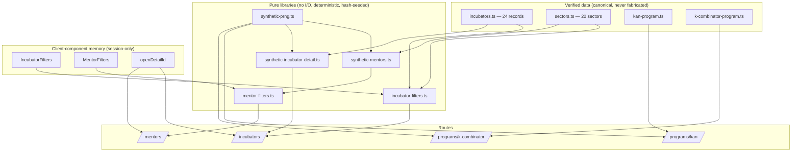
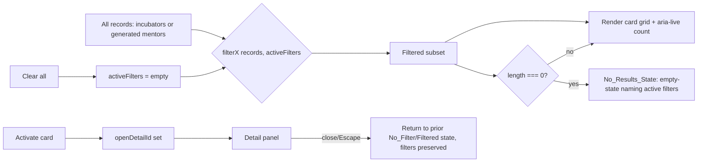

# Design Document — KITE Ecosystem Enablement Layer (Prompt 5)

## Overview

The Ecosystem Enablement Layer completes the bridge between the **founder side**
(registration, schemes, dashboards — Prompts 2–3) and the **investor side**
(Investor Suite — Prompt 4) of the KITE two-sided marketplace. Incubators and
accelerators are where founders are developed and where investors source deals;
mentors are the founder-facing discovery surface that supports that
development. This layer adds **four routes** on top of the existing
Next.js 14 / App Router / TypeScript-strict project, reusing — never forking —
the patterns proven in Prompts 1–4:

- **Incubators & Accelerators Index** (`/incubators`, public) — a filterable
  discovery surface over the 24 verified `Incubator` records, with a per-card
  click-through to an illustrative detail panel.
- **KAN — Karnataka Acceleration Network** (`/programs/kan`, editorial) — a real
  government-grade program page.
- **K-Combinator** (`/programs/k-combinator`, editorial) — a program page
  mirroring KAN's section structure with verified K-Combinator specifics.
- **Mentor Connect** (`/mentors`, public) — a discovery surface over a
  deterministically-generated synthetic mentor directory (24–30 profiles).

The layer is **frontend-only and session-only**: no backend, no database, no
API, no `fetch`/network, and no persistence (`localStorage`, `sessionStorage`,
cookies, `indexedDB`) — only in-memory React state, with blob downloads the sole
permitted output (Req 12). Verified Karnataka ecosystem data is **canonical and
never fabricated** (Req 11); every non-verified figure is **synthetic,
deterministic** (hash-seeded via the existing `synthetic-prng.ts`, never
`Math.random` / `Date` / any ambient input) and **visibly labeled** via the
existing `IllustrativeBadge` (Req 7, 11). Type extensions are **additive only**
(Req 16). Each route holds **First Load JS ≤ 150KB** (Req 13) and targets
**WCAG 2.1 AA** (Req 14). These pages are chart-light by nature, so the chart
discipline is stated but rarely exercised; the synthetic generators and the pure
filter functions are the testable heart of the layer.

### How this layer bridges the two sides

| Surface | Founder value | Investor value | Shared infrastructure |
| --- | --- | --- | --- |
| `/incubators` | Where to apply for support, by cluster/sector | Where to source pre-screened deal flow | Verified `Incubator` data + cluster taxonomy |
| `/programs/kan` + `/programs/k-combinator` | Credible acceleration paths with terms | Cohort pipelines feeding the funnel | Verified program constants + `IllustrativeBadge` |
| `/mentors` | Discover guidance matched to sector/stage | Mentor network is a portfolio-support signal | Canonical 20-sector taxonomy |

### Design decisions and rationale

| Decision | Rationale | Requirements |
| --- | --- | --- |
| **Dedicated static route segments** `app/programs/kan/page.tsx` and `app/programs/k-combinator/page.tsx` (NOT special-casing the `[slug]` dynamic route) | In the App Router, a static segment takes priority over a sibling `[slug]` dynamic segment, so `/programs/kan` and `/programs/k-combinator` resolve to the editorial pages while every other slug still falls through to the existing humanized stub. This leaves `[slug]/page.tsx` **untouched** (no regressions to `leap`, etc.) and keeps editorial content out of the dynamic fallback. | 4.1, 5.1 |
| **One shared `ProgramEditorial` component** fed by two verified page-data modules | KAN and K-Combinator render the identical seven-section `Editorial_Section_Set`; one component driven by data removes drift and guarantees structural parity. | 4.2, 5.2 |
| **Pure filter functions** (`filterIncubators`, `filterMentors`) separate from React | Filtering is the testable logic; keeping it pure makes soundness/subset/AND properties straightforward and keeps the client islands thin. | 2, 9 |
| **Filter state in client-component memory only** (`useState`/`useReducer`) | Session-only discipline: no URL params, no storage; reset on refresh is acceptable and required. | 2.8, 12.3, 12.4 |
| **Inline detail panels** (not separate routes) for incubators and mentors | Detail is illustrative preview content tied to the directory's filter state; an inline panel preserves "return to prior filters" (Req 3.7/10.4) without route round-trips and keeps each route's bundle self-contained. | 3.1, 3.7, 10.1, 10.4 |
| **Synthetic generators are pure, hash-seeded modules in `src/lib`** | Mirrors `synthetic-investor-data.ts`: determinism contract in the module header, seeded by stable string keys, byte-stable across re-renders. | 3.3, 3.6, 7.2–7.4, 5.11 |
| **Mentor count derived deterministically in `[24,30]`** from a fixed seed | A fixed top-level seed yields a stable count and a stable set, satisfying "generated more than once → identical set". | 7.1, 7.4 |
| **Additive types only**, appended to `src/types/index.ts` | Prior features (registration, dashboards, investor suite) must remain intact. | 16 |
| **Add one nav entry for KAN**, keep existing entries | `/incubators`, `/mentors`, `/programs/k-combinator` already exist in `navigation.ts`; only `/programs/kan` is missing. | 17 |

## Architecture

### Route inventory

| Route | File | Rendering | Replaces |
| --- | --- | --- | --- |
| `/incubators` | `app/incubators/page.tsx` | Client island (filter state) | StubPage |
| `/programs/kan` | `app/programs/kan/page.tsx` | Server (editorial) + lazy synthetic stories | dynamic-route humanized stub |
| `/programs/k-combinator` | `app/programs/k-combinator/page.tsx` | Server (editorial) + lazy synthetic stories | StubPage (via `[slug]`) |
| `/mentors` | `app/mentors/page.tsx` | Client island (filter state) | StubPage |

### Module and file map

```
src/
  data/
    incubators.ts                 ← REUSED (24 verified Incubator records)
    sectors.ts                    ← REUSED (20 canonical sectors)
    navigation.ts                 ← EDITED additively (+ KAN entry)
    kan-program.ts                ← NEW verified KAN editorial page-data
    k-combinator-program.ts       ← NEW verified K-Combinator editorial page-data
  lib/
    synthetic-prng.ts             ← REUSED (seededRng/Int/Pick/Shuffle)
    synthetic-mentors.ts          ← NEW pure generator (24–30 MentorProfile)
    synthetic-incubator-detail.ts ← NEW pure generator (illustrative detail)
    incubator-filters.ts          ← NEW pure filterIncubators + option derivation
    mentor-filters.ts             ← NEW pure filterMentors + experience bands
  components/
    incubators/                   ← index header, filter bar, card grid, card, detail panel
    mentors/                      ← directory header, filter bar, card grid, card, detail panel
    programs/                     ← ProgramEditorial + the seven section components
    investors/IllustrativeBadge.tsx ← REUSED
    shared/LazySection.tsx        ← REUSED
    charts/index.ts               ← REUSED barrel (only if a chart is ever added)
  app/
    incubators/page.tsx           ← Incubators_Index client island
    mentors/page.tsx              ← Mentor_Connect client island
    programs/kan/page.tsx         ← KAN editorial (NEW static segment)
    programs/k-combinator/page.tsx← K-Combinator editorial (NEW static segment)
    programs/[slug]/page.tsx      ← UNTOUCHED (humanized fallback for other slugs)
  types/index.ts                  ← EDITED additively (enablement-layer types)
```

### Data-flow

Three sources feed the routes: (1) **verified data files** rendered verbatim,
(2) **pure synthetic generators** seeded by stable keys, and (3) **filter state**
held in client-component memory. Nothing crosses the network or touches storage.



### Directory filtering flow (shared shape for both directories)



### Component trees

`src/components/incubators/` (Incubators_Index):

```
IncubatorsIndexPage (app/incubators/page.tsx, client)
├─ IncubatorsHeaderStrip            (Req 1.4/1.5 — "164+" + representative-subset label)
├─ IncubatorFilterBar               (Req 2.1–2.3 — cluster / focus / type controls + clear)
│  └─ aria-live result count        (Req 2.11, 14.6)
├─ IncubatorCardGrid                (Req 1.2/1.6)
│  └─ IncubatorCard ×N              (Req 1.3/1.7 — name, cluster, type, focus tags)
├─ IncubatorEmptyState              (Req 2.10 — names each active filter)
└─ IncubatorDetailPanel (conditional, ≤1 open) (Req 3 — verified fields + synthetic sections w/ badge)
```

`src/components/mentors/` (Mentor_Connect):

```
MentorConnectPage (app/mentors/page.tsx, client)
├─ MentorDirectoryHeaderStrip       (Req 6 — one directory-level IllustrativeBadge)
├─ MentorFilterBar                  (Req 9.1–9.3 — sector / type / experience controls + clear)
│  └─ aria-live result count        (Req 9.10, 14.6)
├─ MentorCardGrid                   (Req 6.2/6.4)
│  └─ MentorCard ×N                 (Req 8.9 — name, initials-avatar, title, firm, sectors, years, type, availability)
├─ MentorEmptyState                 (Req 9.9 — names active filters)
└─ MentorDetailPanel (conditional)  (Req 10 — all fields + bio + IllustrativeBadge)
```

`src/components/programs/` (shared editorial, used by both KAN and K-Combinator):

```
ProgramEditorial (props: ProgramEditorialData) — server component
├─ ProgramOverviewSection           (verified)            (Req 4.2/5.2 §1)
├─ ProgramProvidesSection           (verified)            (§2)
├─ CohortStructureSection           (verified)            (§3)
├─ ApplicationProcessSection        (verified)            (§4)
├─ [LazySection] SuccessStoriesSection (synthetic + IllustrativeBadge) (§5, Req 4.5/5.11)
├─ PartnerIncubatorsSection         (verified)            (§6)
└─ ApplyCtaSection                  (external https CTA)  (§7, Req 4.7/5.13)
```

## Components and Interfaces

### 1. Verified program-data modules

Both modules export a single `ProgramEditorialData` object built **verbatim**
from the Verified Data Constants (Req 11.1). They contain no synthetic content;
success stories are generated at render time by the synthetic module and merged
by `ProgramEditorial`, so the verified modules stay canonical.

`src/data/kan-program.ts`:

```ts
// VERIFIED data — authored verbatim from approved KAN program facts.
// 6-month acceleration cohorts; 306 startups over 3 years (Req 4.3, 4.4).
export const kanProgram: ProgramEditorialData = {
  slug: 'kan',
  name: 'Karnataka Acceleration Network (KAN)',
  overview: '…declarative, third-person…',          // Req 4.8
  provides: ['…'],
  cohortStructure: { cadenceLabel: '6-month acceleration cohorts', /* … */ },
  verifiedFigures: ['6-month acceleration cohorts', '306 startups supported over 3 years'],
  applicationSteps: ['…'],
  partnerIncubatorIds: ['nsrcel-iimb', '…'],         // ids into incubators.ts
  applyCta: { label: 'Apply on the official portal', href: 'https://…karnataka.gov.in/…' },
  successStoriesSeed: 'kan|success-stories',          // seed key for synthetic stories
};
```

`src/data/k-combinator-program.ts` carries the full verified K-Combinator
constant set (Req 5.3–5.10): KDEM + TiE Mangaluru partnership; located at wrkwrk
in Silicon Beach Mangaluru; 4–6 startups per cohort; 3 cohorts/year; 90 startups
over 5 years; target 5 soonicorns by 2034; the **exact nine sectors** (Deep Tech,
Space, Drone, AI, Robotics, HealthTech, AgriTech, FinTech, MarineTech); grant
₹10 lakh per qualifying startup at 0% equity; 5-year budget ₹9.5 crore from GoK
plus ₹50 lakh in-kind from TiE; `successStoriesSeed: 'k-combinator|success-stories'`.

> The nine K-Combinator sectors are stored as their own verified `string[]`
> literal in the module — they are program-specific verified facts, distinct
> from the canonical 20-sector taxonomy used by mentors/incubator filters.

### 2. Synthetic mentor generator (`src/lib/synthetic-mentors.ts`, pure)

```ts
// Determinism contract: every export is pure and hash-seeded from string keys
// only. NO Math.random, NO Date/Date.now/performance.now, NO locale or ambient
// input. Same module → identical MentorProfile[] on every call (Req 7.2–7.4).

const MENTOR_COUNT_SEED = 'mentors|count';
const MENTOR_DIRECTORY_SEED = 'mentors|directory';

/** Deterministic directory size in [24,30] inclusive (Req 7.1). */
export function getMentorCount(): number {
  return seededInt(seededRng(MENTOR_COUNT_SEED), 24, 30);
}

/** The full directory; byte-stable across calls (Req 7.4). */
export function generateMentors(): MentorProfile[] {
  const count = getMentorCount();
  return Array.from({ length: count }, (_, i) => generateMentor(`mentor|${i}`));
}

/** One profile from a stable per-mentor key (Req 7.2). */
export function generateMentor(key: string): MentorProfile { /* … */ }
```

Per-mentor derivation (all via one `seededRng(key)` stream so fields are stable
and independent of call order):

- **name** — `seededPick` from fixed first/last name pools → `"Asha Nair"`.
- **initialsAvatar** — `deriveInitials(name)` (see §4); never a photo (Req 8.2).
- **title** + **firm** — `seededPick` from fixed title/firm pools (Req 8.3).
- **sectors** — `seededShuffle(canonicalSectorIds).slice(0, seededInt(1,3))`,
  guaranteeing 1–3 distinct ids drawn from the 20 canonical sectors (Req 7.5, 8.4).
- **yearsExperience** — `seededInt(rng, 2, 32)` → positive integer (Req 8.5).
- **mentorType** — `seededPick(MENTOR_TYPES)` (the four values) (Req 7.6, 8.6).
- **availability** — `seededPick(MENTOR_AVAILABILITY)` (Req 8.7).
- **bio** — a one-paragraph template filled from the picked fields; declarative,
  third-person, illustrative (Req 8.8, 6.6).
- **id** — `'mentor-' + i` (stable; used as React key and detail key).

### 3. Synthetic incubator-detail generator (`src/lib/synthetic-incubator-detail.ts`, pure)

```ts
// Same determinism contract. Seeded ONLY by the incubator id (Req 3.3).
export function generateIncubatorDetail(incubatorId: string): IncubatorDetail {
  const rng = seededRng(`incubator-detail|${incubatorId}`);
  return {
    incubatorId,
    aboutParagraph: /* templated, seeded */,
    cohortsPerYear: seededInt(rng, 1, 4),
    startupsSupported: seededInt(rng, 20, 240),
    illustrativeOfferings: /* seededShuffle of a fixed offering pool, sliced */,
    illustrativeContactLabel: /* fixed-string label, never a real address */,
  };
}
```

Regenerating for the same id yields byte-identical content (Req 3.6); the
verified fields (name/cluster/type/focus) are **not** part of this shape — the
detail panel reads those straight from the `Incubator` record (Req 3.2) and wraps
only the `IncubatorDetail` sections in `IllustrativeBadge` (Req 3.4, 3.5).

### 4. Pure filter & helper functions

`src/lib/incubator-filters.ts`:

```ts
export interface IncubatorFilters {
  cluster: string | null;   // null = inactive
  focus: string | null;
  type: IncubatorType | null;
}
export const EMPTY_INCUBATOR_FILTERS: IncubatorFilters =
  { cluster: null, focus: null, type: null };

/** Distinct cluster values in source order (Req 2.1). */
export function deriveClusterOptions(data: readonly Incubator[]): string[];
/** Distinct focus values across all focus[] arrays (Req 2.2). */
export function deriveFocusOptions(data: readonly Incubator[]): string[];

/** Sound, subset-preserving AND filter (Req 2.4–2.7, 2.9). */
export function filterIncubators(
  data: readonly Incubator[],
  filters: IncubatorFilters,
): Incubator[] {
  return data.filter((inc) =>
    (filters.cluster === null || inc.cluster === filters.cluster) &&
    (filters.focus === null || inc.focus.includes(filters.focus)) &&
    (filters.type === null || inc.type === filters.type),
  );
}

/** Human empty-state lines, one per active filter (Req 2.10). */
export function describeActiveFilters(filters: IncubatorFilters): string[];
```

`src/lib/mentor-filters.ts`:

```ts
export interface ExperienceBand { id: ExperienceLevel; label: string; min: number; max: number; }
export const EXPERIENCE_BANDS: readonly ExperienceBand[] = [
  { id: 'emerging',     label: 'Emerging (2–7 yrs)',    min: 2,  max: 7  },
  { id: 'established',  label: 'Established (8–15 yrs)', min: 8,  max: 15 },
  { id: 'veteran',      label: 'Veteran (16+ yrs)',     min: 16, max: Number.MAX_SAFE_INTEGER },
];

export interface MentorFilters {
  sector: string | null;
  mentorType: MentorType | null;
  experienceLevel: ExperienceLevel | null;
}
export const EMPTY_MENTOR_FILTERS: MentorFilters =
  { sector: null, mentorType: null, experienceLevel: null };

/** Sound, subset-preserving AND filter incl. experience band (Req 9.4–9.8). */
export function filterMentors(mentors: readonly MentorProfile[], filters: MentorFilters): MentorProfile[];

/** Empty-state lines naming active filters (Req 9.9). */
export function describeActiveMentorFilters(filters: MentorFilters): string[];
```

`deriveInitials` (shared, used by mentors + avatar text alternative):

```ts
/** First letter of the first up-to-two whitespace tokens, uppercased.
 *  "Asha Nair" → "AN"; "Ravi" → "R". Always 1–2 uppercase letters (Req 8.2, 14.7). */
export function deriveInitials(name: string): string;
```

### 5. Routing components

- `app/programs/kan/page.tsx` — server component: `return <ProgramEditorial data={kanProgram} />;`
- `app/programs/k-combinator/page.tsx` — server component: `return <ProgramEditorial data={kCombinatorProgram} />;`
- The existing `app/programs/[slug]/page.tsx` is **unchanged**; because static
  segments outrank the dynamic segment, `kan` and `k-combinator` never reach it
  (Req 4.1, 5.1).
- `ProgramEditorial` composes the seven sections in fixed order, reads verified
  figures from `data`, and renders the success-stories section inside a
  `LazySection` fed by `generateSuccessStories(data.successStoriesSeed)` with a
  single `IllustrativeBadge` (Req 4.5, 5.11).

### 6. Directory client islands

Both `IncubatorsIndexPage` and `MentorConnectPage` are `"use client"` components
holding filter state in `useState` (no URL/storage). On every state change they
recompute `filterIncubators` / `filterMentors` inside `useMemo` keyed on the
filters (and, for mentors, the once-generated directory), update an
`aria-live="polite"` count region, and conditionally render the detail panel for
`openDetailId`. Closing the panel clears `openDetailId` only, preserving filter
state (Req 3.7, 10.4). An unknown/absent detail id is a no-op that never enters
`Detail_Open_State` (Req 3.8).

## Data Models

All shapes below are **appended** to `src/types/index.ts` after the Investor
Suite block; no existing export is altered or removed (Req 16.1–16.3) and all
compile under `strict` + `noUncheckedIndexedAccess` (Req 16.4). Existing
`Incubator` / `IncubatorType` are **reused**, not redefined.

```ts
// ===========================================================================
// KITE Ecosystem Enablement (Prompt 5) — additive types only.
// Reuses existing Incubator / IncubatorType above. No existing export changed.
// ===========================================================================

// --- Mentor enumerations ---
export type MentorType =
  | 'Domain Expert' | 'Founder Mentor' | 'Investor Mentor' | 'Government Liaison';

export const MENTOR_TYPES: readonly MentorType[] =
  ['Domain Expert', 'Founder Mentor', 'Investor Mentor', 'Government Liaison'];

export type MentorAvailability = 'Open to mentees' | 'Limited availability' | 'Waitlist';

export const MENTOR_AVAILABILITY: readonly MentorAvailability[] =
  ['Open to mentees', 'Limited availability', 'Waitlist'];

/** Experience banding id used by the Experience_Level filter. */
export type ExperienceLevel = 'emerging' | 'established' | 'veteran';

// --- Mentor profile (synthetic; Req 8) ---
export interface MentorProfile {
  id: string;                 // stable key, e.g. "mentor-0"
  name: string;               // Req 8.1
  initialsAvatar: string;     // 1–2 uppercase letters, no photo (Req 8.2)
  title: string;              // Req 8.3
  firm: string;               // Req 8.3
  sectors: string[];          // 1–3 ids drawn from the 20 canonical sectors (Req 8.4)
  yearsExperience: number;    // positive integer (Req 8.5)
  mentorType: MentorType;     // Req 8.6
  availability: MentorAvailability; // Req 8.7
  bio: string;                // one-paragraph illustrative (Req 8.8)
}

// --- Incubator illustrative detail (synthetic; Req 3) ---
export interface IncubatorDetail {
  incubatorId: string;        // matches Incubator.id
  aboutParagraph: string;     // illustrative
  cohortsPerYear: number;     // illustrative
  startupsSupported: number;  // illustrative
  illustrativeOfferings: string[];
  illustrativeContactLabel: string;
}

// --- Directory filter state ---
export interface IncubatorFilters {
  cluster: string | null;
  focus: string | null;
  type: IncubatorType | null;
}

export interface MentorFilters {
  sector: string | null;
  mentorType: MentorType | null;
  experienceLevel: ExperienceLevel | null;
}

/** Experience band definition (min/max inclusive years). */
export interface ExperienceBand {
  id: ExperienceLevel;
  label: string;
  min: number;
  max: number;
}

// --- Editorial program page-data (verified; Req 4, 5) ---
export interface ProgramApplyCta {
  label: string;
  href: string;               // external https Karnataka portal (Req 4.7, 5.13)
}

export interface ProgramCohortStructure {
  cadenceLabel: string;       // e.g. "6-month acceleration cohorts"
  detailLines: string[];      // verified cohort facts
}

export interface ProgramEditorialData {
  slug: 'kan' | 'k-combinator';
  name: string;
  overview: string;
  provides: string[];
  cohortStructure: ProgramCohortStructure;
  verifiedFigures: string[];        // canonical figures rendered verbatim (Req 11.1)
  sectors?: string[];               // K-Combinator's exact nine sectors (Req 5.8)
  applicationSteps: string[];
  partnerIncubatorIds: string[];    // ids into incubators.ts
  applyCta: ProgramApplyCta;
  successStoriesSeed: string;       // seed key for synthetic stories (Req 4.5, 5.11)
}

/** A single synthetic success story (illustrative). */
export interface ProgramSuccessStory {
  id: string;
  startupName: string;
  sector: string;
  outcomeLine: string;        // illustrative, declarative
}
```

## Correctness Properties

*A property is a characteristic or behavior that should hold true across all
valid executions of a system — essentially, a formal statement about what the
system should do. Properties serve as the bridge between human-readable
specifications and machine-verifiable correctness guarantees.*

This layer is well suited to property-based testing because its core logic is a
set of **pure functions**: the two hash-seeded synthetic generators
(`synthetic-mentors.ts`, `synthetic-incubator-detail.ts`) and the two pure filter
modules (`incubator-filters.ts`, `mentor-filters.ts`), plus `deriveInitials`.
The editorial pages and visual/navigation/no-IO requirements are verified by
example, smoke, and a11y tests instead (see Testing Strategy). Each property
below is tested with `fast-check` at `{ numRuns: 100 }` and tagged in code with a
`// Feature: kite-ecosystem-enablement` comment naming the property number and text.

### Property 1: Synthetic generation is deterministic and ambient-free

*For any* mentor key (and *for any* incubator id), generating the value two or
more times returns deep-equal output, and `generateMentors()` returns a
deep-equal `MentorProfile[]` on every call — with no dependence on `Math.random`,
`Date`, `Date.now`, `performance.now`, locale, or any other ambient input.

**Validates: Requirements 3.3, 3.6, 5.11, 7.2, 7.3, 7.4, 11.3**

### Property 2: Mentor directory cardinality is in range

*For any* execution, `generateMentors()` produces between 24 and 30
`MentorProfile` records inclusive.

**Validates: Requirements 7.1**

### Property 3: Every mentor profile is well-formed

*For any* generated `MentorProfile`, the record has a non-empty name, title,
firm, and bio; a `sectors` array that is non-empty and a subset of the 20
canonical sector ids; a `yearsExperience` that is a positive integer; a
`mentorType` drawn from the four canonical values; and an `availability` drawn
from the canonical availability set.

**Validates: Requirements 7.5, 7.6, 8.1, 8.3, 8.4, 8.5, 8.6, 8.7, 8.8, 8.9**

### Property 4: Initials-avatar derivation and text alternative

*For any* non-empty name, `deriveInitials(name)` returns 1–2 uppercase letters
equal to the first letters of the first up-to-two whitespace-separated tokens of
the name, contains no image reference, and is suitable as the avatar's text
alternative.

**Validates: Requirements 8.2, 14.7**

### Property 5: Filter options equal the distinct values in the data

*For any* incubator dataset, `deriveClusterOptions` returns exactly the set of
distinct `cluster` values and `deriveFocusOptions` returns exactly the set of
distinct values across all `focus[]` arrays — each with no duplicates and
omitting no present value.

**Validates: Requirements 2.1, 2.2**

### Property 6: Incubator filtering is sound, AND-composed, and subset-preserving

*For any* incubator dataset and *any* `IncubatorFilters`, every incubator in
`filterIncubators` output satisfies every active filter (cluster equality, focus
membership, type equality), the result is a subset of the input (no fabricated or
duplicated records), and when two or more dimensions are active the result is the
logical AND of all of them.

**Validates: Requirements 2.4, 2.5, 2.6, 2.7**

### Property 7: Mentor filtering is sound, AND-composed, and subset-preserving

*For any* generated mentor set and *any* `MentorFilters`, every mentor in
`filterMentors` output satisfies every active filter (sector membership,
`mentorType` equality, and `yearsExperience` within the selected
`ExperienceBand`'s `[min, max]`), the result is a subset of the input, and when
more than one filter is active the result satisfies all of them.

**Validates: Requirements 9.4, 9.5, 9.6, 9.7**

### Property 8: Clearing all filters returns the full set

*For any* dataset, applying the empty filter set returns exactly the input
records (same membership), for both `filterIncubators` and `filterMentors`.

**Validates: Requirements 2.9, 9.8**

### Property 9: Match count equals result length, is bounded, and empty results name active filters

*For any* dataset and *any* filters, the displayed matching count equals the
filtered result length and lies within `[0, dataset.length]`; and whenever the
filtered result is empty while at least one filter is active, the empty-state
description lists every active filter's dimension and selected value (for both
directories).

**Validates: Requirements 2.10, 2.11, 9.9, 9.10**

### Property 10: Verified incubator data is rendered verbatim

*For any* incubator record, the rendered card and detail present the record's
`name`, `cluster`, and `type` unaltered character-for-character, and render
exactly one tag per `focus[]` entry preserving the stored order — never altering
or reordering verified fields.

**Validates: Requirements 1.3, 3.2, 11.1**

## Error Handling

The layer is frontend-only with no network or storage, so error handling is
about **defensive purity and graceful degradation**, not I/O recovery.

- **Pure-generator totality** — `synthetic-mentors.ts` and
  `synthetic-incubator-detail.ts` only call the seeded helpers, which clamp
  indices (`seededInt`, `seededPick`) and never throw on edge seeds; output is
  always within declared ranges and never reads the clock or `Math.random`.
- **Filter totality** — `filterIncubators` / `filterMentors` treat a `null`
  filter field as "any", so any combination (including all-null) is total and
  returns a subset; no input throws.
- **Unknown detail id** — opening a detail for an id with no matching record is a
  no-op: the island never enters `Detail_Open_State` and preserves current
  filters (Req 3.8). The detail panel null-guards its lookup under
  `noUncheckedIndexedAccess`.
- **Empty / zero-result state** — when filters match nothing, the directory
  renders `IncubatorEmptyState` / `MentorEmptyState` naming the active filters
  (Req 2.10, 9.9) rather than a blank grid.
- **Editorial route fallback** — `/programs/kan` and `/programs/k-combinator`
  resolve to dedicated static segments; any other `/programs/<slug>` still falls
  through to the existing humanized stub, so the route space remains total with
  no 404 regressions.
- **LazySection / charts** — `LazySection` renders children eagerly when
  `IntersectionObserver` is unavailable (SSR/test), so deferred success-stories
  content never hides behind an unresolved skeleton; if a chart is ever added it
  imports through the barrel and renders its own empty state.
- **No-IO guarantee** — no `fetch`/storage calls exist to fail; the no-IO smoke
  test enforces this (Req 12).

## Testing Strategy

### Dual approach

- **Property tests** (`fast-check`, `numRuns: 100`) verify the 10 universal
  properties above against the pure modules (synthetic generators, filter
  functions, `deriveInitials`, derived options, verbatim integrity).
- **Unit / component tests** verify concrete examples, edge cases, rendering,
  badges, copy, labels, and a11y (the EXAMPLE / EDGE_CASE / SMOKE items from the
  prework).
- **Integration / e2e tests** verify card→detail open/close with filter
  preservation, filter→grid recompute, and navigation routing.

Property tests are tagged in code with a `// Feature: kite-ecosystem-enablement`
comment that names the property number and text, and reference their design
property. Unit tests stay lean — property tests carry the broad input
coverage; unit tests focus on specific examples, integration points, and edge
cases. Generators reuse canonical data where shape matters (sector ids,
`IncubatorType` / `MentorType` unions, experience bands) and randomize the rest,
exercising boundaries (empty datasets, all-null and fully-active filters,
single-token names, zero-result combinations).

### Test architecture

| Test file (under `src/lib/__tests__`, `src/components/**/__tests__`, or `src/app/__tests__`) | Type | Covers (Properties / Reqs) |
| --- | --- | --- |
| `synthetic-mentors.pbt.test.ts` | PBT ×100 | P1, P2, P3 (determinism, cardinality, well-formedness) — Req 7, 8 |
| `synthetic-incubator-detail.pbt.test.ts` | PBT ×100 | P1 (determinism, byte-identical regeneration) — Req 3.3, 3.6 |
| `derive-initials.pbt.test.ts` | PBT ×100 | P4 (initials derivation + text alternative) — Req 8.2, 14.7 |
| `incubator-filters.pbt.test.ts` | PBT ×100 | P5, P6, P8, P9 (options, soundness/AND/subset, clear-all, count/empty-state) — Req 2 |
| `mentor-filters.pbt.test.ts` | PBT ×100 | P7, P8, P9 (soundness/AND/subset incl. band, clear-all, count/empty-state) — Req 9 |
| `verified-data-integrity.pbt.test.ts` | PBT ×100 | P10 (incubator verbatim fields + tag order) — Req 1.3, 3.2, 11.1 |
| `IncubatorsIndex.test.tsx` | component | replaces stub, 24 cards, "164+" + subset label, card fields/treatment, aria-live count, empty-state — Req 1, 2.3/2.8/2.10/2.11, 15 |
| `IncubatorDetailPanel.test.tsx` | component | open via click + Enter/Space, ≤1 open, verified fields verbatim, badge on synthetic sections only, close preserves filters, unknown id no-op — Req 3 |
| `MentorConnect.test.tsx` | component | replaces stub, one directory badge, one card per mentor, card fields/treatment, filter labels, aria-live count, empty-state — Req 6, 8.9, 9.1–9.3/9.9/9.10, 15 |
| `MentorDetailPanel.test.tsx` | component | open detail, all fields + bio, IllustrativeBadge present, close preserves state — Req 10 |
| `ProgramEditorial.test.tsx` | component | seven ordered sections; KAN 6-month + 306; K-Combinator KDEM/TiE, wrkwrk, 4–6/3-per-yr, 90/5yr, 5 soonicorns 2034, exact nine sectors, ₹10L@0%, ₹9.5Cr+₹50L; success-stories badge; verified sections badge-free; external https CTA — Req 4, 5, 11.5 |
| `programs-routing.test.tsx` | integration | `/programs/kan` + `/programs/k-combinator` resolve to editorial (not stub); other slugs still humanized — Req 4.1, 5.1 |
| `enablement.e2e.test.tsx` | e2e | filter → grid recompute → open detail → close → filters preserved, both directories — Req 2, 3, 9, 10 |
| `enablement-a11y.test.tsx` | a11y (axe) | heading order, control names, keyboard, filter labels, region aria-labels, aria-live counts, avatar text alternatives — Req 14 |
| `enablement-responsive.test.tsx` | responsive | header/filter bar/card grid/detail at mobile/tablet/desktop — Req 13, 15 |
| `enablement-perf.test.tsx` | static-graph perf | First Load JS ≤150KB per route; success-stories lazy; no eager chart/heavy module — Req 13 |
| `enablement-no-io.smoke.test.ts` | smoke | no fetch/localStorage/sessionStorage/cookie/IndexedDB; generators use no Math.random/Date; Apply CTAs are external https | Req 12 |
| `navigation-enablement.test.ts` | unit | nav keeps `/incubators`, `/mentors`, `/programs/k-combinator`; adds `/programs/kan`; removes none — Req 17 |
| `enablement-types.test-d.ts` | type (tsc) | new types compile; existing exports unchanged — Req 16 |

### Property-test configuration

- Library: `fast-check` (already a dependency; used by existing PBTs).
- `numRuns: 100` minimum per property test.
- Each property test references its design property number in a tag comment.
- Generators reuse canonical sector ids, `IncubatorType`/`MentorType` unions, and
  `EXPERIENCE_BANDS`, and randomize numeric/string fields including edge cases
  (empty datasets, all-null filters, fully-active filters, single-token names,
  zero-result combinations) so soundness, subset, count, and empty-state
  properties are exercised at their boundaries.

## Bundle and Performance Strategy

Each of the four routes holds **First Load JS ≤ 150KB** (Req 13.1), mirroring the
Prompt 3–4 page composition.

- **Chart-light by design** — these routes render no charts in the baseline
  design. If a chart is ever introduced, it MUST import through
  `src/components/charts/index.ts` (which re-exports via `next/dynamic`,
  `ssr: false`), so Recharts never enters any route's initial bundle (Req 13.2).
- **Below-the-fold lazy-loading** — the editorial **success-stories** section
  (the only synthetic, slightly heavier section) is wrapped in `LazySection`
  with a reserved `minHeight` (no CLS), and other below-the-fold editorial
  sections may be `next/dynamic`-split if needed (Req 13.3).
- **Pure libs are tree-shake-friendly** — generators and filters are plain
  functions with no framework imports; the directories' client islands ship only
  the filter UI plus the in-memory data, well within budget.
- **No animation libraries** — all motion (if any) is plain CSS; no
  framer-motion / react-spring.

## Accessibility Strategy (WCAG 2.1 AA)

- **Heading order** — each route uses a single `h1` (page title) then `h2`
  section headings without skipping levels; the editorial pages number their
  seven sections as sequential `h2`s (Req 14.1).
- **Filter labels** — every filter control (cluster/focus/type selects;
  sector/type/experience selects) has a visible `<label>` associated via
  `htmlFor`/`id`, plus an accessible name (Req 14.2, 14.4).
- **Keyboard operability** — cards are focusable and activatable by pointer and
  by keyboard (Enter/Space); the detail panel is dismissable via a close control
  and Escape; all controls are reachable in DOM order (Req 14.3, 3.1).
- **aria-live result counts** — each directory's matching count lives in an
  `aria-live="polite"` region that announces the updated integer whenever filter
  selections change (Req 14.6, 2.11, 9.10).
- **Region landmarks** — each major section is a landmark (`role="region"` /
  `<section>`) carrying an `aria-label` (e.g. "Incubator filters", "Mentor
  directory", "KAN cohort structure") (Req 14.5).
- **Initials-avatar text alternatives** — the initials avatar is decorative
  glyph text accompanied by an accessible text alternative equal to the mentor's
  name (e.g. an `aria-label` / sr-only name), never a photo (Req 14.7, 8.2).
- **Restraint** — declarative, third-person copy throughout; no superlatives,
  exclamation marks, or urgency phrasing; the Apply CTA is the only call to
  action on the editorial pages (Req 4.8, 5.14, 6.6). Full WCAG conformance still
  requires manual assistive-technology testing and expert review.

## Visual Discipline

Follows the established KITE system (Req 15): `rounded-xl shadow-sm border` cards;
`py-16` / `md:py-24` content sections and `py-8` / `py-12` header strips;
`max-w-7xl` containers; Plus Jakarta Sans headings and Inter body; Lucide icons
only; **no** gradients, blobs, emoji, glassmorphism, glow effects, or SaaS-style
rounding; and **no** `text-h4` class (use existing `text-display/h1/h2/h3/body/
caption` tokens, falling back to `text-lg` where a smaller heading is needed).

## Navigation Integration

`src/data/navigation.ts` already contains leaf links to `/incubators`
(For Stakeholders → "Incubators & Accelerators"), `/mentors` (For Stakeholders →
"Mentors" and Connect → "Mentor Connect"), and `/programs/k-combinator`
(Schemes & Benefits → "K-Combinator"). These are **kept** and now resolve to the
routes defined here (Req 17.1, 17.4). The only change is **additive**: append a
KAN entry — `{ label: 'KAN — Karnataka Acceleration Network', href: '/programs/kan' }`
— under an appropriate group (Schemes & Benefits, alongside K-Combinator), with
**no existing entry removed** (Req 17.2, 17.3).

## No-IO Discipline

The layer makes no backend/API/database calls, uses no `fetch` or any other
network request, and uses no `localStorage`, `sessionStorage`, cookies, or
`indexedDB`; all state (filters, open-detail id) is in-memory React state that
resets on refresh (Req 12.1–12.4). No downloads are offered by these routes; if
one were added it would derive from an in-memory `Blob` with no network
(Req 12.5). Every Apply CTA is an external `https` link to the official Karnataka
portal and transmits no user or portal data (Req 12.6, 4.7, 5.13). The
`enablement-no-io.smoke.test.ts` enforces these guarantees and that the synthetic
generators reference no `Math.random` or time/date source.
