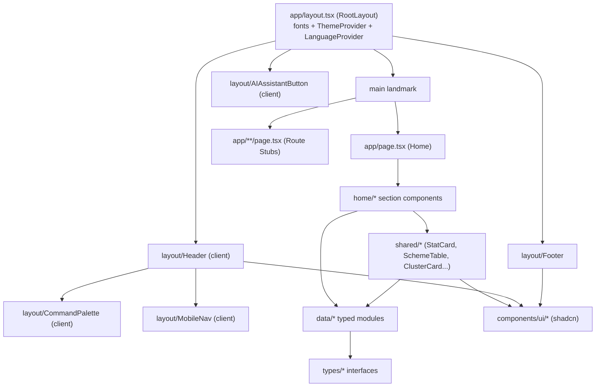
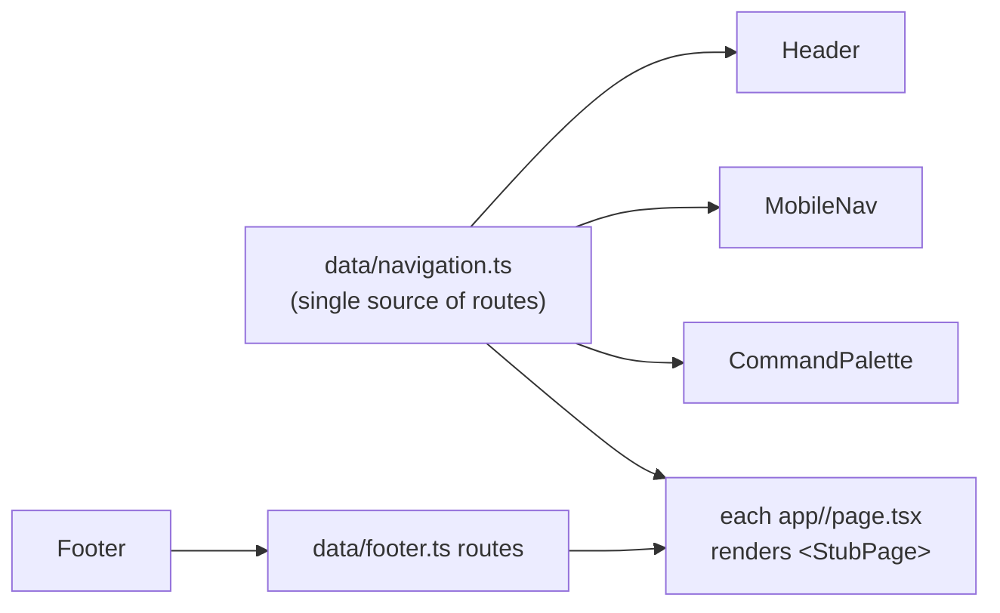

# Design Document

## Overview

This document specifies the design for the **foundation slice** of **KITE — Karnataka Innovation & Technology Ecosystem**, a production-ready Next.js 14 (App Router) website owned by the Department of Electronics, IT, Bt and S&T, Government of Karnataka. This slice (Prompt 1 of a multi-prompt build) delivers four concerns: project scaffolding, the KITE Design System, the global layout (Header, Footer, MobileNav, Command Palette, AI Assistant), and a complete ten-section data-dense Home Page.

There is **no backend** in this slice. All content is sourced from typed TypeScript modules under `src/data/`. There are no network/API calls and no use of browser storage (`localStorage`, `sessionStorage`, cookies, IndexedDB). Backend-dependent features (real AI responses, search submission, notifications, language switching) are visual-only placeholders. Non-Home routes exist as stubs so navigation always resolves.

### Design Goals

- **Government-grade visual language**: gov.uk clarity + Stripe polish + Y Combinator data density. Editorial, flat, data-dense.
- **Zero AI-template aesthetic**: no gradients, no decorative blobs/waves/abstract shapes, no glassmorphism, no neon, no emoji, no overly-rounded "friendly SaaS" look.
- **Type safety**: TypeScript strict mode, zero `any`, every data file backed by an interface in `src/types/`.
- **Accessibility-first**: WCAG 2.1 AA baked in, not retrofitted.
- **Performance**: CSS-only decorations, lazy-loaded below-fold sections, `next/font` optimization.
- **Data integrity**: every number traces to verified Karnataka ecosystem source data.

### Non-Negotiable Stack

| Concern | Choice |
|---|---|
| Framework | Next.js 14 App Router, TypeScript strict mode |
| Styling | Tailwind CSS 3.4+ + shadcn/ui (CLI install → `src/components/ui/`) |
| Charts | Recharts |
| Icons | Lucide React (20×20 default, no emoji) |
| Country flags | `flag-icons` (`npm i flag-icons`) — CSS sprite SVG flags; `flag-icons/css/flag-icons.min.css` imported in `globals.css` |
| Animation | Framer Motion (panel transitions) + CSS-only decorations |
| Fonts | Inter (body) + Plus Jakarta Sans (headings) via `next/font/google` |
| Data | Typed TS files in `src/data/` — no fetch, no API, no storage |
| State | React Context where shared, otherwise local component state |

### Reference Aesthetic (explicit, inherited by all later prompts)

The following visual rules are binding for this and every subsequent build prompt:

- **NO gradient backgrounds anywhere.** Section backgrounds are flat solid tokens only (`dark`, `surface`, `card`/white).
- **NO decorative blobs, waves, or abstract shapes.** The only permitted decoration is the Hero CSS grid pattern (faint lines) and the AI button pulse/glow.
- **NO emoji in UI — absolute, zero exceptions.** Lucide icons only. Country flags render as SVG via the `flag-icons` library (see Data Models / GIACountry), never as emoji.
- **NO glassmorphism, neon, or friendly-SaaS rounding.**
- **Border radius scale**: cards `rounded-xl`, buttons `rounded-lg`, badges `rounded-md`, pills/chips `rounded-full`.
- **Shadow scale**: cards use `shadow-sm` **with** `border border-gray-200` (border-defined, not shadow-heavy).
- **Section padding**: home sections `py-16 md:py-24`; inner/stub pages `py-12`.
- **Container**: `max-w-7xl mx-auto px-4 sm:px-6 lg:px-8`.

## Architecture

### High-Level Architecture

KITE foundation is a statically-composable Next.js App Router application. Pages are React Server Components by default; interactivity (dropdowns, overlays, filter tabs, chip selection) is isolated into Client Components marked `"use client"`. There is no server data fetching — data modules are imported directly and tree-shaken into the bundle.



### Rendering & Component Boundary Strategy

| Layer | Rendering | Rationale |
|---|---|---|
| `RootLayout`, `Footer`, Route Stubs, static Home sections (SocialProof, GIA grid) | Server Component | No interactivity; smallest JS payload |
| `Header`, `MobileNav`, `CommandPalette`, `AIAssistantButton` | Client Component | Open/close state, focus management, keyboard handlers |
| `LiveMetrics`/`StatCard`, `AllSchemes`, `SectorExplorer` | `StatCard`/`LiveMetrics` are static Server Components; `AllSchemes`/`SectorExplorer` are Client Components | Filter tab state, chip selection (StatCard count-up superseded — static) |
| Below-fold sections | Client wrapper with lazy boundary | `next/dynamic` + IntersectionObserver-driven load |

### Routing & Route-Stub Strategy

All navigation destinations referenced by Header, MobileNav, Footer, and Home resolve to a real route. The Home route (`/`) is fully built. Every other destination is a **Route Stub** rendered by a single reusable `StubPage` component, plus a global `not-found.tsx`.

To avoid hand-authoring ~40 stub files, routes are grouped and each `page.tsx` calls the shared `StubPage` with a title and description:



Route inventory (derived from navigation + footer + home CTAs), each a stub unless noted:

- `/` (built Home)
- Startups: `/startups`, `/startups/register`, `/startups/dashboard`
- Investors: `/investors/connect`, `/investors`, `/investors/dashboard`
- Schemes: `/schemes`, `/schemes/calculator`, `/schemes/track`
- More: `/mentors`, `/women-hub`, `/idea-bank`, `/gia`, `/clusters`, `/jobs`, `/intelligence`, `/events`
- Top-level: `/support`, `/login`, `/register`
- Footer "Programs & Policies" + "Support & Resources" targets: `/policies/startup-2025-30`, `/policies`, `/programs/leap`, `/coe`, `/programs/nain`, `/schemes/gck`, `/clusters`, `/support`, `/support/faqs`, `/contact`, `/events`, `/reports`, `/tenders`, `/developers` (the Helpline `tel:` and Email `mailto:` entries are external anchors, not routes)
- Footer "For Ecosystem Partners" targets: `/incubators`, `/corporates`, `/csr`, `/universities`, `/gia`, `/procurement`
- Footer bottom row: `/privacy`, `/terms`, `/accessibility`, `/sitemap`, `/rti`
- Cluster + scheme + quick-action targets resolve into the above or dedicated stubs.

Every stub renders Header + Footer (inherited from `RootLayout`) and a heading + "content forthcoming" message (Req 19).

### Navigation Error Handling (broken/invalid routes)

Several requirements (5.9, 8.7, 10.5, 11.7, 12.7, 13, 16) require that activating a link whose target is unavailable/invalid keeps the visitor on the current page and indicates the destination could not be reached. Because all in-app routes are guaranteed to exist as stubs, "invalid" is defined as a record whose `href` field is missing, empty, or fails a validation predicate. The design introduces a single `safeNavigate(router, href)` helper in `src/lib/utils.ts`:

- If `href` is a valid internal path (validated by `isValidRoute`), call `router.push(href)`.
- If `href` is missing/empty/invalid, do **not** navigate; surface a non-blocking toast/inline indication ("This destination isn't available yet") and remain on the page.

This centralizes the "could not be reached" behavior so every CTA inherits it identically.

## Components and Interfaces

### Directory / File Structure (must match exactly)

```
src/
├── app/
│   ├── layout.tsx                 # RootLayout: fonts, providers, Header/Footer/AIButton
│   ├── globals.css                # Tailwind layers + CSS variable tokens
│   ├── page.tsx                   # Home Page (composes 10 sections)
│   ├── not-found.tsx              # 404 with Header/Footer
│   ├── startups/{page,register/page,dashboard/page}.tsx
│   ├── investors/{connect/page,page,dashboard/page}.tsx
│   ├── schemes/{page,calculator/page,track/page}.tsx
│   ├── programs/<slug>/page.tsx   # 8 flagship program stubs
│   ├── <more & resource routes>/page.tsx
│   └── ... (route stubs)
├── components/
│   ├── ui/                        # shadcn primitives (CLI-generated)
│   │   ├── button.tsx  card.tsx  badge.tsx  dialog.tsx  sheet.tsx
│   │   ├── tabs.tsx  dropdown-menu.tsx  navigation-menu.tsx  input.tsx
│   │   ├── select.tsx  separator.tsx  avatar.tsx  tooltip.tsx
│   │   ├── accordion.tsx  command.tsx  popover.tsx  scroll-area.tsx
│   │   ├── skeleton.tsx  table.tsx  chart.tsx  toast/sonner.tsx
│   ├── layout/
│   │   ├── Header.tsx
│   │   ├── Footer.tsx
│   │   ├── MobileNav.tsx
│   │   ├── CommandPalette.tsx
│   │   └── AIAssistantButton.tsx
│   ├── home/
│   │   ├── HeroSection.tsx
│   │   ├── LiveMetricsSection.tsx
│   │   ├── QuickActionsSection.tsx
│   │   ├── FlagshipProgramsSection.tsx
│   │   ├── ClustersSection.tsx
│   │   ├── AllSchemesSection.tsx
│   │   ├── SectorExplorerSection.tsx
│   │   ├── EventsPreviewSection.tsx
│   │   ├── GIACountriesSection.tsx
│   │   └── SocialProofSection.tsx
│   └── shared/
│       ├── StatCard.tsx
│       ├── SchemeRow.tsx / SchemeTable.tsx
│       ├── ClusterCard.tsx
│       ├── QuickActionCard.tsx
│       ├── FlagshipProgramCard.tsx
│       ├── SectorChip.tsx
│       ├── EventCard.tsx
│       ├── GIACountryTile.tsx
│       ├── SectionHeading.tsx
│       ├── StubPage.tsx
│       └── LazySection.tsx
├── data/
│   ├── ecosystem-stats.ts
│   ├── schemes.ts
│   ├── clusters.ts
│   ├── sectors.ts
│   ├── events.ts
│   ├── incubators.ts
│   ├── gia-countries.ts
│   ├── policies.ts
│   ├── navigation.ts
│   ├── quick-actions.ts
│   ├── flagship-programs.ts
│   ├── footer.ts
│   └── social-proof.ts
├── lib/
│   └── utils.ts                   # cn, formatters, safeNavigate, isValidRoute, validation guards
├── types/
│   └── index.ts                   # all interfaces (Scheme, Cluster, Stat, ...)
└── context/
    ├── LanguageContext.tsx        # EN/ಕನ್ನಡ toggle (UI-only)
    └── (overlay state handled locally per component)
```

### Layout Components

**RootLayout (`app/layout.tsx`, Server Component)**
- Loads Inter (`--font-inter`) and Plus Jakarta Sans (`--font-jakarta`) via `next/font/google` with `display: 'swap'` and system-sans fallback (Req 1.6/1.7, 2.16, 22.3).
- Wraps children in `LanguageProvider`.
- Renders semantic structure: `<header>` (banner) → `<main>` → `<footer>` (contentinfo) + floating `AIAssistantButton` + toast region (Req 21.1).

**Header (`layout/Header.tsx`, Client)**
- Client Component, fixed top, `h-16` (64px), `bg-dark` (Req 3.1).
- Binds explicitly to `navigation`, `utilityNav`, and `primaryCtaHref` imported from `src/data/navigation.ts` — the single source of truth for nav structure (Req 3.3).
- Left: kite Lucide icon + "KITE" wordmark + sub-line (Req 3.2).
- Desktop center (≥lg): a shadcn `NavigationMenu` rendering the FIVE dropdown parents — **Ecosystem, Schemes & Benefits, For Stakeholders, Beyond Bengaluru, Connect** — each opening its children from `navigation.ts` (Req 3.3, 3.4, 3.10, 3.13). "Register" is NOT in the center menu; it is the primary CTA button on the right (`bg-accent`), linking to `primaryCtaHref` (`/register`) (Req 3.8, 3.9).
- Right utility cluster, in order: search trigger (opens `CommandPalette`, ⌘K / Ctrl+K), bilingual toggle "EN | ಕನ್ನಡ" (visual-only, wired to `useLanguage`), notification bell (visual-only, no badge), Sign In link (`utilityNav.signInHref` → `/signin`), Register CTA (`primaryCtaHref` → `/register`, `bg-accent`) (Req 3.8, 3.9, 3.12).
- Mobile (<lg): hamburger replaces the center nav and opens `MobileNav` (Req 3.11, 3.13, 20.4).
- Per the verified utility cluster there is **NO header "AI Assistant" button**; the floating `AIAssistantButton` is the AI entry point.
- Bilingual toggle + notification bell are visual-only in this slice (Req 3.12).
- Keyboard: Enter/Space open dropdowns; Escape closes and returns focus to the trigger (Req 3.4, 3.14). Icon-only buttons (search, bell, language toggle) carry `aria-label`s; all interactive controls show focus-visible rings (Req 21.x).

**MobileNav (`layout/MobileNav.tsx`, Client)**
- shadcn `Sheet` from left over dimming overlay, slide-in 150–400ms (Req 4.1).
- Five dropdown parents (Ecosystem, Schemes & Benefits, For Stakeholders, Beyond Bengaluru, Connect) expand their nested children via `Accordion`; "Register" is a direct leaf link (Req 4.2, 4.4).
- Leaf activation navigates + closes (Req 4.3); parent toggles and stays open (Req 4.4); close control/overlay/Escape close (Req 4.5, 4.6); focus trapped while open and returned to hamburger on close (Req 4.7, 4.8, 21.4).

**Footer (`layout/Footer.tsx`, Server)**
- Renders `bg-dark` (Req 5.1). Binds to `footerColumns: FooterColumn[]` and `footerBottom: FooterBottom` imported from `src/data/footer.ts`.
- Exactly five link columns in order, with these titles and link counts (Req 5.2–5.7): "For Startups" (9 links), "For Investors" (7 links), "For Ecosystem Partners" (6 links), "Programs & Policies" (7 links), "Support & Resources" (9 links).
- The "Support & Resources" column includes the Helpline (`tel:+918022231007`) and Email (`mailto:startupcell@karnataka.gov.in`) links, both marked `external: true` and rendered as real `<a>` anchor tags — not via `safeNavigate`, because they use external protocols (Req 5.7, 5.8).
- Internal footer links are activated through `safeNavigate`; external links (`tel:`/`mailto:`) render as native anchors (Req 5.8, 5.13, 5.14).
- Bottom utility row sourced from `footerBottom` (Req 5.9–5.11): three legal lines in order ("© 2025 Government of Karnataka. All rights reserved."; "Department of Electronics, IT, Bt and S&T"; "Operated by KITS (Karnataka Innovation and Technology Society) and KDEM (Karnataka Digital Economy Mission)"), five bottom-right links (Privacy Policy, Terms of Use, Accessibility, Sitemap, RTI), and the centered tagline "One Portal. One Login. One Ecosystem.".
- Textual Karnataka emblem watermark behind content, `aria-hidden`, low opacity, `pointer-events-none`, never overlapping or obscuring any interactive element (Req 5.12, 21.5).
- Internal links use `safeNavigate`; an invalid/unavailable target keeps the visitor on the current page with an "unreachable destination" indication (Req 5.13, 5.14).

**CommandPalette (`layout/CommandPalette.tsx`, Client)**
- shadcn `command` overlay; opening moves focus to input (Req 7.1).
- Destinations sourced from `navigation.ts` flattened list (Req 7.2).
- Case-insensitive substring filter (Req 7.3); no-match indication, stays open (Req 7.4).
- Select via click/Enter navigates + closes (Req 7.5); Escape closes + restores focus to search control (Req 7.6); ArrowUp/Down move highlight (Req 7.7).

**AIAssistantButton (`layout/AIAssistantButton.tsx`, Client)**
- Fixed bottom-right, stays visible on scroll (Req 6.1).
- CSS-only looping glow + pulse, suppressed under reduced-motion (Req 6.2, 22.1, 21.7).
- Activation opens right `Sheet` "Ask KITE AI", moves focus into panel (Req 6.3).
- Panel: one static welcome message + 3–6 sample questions (Req 6.4).
- Close control / Escape close and restore focus to button (Req 6.5, 6.6); focus trapped while open (Req 6.8, 21.4).
- Visual-only — sample questions never call any backend (Req 6.7).

### Home Section Components (one file per section, in order)

| # | Component | Background | Key behavior / Req |
|---|---|---|---|
| 1 | HeroSection | `dark` + CSS grid pattern | Heading "Karnataka's Innovation & Technology Ecosystem", verified-scale subheading (21,000+ DPIIT / 183 soonicorns / 730+ GCCs / 25,000 by 2030), 2 CTAs ("Register Your Startup", "Explore Schemes & Benefits"), verified stat strip, 4 text-only trust badges (Req 8) |
| 2 | LiveMetricsSection | white | 6 static stat cards (curated Stats Strip); title "Karnataka's Digital Landscape" (Req 9) |
| 3 | QuickActionsSection | `surface` | 8 action cards (Req 10) |
| 4 | FlagshipProgramsSection | white (`card`) | 6 programs as cards/tabs, status badge, CTA (Req 11) |
| 5 | ClustersSection | `surface` | 6 cluster cards, skip-malformed (Req 12) |
| 6 | AllSchemesSection | white | curated ~12-scheme preview, 3 filter tabs (All / Fiscal Incentives / Grant-in-Aid) with an Eligibility column, "View All 22 Schemes" → /schemes (Req 13) |
| 7 | SectorExplorerSection | `surface` | ~20 single-row scrollable chips (from sectors.ts), single-select (Req 14) |
| 8 | EventsPreviewSection | white | 4–6 event cards sorted by date (Req 15) |
| 9 | GIACountriesSection | `dark` | SVG flag (`flag-icons`) + name grid, skip-invalid, "and N more" (Req 16) |
| 10 | SocialProofSection | white + top/bottom border | 10 grayscale text logos (Req 17) |

### Shared Components (selected interfaces)

```typescript
// StatCard.tsx
interface StatCardProps { stat: Stat; className?: string }
// Static Server Component (count-up superseded per founder direction): renders
// stat.displayValue, label, and source · asOf directly. No IntersectionObserver,
// no Framer Motion, no per-session animation state. Reusable beyond the home page.

// SchemeTable.tsx
interface SchemeTableProps { schemes: Scheme[] }
// Holds active filter tab state; computes visible = filterSchemes(schemes, activeTab).

// ClusterCard.tsx
interface ClusterCardProps { cluster: Cluster }  // parent skips records failing isValidCluster

// GIACountryTile.tsx
interface GIACountryTileProps { country: GIACountry }
// Renders the flag as an SVG sprite span: <span className={`fi fi-${country.countryCode.toLowerCase()}`} aria-hidden />
// alongside the country name (the name provides the text alternative). No emoji.

// LazySection.tsx — wraps below-fold sections; renders Skeleton of equal height until
// within 200px of viewport (rootMargin: '200px'), then swaps content (Req 22.4, 22.5).

// SectionHeading.tsx — consistent h2 (Plus Jakarta Sans) + optional eyebrow/description.
// StubPage.tsx — { title, description } heading + "content forthcoming" message (Req 19.4).
```

## Data Models

All interfaces live in `src/types/index.ts`. Every `src/data/*` collection is annotated with its interface (no `any`, no implicit types). Required string fields are non-empty; required numbers trace to verified source data (Req 18.3, 18.9, 18.10).

### Verified Source Data (traceability anchor)

Every displayed number MUST trace to this list. Referencing a number not present here is a defect.

| Metric | Verified value |
|---|---|
| DPIIT-recognized startups | 21,000+ |
| VC funding | $79B |
| Soonicorns | 183 |
| GCCs (Global Capability Centres) | 730+ |
| ELEVATE startups | 1,227+ |
| LEAP corpus | ₹1,000 Cr |
| Incubators | 164+ |
| GIA partner countries | 32 |
| Schemes | 22 |
| Beyond-Bengaluru clusters | 6 |
| Vertical policies | 10 |
| Global Startup Ecosystem Ranking | #14 (GSER 2025) |
| Women-led | 25% |

### Type Definitions

```typescript
// src/types/index.ts

export type SchemeType = 'fiscal' | 'grant';

export type SchemeStatus = 'open' | 'upcoming';

export interface Scheme {
  id: string;
  name: string;
  type: SchemeType;
  shortDescription: string;
  amount: string;             // e.g. "₹50 Lakh" — display string, real values only
  maxBenefit: string;
  duration: string;
  eligibility: string[];
  documents: string[];
  status: SchemeStatus;
  note?: string;
}

export interface Cluster {
  id: string;
  name: string;               // Mysuru, Mangaluru, ...
  tagline: string;
  focusAreas: string[];
  infrastructure: string[];
  seedFund: string;
  anchorInstitutions: string[];
  ctaLabel: string;
  href: string;               // canonical internal route
  note?: string;
}

export interface Stat {
  id: string;
  label: string;              // e.g. "DPIIT Startups"
  value: number;              // numeric value (verified)
  displayValue: string;       // formatted display string
  source: string;             // visible attribution (Req 9.6)
  asOf: string;               // data currency date
}

export interface Incubator {
  id: string;
  name: string;
  cluster: string;
  focus: string[];
  type: IncubatorType;
}

export type IncubatorType = 'Incubator' | 'Accelerator' | 'Research Park';

export interface Sector {
  id: string;
  name: string;               // HealthTech, FinTech, ...
  description?: string;       // optional supporting copy for the chip/tooltip
  icon?: string;              // optional Lucide icon name
}

export type EventCategory =
  | 'summit' | 'demo-day' | 'hackathon' | 'convening' | 'masterclass';

export interface EcosystemEvent {
  id: string;
  name: string;
  startDate: string;          // ISO 8601 for reliable ascending sort
  endDate: string;            // ISO 8601
  location: string;
  category: EventCategory;
  description: string;
  href: string;               // canonical internal route
}

export type GIARegion =
  | 'Europe' | 'Middle East' | 'Asia-Pacific' | 'Americas' | 'Africa';

export interface GIACountry {
  id: string;
  name: string;               // non-empty required
  countryCode: string;        // ISO 3166-1 alpha-2 (e.g. "GB", "DE", "JP"); drives `fi fi-${code}` SVG flag
  focusAreas: string[];
  region: GIARegion;
}

export type PolicyVertical =
  | 'startup' | 'it' | 'biotech' | 'gcc' | 'esdm'
  | 'avgc' | 'spacetech' | 'cybersecurity' | 'skill' | 'industrial';

export interface Policy {
  id: string;
  name: string;
  vertical: PolicyVertical;
  period: string;
  summary: string;
  href: string;               // canonical internal route
}

export type ProgramStatus = 'active' | 'upcoming';

export interface FlagshipProgram {
  id: string;
  name: string;               // LEAP, K-Combinator, KITVEN Fund-5, ...
  tagline: string;
  description: string;
  keyMetric: string;
  status: ProgramStatus;      // from fixed enum (Req 11.4)
  ctaLabel: string;
  href: string;               // canonical internal route
}

export interface NavItem {
  label: string;
  href?: string;              // leaf items have href
  children?: NavItem[];       // parent items have children
  description?: string;       // optional supporting copy for mega-menu items
}

export interface QuickAction {
  id: string;
  label: string;
  description: string;
  icon: string;               // Lucide icon name
  href: string;               // canonical internal route
}

export interface TrustBadge { id: string; label: string; }
export interface PartnerLogo { id: string; label: string; }     // SocialProof
export interface FooterLink {
  label: string;
  href: string;
  external?: boolean;         // true for tel:/mailto: links (rendered as native anchors)
}
export interface FooterColumn { title: string; links: FooterLink[]; }

// Footer bottom utility row (legal lines + bottom-right links + tagline)
export interface FooterBottom {
  legalLines: string[];       // copyright, department, operators (in order)
  links: FooterLink[];        // bottom-right links (Privacy, Terms, Accessibility, Sitemap, RTI)
  tagline: string;            // centered tagline
}
```

### Data Module Inventory (Req 18.1, 18.5–18.8)

| Module | Type | Cardinality constraint |
|---|---|---|
| `ecosystem-stats.ts` | `Stat[]` | stores the FULL set of stats (20); the home Stats Strip renders SIX curated stats (DPIIT, VC, soonicorns, GCCs, GSER rank, GIA) |
| `schemes.ts` | `Scheme[]` | exactly 22 (Req 18.5); type ∈ {fiscal, grant} |
| `clusters.ts` | `Cluster[]` | exactly 6 (Req 18.6) |
| `sectors.ts` | `Sector[]` | derived taxonomy of ~20 sectors (union of verified focus areas); `Sector` has optional `description?`/`icon?` |
| `events.ts` | `EcosystemEvent[]` | ≥ 6 (preview shows 4–6) |
| `incubators.ts` | `Incubator[]` | representative set (verified provides 24; home preview shows 8) |
| `gia-countries.ts` | `GIACountry[]` | exactly 32 (Req 18.8) |
| `policies.ts` | `Policy[]` | exactly 10 (Req 18.7) |
| `navigation.ts` | `NavItem[]` | 6 top-level items (5 dropdowns + "Register" leaf); also exports `utilityNav` and `primaryCtaHref` constants |
| `quick-actions.ts` | `QuickAction[]` | exactly 8 (Req 10.2/10.3) |
| `flagship-programs.ts` | `FlagshipProgram[]` | exactly 6 (LEAP, K-Combinator, KITVEN Fund-5, ELEVATE, Beyond Bengaluru Cluster Fund, Grand Challenge Karnataka) (Req 11.2) |
| `footer.ts` | `FooterColumn[]` + `FooterBottom` | exports `footerColumns` (5 columns of 9/7/6/7/9 links — Req 5.2–5.7) and `footerBottom` (3 legal lines + 5 links + tagline — Req 5.9–5.11) |
| `social-proof.ts` | `PartnerLogo[]` | exactly 10 (Req 17.3) |

> **Canonical route field:** across all data modules the canonical route field is `href` (not `route`/`applyLink`).

### Design System Token Mapping (Tailwind config + CSS variables)

There is exactly **one canonical name per token** — no `kite-*` prefixes and no `secondary` alias. The same canonical names are used in both `tailwind.config.ts` and `globals.css`, so there is no ambiguity and no backward-compatible aliasing. `--accent` (#E85D26, Karnataka Orange) is the single name for what was previously called `secondary`.

| Token name | CSS variable | Hex |
|---|---|---|
| primary | `--primary` | #1B4D8E (Karnataka Blue) |
| accent | `--accent` | #E85D26 (Karnataka Orange) |
| dark | `--dark` | #0F1B2D |
| surface | `--surface` | #F7F8FA |
| card | `--card` | #FFFFFF |
| muted | `--muted` | #64748B |
| border | `--border` | #E2E8F0 |
| success | `--success` | #16A34A |
| warning | `--warning` | #D97706 |
| danger | `--danger` | #DC2626 |
| info | `--info` | #0EA5E9 |
| teal | `--teal` | #0D9488 |
| purple | `--purple` | #7C3AED |
| pink | `--pink` | #DB2777 |

> **Single canonical names, no aliases:** each token has exactly one name (`primary`, `accent`, `dark`, `surface`, `card`, `muted`, `border`, plus the semantic and accent tokens). There is no `secondary` token and no `kite-*` prefix anywhere; all code references the canonical name directly (e.g. `bg-accent` for the Karnataka Orange).

`tailwind.config.ts` maps each token to `hsl(var(--token))` (or direct var); `globals.css` declares the CSS variables under `:root` in `@layer base`. Typography scale (display > h1 > h2 > h3 > body > caption, monotonically non-increasing — Req 2.4), radii (`rounded-xl`/`lg`/`md`/`full`), default icon size 20px, and the `shadow-sm + border` card style are defined centrally.

```css
/* globals.css excerpt */
:root {
  --primary: 211 68% 33%;     /* #1B4D8E */
  --accent: 16 81% 53%;       /* #E85D26 */
  --dark: 215 49% 12%;        /* #0F1B2D */
  --surface: 220 20% 97%;     /* #F7F8FA */
  --card: 0 0% 100%;
  --muted: 215 16% 47%;
  --border: 214 32% 91%;
  --success: 142 71% 36%;
  --warning: 33 90% 44%;
  --danger: 0 72% 51%;
  --info: 199 89% 48%;
  --teal: 175 84% 32%;
  --purple: 263 70% 58%;
  --pink: 330 81% 47%;
}
@media (prefers-reduced-motion: reduce) {
  *, *::before, *::after { animation: none !important; transition: none !important; }
}
```

## Correctness Properties

*A property is a characteristic or behavior that should hold true across all valid executions of a system — essentially, a formal statement about what the system should do. Properties serve as the bridge between human-readable specifications and machine-verifiable correctness guarantees.*

The properties below were derived from the acceptance-criteria prework analysis. Pure-logic concerns (filtering, sorting, validation/skip, arithmetic counts, single-select state, data integrity, route reachability, accessibility invariants) are expressed as universally-quantified properties. Fixed-content rendering, layout, focus-interaction, and config/setup criteria are covered by example, edge-case, integration, and smoke tests in the Testing Strategy instead.

### Property 1: Safe navigation rejects invalid destinations

*For any* href value, `safeNavigate` SHALL navigate (push the route) if and only if the href is a valid internal route; for any missing, empty, or invalid href it SHALL NOT navigate, SHALL keep the visitor on the current page, and SHALL surface an "unreachable destination" indication.

**Validates: Requirements 5.9, 8.7, 10.5, 11.7, 12.7**

### Property 2: Command palette filters by case-insensitive substring

*For any* destination list and any query string, the filtered destinations SHALL be exactly those whose label contains the query as a case-insensitive substring — every shown item matches and every hidden item does not.

**Validates: Requirements 7.3, 7.4**

### Property 3: Count-up reaches its target — SUPERSEDED

> **SUPERSEDED (founder direction):** StatCard is a static Server Component with no count-up animation. This property no longer applies. It is replaced by a StatCard **rendering-completeness** property test (task 4.2): for any valid `Stat`, rendering `<StatCard>` surfaces `displayValue`, `label`, `source`, and `asOf`.

*(Original, no longer asserted)* For any non-negative target value, the count-up animation begins at 0, ends exactly at the target value, and every intermediate sampled value lies within [0, target] and is monotonically non-decreasing.

**Validates: Requirements 9.4**

### Property 4: Count-up runs at most once per session — SUPERSEDED

> **SUPERSEDED (founder direction):** StatCard is static; there is no animation to run once. Replaced by the rendering-completeness property test (task 4.2).

*(Original, no longer asserted)* For any number of visibility triggers on a stat card, the count-up executes at most once and the displayed value remains equal to the target after the first completion.

**Validates: Requirements 9.5**

### Property 5: Quick action field limits hold

*For any* quick action in the collection, its label length SHALL be at most 40 characters, its description length SHALL be at most 120 characters, and its `href` SHALL be a non-empty string.

**Validates: Requirements 10.2**

### Property 6: Flagship program field validity

*For any* flagship program in the collection, its description SHALL be non-empty and at most 300 characters, and its status SHALL be a member of the fixed `ProgramStatus` enumeration.

**Validates: Requirements 11.3, 11.4**

### Property 7: Invalid clusters are skipped, valid clusters preserved

*For any* list of cluster records (some possibly missing required fields), the set of rendered cluster cards SHALL equal exactly the subset of records that pass `isValidCluster`, preserving source order and excluding every malformed record.

**Validates: Requirements 12.3**

### Property 8: Scheme filtering selects by type

*For any* scheme set and any selected filter tab, when the tab is "All" the visible schemes SHALL equal the full set; otherwise the visible schemes SHALL be exactly those whose `type` equals the tab label, and no hidden scheme SHALL match the tab label.

**Validates: Requirements 13.4, 13.5, 13.6, 13.7**

### Property 9: Sector chip single-selection

*For any* sequence of sector-chip clicks, at most one chip SHALL be in the selected state at any time, and the selected chip SHALL be the most recently clicked one.

**Validates: Requirements 14.5**

### Property 10: Sector selection has no side effects

*For any* sector-chip selection, the data displayed by every other Home section SHALL remain unchanged — the selection reducer alters only the selected sector id and nothing else.

**Validates: Requirements 14.6**

### Property 11: Events preview is sorted and bounded

*For any* events source array of at least six items, the previewed list SHALL be a subset of the source ordered ascending by `startDate`, and its length SHALL be between 4 and 6 inclusive.

**Validates: Requirements 15.2**

### Property 12: Invalid GIA countries are skipped, valid preserved

*For any* list of GIA country records, the set of rendered country tiles SHALL equal exactly the subset whose `name` is non-empty and whose `countryCode` is a non-empty, valid ISO 3166-1 alpha-2 code, omitting every invalid entry and preserving the remaining valid ones.

**Validates: Requirements 16.3, 16.4**

### Property 13: "And N more" indicator arithmetic

*For any* total count of valid GIA countries V and displayed count D where 0 ≤ D ≤ V, the section SHALL display an "and N more" indicator with N equal to V − D when D < V, and SHALL display no such indicator when D = V.

**Validates: Requirements 16.5, 16.6**

### Property 14: Data module cardinality

*For any* data module with a fixed required count, the module's exported collection length SHALL equal that count: schemes = 22, clusters = 6, policies = 10, gia-countries = 32, sectors = 20, quick-actions = 8, flagship-programs = 6, social-proof logos = 10. Additionally, *for any* render of the home Stats Strip, the strip SHALL render exactly 6 curated stats (the `ecosystem-stats` module itself stores the full set).

**Validates: Requirements 18.5, 18.6, 18.7, 18.8**

### Property 15: Data completeness

*For any* record in any data module, every required field SHALL be non-null and non-undefined, and every required string field SHALL be a non-empty value.

**Validates: Requirements 18.9**

### Property 16: No placeholder or fabricated content

*For any* string field across all data modules, the value SHALL NOT match any placeholder pattern (empty string, "TBD", "TODO", "N/A", "lorem ipsum", or repeated filler characters).

**Validates: Requirements 18.10**

### Property 17: Every referenced route resolves

*For any* navigation destination referenced by the navigation data, footer data, or Home-page CTAs, there SHALL exist a corresponding application route (a built page or a Route Stub) — no referenced destination resolves to a missing route.

**Validates: Requirements 19.1**

### Property 18: Landmark uniqueness per page

*For any* page route in the application, the rendered page SHALL expose exactly one banner landmark, exactly one primary navigation landmark, exactly one main landmark, and exactly one contentinfo landmark.

**Validates: Requirements 21.1**

### Property 19: Accessible names for label-less controls

*For any* interactive control that lacks a visible text label (including icon-only buttons and program CTAs), the control SHALL expose a programmatically determinable, non-empty accessible name.

**Validates: Requirements 21.2, 11.5**

### Property 20: Text alternatives and decorative marking

*For any* non-text element that conveys meaning (e.g. meaningful icons), the element SHALL provide a non-empty text alternative, and *for any* purely decorative non-text element (e.g. the `flag-icons` SVG flag spans, whose country name supplies the text), it SHALL be marked so assistive technologies ignore it.

**Validates: Requirements 21.5**

## Error Handling

This slice has no backend, so error handling centers on data integrity, navigation safety, and graceful degradation of data-driven sections.

### Navigation Errors
- `safeNavigate(router, href)` is the single entry point for all link/CTA activation. It validates `href` via `isValidRoute` (non-empty, internal path shape). Invalid → no navigation, a non-blocking toast ("This destination isn't available yet"), visitor remains on page (Req 5.9, 8.7, 10.5, 11.7, 12.7).
- Because every referenced route has a stub, unknown URLs fall through to `app/not-found.tsx`, which renders Header + Footer and keeps navigation available (Req 19.5).

### Data Load / Malformed Record Handling
- **Live Metrics (Req 9.7):** if `ecosystem-stats` is empty/unavailable, render an "metrics currently unavailable" message instead of animated cards.
- **Clusters (Req 12.3):** filter through `isValidCluster`; skip malformed records while preserving layout and source order.
- **All Schemes (Req 13.7):** when the active filter yields zero schemes, show "No schemes match this filter" while keeping the three filter tabs (All / Fiscal Incentives / Grant-in-Aid) visible.
- **Sector Explorer (Req 14.7):** zero sectors → render the section container with no chips and no broken/empty chip element.
- **Events Preview (Req 15.6):** empty/failed events → "No upcoming events" message; suppress event cards.
- **GIA Countries (Req 16.3, 16.4):** omit entries whose `countryCode` is missing/invalid or whose `name` is empty (validated by `isValidGIACountry`); if zero valid entries, render title + CTA with no empty grid.

### Defensive Validation Layer
Validation guards live in `src/lib/utils.ts`: `isValidCluster`, `isValidGIACountry`, `isValidRoute`, plus a dev-time `assertDataIntegrity` run in tests that enforces cardinality (Property 14), completeness (Property 15), and no-placeholder (Property 16) rules. These guards make the skip/omit behaviors deterministic and testable.

### Reduced Motion
Under `prefers-reduced-motion: reduce`, pulse/glow animations (AI button) are disabled via the global CSS rule (Req 21.7). StatCard renders statically in all cases (count-up superseded).

## Testing Strategy

### Dual Approach
- **Property-based tests** verify the 20 universal properties above across many generated inputs.
- **Example / edge-case / integration / smoke tests** cover fixed-content rendering, focus interactions, layout, configuration, and setup.

### Property-Based Testing
- **Library:** `fast-check` integrated with the unit-test runner (Vitest) for the TypeScript/React stack. We will NOT hand-roll property testing.
- **Iterations:** each property test runs a minimum of **100 iterations** (`fc.assert(..., { numRuns: 100 })`).
- **Tagging:** each property test is tagged with a comment referencing its design property in the format:
  `// Feature: kite-foundation-home, Property {number}: {property_text}`
- **One test per property:** each of the 20 correctness properties is implemented by a single property-based test.
- **Generators:** custom arbitraries for `Scheme`, `Cluster`, `GIACountry`, `QuickAction`, `FlagshipProgram`, `EcosystemEvent`, navigation lists, query strings (including empty, whitespace, unicode, mixed-case), href strings (valid internal, empty, malformed, external), and click sequences. Edge-case criteria (7.4, 9.7, 13.7, 14.7, 15.6, 16.4) are exercised by ensuring generators produce the relevant boundary inputs (empty collections, no-match queries, all-invalid records).

### Example-Based Unit / Component Tests
Cover fixed-content and interaction criteria not suited to PBT:
- Header/Footer/MobileNav structure, dropdown contents, focus restoration (Req 3, 4, 5, 7 interactions).
- AI Assistant open/close/focus and sample-question count in [3,6] (Req 6).
- Hero fixed text, CTAs, trust badges (Req 8.1–8.4, 8.8).
- Section titles/backgrounds and fixed metric/logo/event content (Req 9.1–9.3/9.6, 10.1/10.3, 11.1/11.2, 12.1/12.2, 13.1–13.3, 14.1–14.4, 15.1/15.3–15.5, 16.1/16.2/16.7, 17).
- Typography monotonicity and WCAG contrast for the fixed palette pairs (Req 2.4, 2.13–2.15, 21.6).
- Reduced-motion final-state rendering (Req 21.7).
- Not-found page renders Header/Footer (Req 19.5).

### Integration Tests
- Route-stub navigation: every collected route renders within budget showing Header + Footer + heading + "forthcoming" message (Req 19.2–19.4) — complements Property 17.
- Overlay focus-trap and focus-return across MobileNav, AI panel, Command Palette (Req 21.4).
- Lazy-load: mocked IntersectionObserver verifies below-fold deferral, skeleton placeholders reserving height (no CLS), and content swap (Req 22.2, 22.4, 22.5).

### Smoke Tests (single execution, CI)
- `tsc --noEmit` zero errors (Req 1.8, 18.4); `next build` succeeds (Req 1.9); `eslint` zero errors (Req 1.11).
- shadcn components present, dependencies resolve (Req 1.4, 1.5).
- Static scan: no `fetch`/`XMLHttpRequest`/`localStorage`/`sessionStorage`/`cookie`/`indexedDB` usage in slice; decorative effects are CSS-only; fonts loaded via `next/font` (Req 18.12, 18.13, 22.1, 22.3).

### Responsive Tests
Render at representative widths (360, 768, 1023, 1440, 1920px) asserting column counts, single-column mobile stacking in source order, MobileNav presence, and absence of horizontal overflow (Req 20.1–20.5).

### Accessibility Tests
- `axe-core` automated audit per page.
- Property-driven checks for landmark uniqueness (Property 18), accessible names (Property 19), and alt-text/decorative marking (Property 20), complemented by keyboard tab-order and focus-indicator example tests (Req 21.3).
- Note: full WCAG AA conformance requires manual testing with assistive technologies and expert review; automated tests establish the baseline only.
