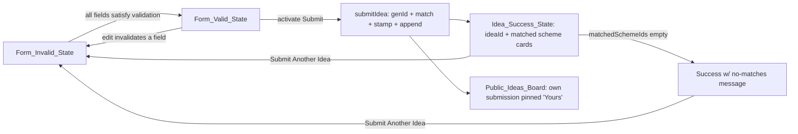
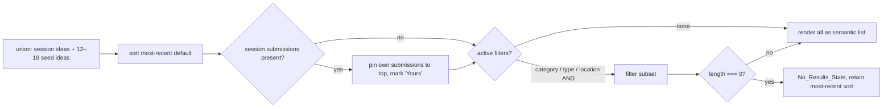

# Design Document — KITE Inclusion & Grassroots Layer (Prompt 6)

## Overview

The Inclusion & Grassroots Layer broadens participation in the Karnataka startup
ecosystem beyond the marketplace (Prompts 2–4) and the enablement layer
(Prompt 5). Where earlier prompts served founders, investors, incubators, and
mentors, Prompt 6 adds three public surfaces aimed at **under-represented and
non-marketplace participants** — women founders, CSR/NGO partners, and grassroots
innovators (citizens, students, farmers, researchers, rural innovators). It
replaces three existing `StubPage` placeholders (`/women`, `/csr`, `/ideas`) with
full institutional surfaces and adds the session-only state, pure data modules,
and additive types they require.

- **Women Founders Hub** (`/women`, mostly server) — a discovery and program
  surface reproducing the verified women-founder provisions of the Karnataka
  Startup Policy (25% women-led ELEVATE winners, the 51% founder-stake and 51%
  women-employee thresholds, the ₹5 crore Women-Led Accelerator grant over 5
  years, ELEVATE Unnati for SC/ST founders), a filterable women-relevant schemes
  list, illustrative founders and women mentors, resources, and get-involved
  pathways.
- **CSR & NGO Hub** (`/csr`, mostly server + one client island for the brief
  download) — a KDEM partnership memo: the CSR landscape, a CSR-aligned programs
  list, illustrative partnerships and NGO partners, illustrative impact metrics,
  a partnership pathway with a client-side `Blob` brief download, and resources.
- **Idea Bank** (`/ideas`, server shell + one client island) — a grassroots
  submission and discovery surface. Citizens submit ideas through a session-only
  form; each submission is assigned an `IDEA-YYYY-XXXXXX` identifier, matched to
  real Karnataka schemes by a deterministic engine, and surfaced on a public
  board alongside 12–18 deterministic seed ideas.

### How this layer complements Prompts 1–5

| Prompt | Layer | What Prompt 6 adds on top |
| --- | --- | --- |
| 1 | Foundation (home, chrome, nav, schemes data) | Reuses `SchemeRow`, `IllustrativeBadge`, `LazySection`, the 22-scheme `Scheme_Data`, nav/footer slots already present for the three routes |
| 2 | Registration & schemes & calculator | Idea Bank's "I am a Woman Founder" / submission CTAs route into `/register` and `/schemes`; matching engine points at the same canonical scheme ids |
| 3 | Dashboards | Reuses the hash-seeded `synthetic-prng` determinism discipline and the dynamic chart barrel (only if a CSR chart is added) |
| 4 | Investor Suite | `IdeaBankContext` mirrors `InvestorContext` exactly (provider + throwing hook + non-throwing optional hook + NOT-wired fallback); investor id-generator is the template for the idea id-generator |
| 5 | Ecosystem Enablement (mentors) | Extends `MentorProfile` additively with an illustrative-gender field so the Women Hub can surface illustrative women mentors from the existing `synthetic-mentors` directory |

The layer follows the operating discipline locked in Prompts 1–5: **frontend-only
and session-only**. No backend, no database, no API, no `fetch`/network, no
persistence (`localStorage`/`sessionStorage`/cookies/`indexedDB`); the only
permitted output is a client-side `Blob` download (the CSR brief). The new
`IdeaBankContext` holds submissions in in-memory React state that resets on
refresh. Verified Karnataka data is canonical and never fabricated; every
non-verified figure is synthetic, deterministic (hash-seeded via the existing
`synthetic-prng.ts`, never `Math.random`/`Date`/any ambient input), and visibly
labeled via the existing `IllustrativeBadge`. Type extensions are additive only.
Each route holds First Load JS ≤ 150KB and targets WCAG 2.1 AA.

The testable heart of this layer is its **pure logic**: the idea-id generator,
the idea→scheme matching engine, the four synthetic generators, the
illustrative-gender mentor extension, and the `IdeaBankContext` reducer-style
mutators. These are covered by property-based tests; the editorial/visual/nav
requirements are covered by example, smoke, and a11y tests.

## Architecture

### Route inventory

| Route | File | Rendering | Replaces |
| --- | --- | --- | --- |
| `/women` | `app/women/page.tsx` | Server shell; one small client island for the schemes filter | StubPage |
| `/csr` | `app/csr/page.tsx` | Server shell; one small client island for the schemes filter + brief download | StubPage |
| `/ideas` | `app/ideas/page.tsx` | Server shell; one client island (`IdeaBankClient`) for form + success + board | StubPage |

### Module and file map

```
src/
  data/
    schemes.ts                       ← REUSED (22 verified Scheme records, canonical)
    navigation.ts                    ← already exposes /women, /csr, /ideas (kept)
  context/
    InvestorContext.tsx              ← REUSED as the structural template
    IdeaBankContext.tsx              ← NEW session-only provider (mirrors InvestorContext)
  lib/
    synthetic-prng.ts                ← REUSED (seededRng/Int/Pick/Shuffle)
    investor-id-generator.ts         ← REUSED as the id-generator template
    idea-id-generator.ts             ← NEW pure IDEA-YYYY-XXXXXX generator
    idea-scheme-matching.ts          ← NEW pure matching engine (Req 4 rules + reasons)
    scheme-tagging.ts                ← NEW pure badge helper (Women Pref / CSR-Aligned / Grassroots)
    synthetic-women-founders.ts      ← NEW pure generator (exactly 6 founders)
    synthetic-csr-partnerships.ts    ← NEW pure generator (exactly 6 partnerships)
    synthetic-ngo-partners.ts        ← NEW pure generator (≥3 NGO partners)
    synthetic-ideas.ts               ← NEW pure generator (12–18 seed ideas)
    synthetic-csr-impact.ts          ← NEW pure generator (3 illustrative impact metrics)
    synthetic-mentors.ts             ← EDITED additively (+ illustrativeGender assignment)
    ideas-board-filters.ts           ← NEW pure board filter + sort
  components/
    investors/IllustrativeBadge.tsx  ← REUSED
    shared/SchemeRow.tsx             ← REUSED (table-row pattern; rendered in a Table)
    shared/LazySection.tsx           ← REUSED
    charts/index.ts                  ← REUSED barrel (only if a CSR chart is added)
    women/                           ← NEW Women Hub section components
    csr/                             ← NEW CSR Hub section components
    ideas/                           ← NEW Idea Bank section components (incl. client island)
  app/
    women/page.tsx                   ← Women_Hub (NEW, replaces stub)
    csr/page.tsx                     ← CSR_Hub (NEW, replaces stub)
    ideas/page.tsx                   ← Idea_Bank (NEW, replaces stub)
    layout.tsx                       ← EDITED additively (+ IdeaBankProvider, innermost)
  types/index.ts                     ← EDITED additively (inclusion-layer types)
```

### Data-flow

Four sources feed the routes: (1) **verified scheme data** rendered verbatim via
`SchemeRow` + badges, (2) **pure synthetic generators** seeded by stable string
keys, (3) the **`IdeaBankContext` in-memory state** holding session submissions,
and (4) the **pure matching engine** mapping a submission to real scheme ids.
Nothing crosses the network or touches storage.

```mermaid
flowchart TD
  subgraph Verified["Verified data (canonical, never fabricated)"]
    SCH[schemes.ts — 22 records]
    WSTAT[Women verified constants<br/>25% / 51% / 51% / ₹5cr / Unnati]
  end

  subgraph Pure["Pure libraries (no I/O, deterministic, hash-seeded)"]
    PRNG[synthetic-prng.ts]
    IDGEN[idea-id-generator.ts]
    MATCH[idea-scheme-matching.ts]
    TAG[scheme-tagging.ts]
    GWF[synthetic-women-founders.ts]
    GCSR[synthetic-csr-partnerships.ts]
    GNGO[synthetic-ngo-partners.ts]
    GIDEAS[synthetic-ideas.ts]
    GIMPACT[synthetic-csr-impact.ts]
    GMENT[synthetic-mentors.ts +gender]
    BFILT[ideas-board-filters.ts]
  end

  subgraph State["IdeaBankContext (session-only, in-memory)"]
    IDEAS[ideas: IdeaSubmission[]]
    MUT[submitIdea / updateIdeaStatus / removeIdea / getMatchedIdeas]
  end

  subgraph Routes
    RW[/women/]
    RC[/csr/]
    RI[/ideas/]
  end

  WSTAT --> RW
  SCH --> TAG --> RW
  GWF --> RW
  GMENT --> RW
  PRNG --> GMENT

  SCH --> TAG --> RC
  GCSR --> RC
  GNGO --> RC
  GIMPACT --> RC
  PRNG --> GCSR
  PRNG --> GNGO
  PRNG --> GIMPACT

  PRNG --> GWF
  PRNG --> GIDEAS
  GIDEAS --> BFILT --> RI
  IDEAS --> BFILT
  SCH --> TAG --> RI
  RI -->|submitIdea draft| MUT
  MUT --> IDGEN
  MUT --> MATCH
  SCH --> MATCH
  MUT --> IDEAS
```

### Idea submission flow (the client island state machine)



### Public board filter/sort flow



### `IdeaBankContext` provider wiring (additive)

`IdeaBankProvider` is added to `app/layout.tsx` as the **innermost** provider,
preserving the existing composition order (`LanguageProvider` →
`RegistrationProvider` → `InvestorProvider` → **`IdeaBankProvider`** →
`SiteChrome`/`main`/`Footer`). Nesting it innermost keeps the existing providers
untouched and means the Idea Bank state is available to the page tree without
altering any current consumer (Req 3.9, additive-only).

```tsx
// app/layout.tsx (additive change only)
<LanguageProvider>
  <RegistrationProvider>
    <InvestorProvider>
      <IdeaBankProvider>          {/* NEW — innermost, order preserved */}
        <SiteChrome />
        <main id="main" className="flex-1 pt-16">{children}</main>
        <Footer />
        <AIAssistantButton />
        <Toaster />
      </IdeaBankProvider>
    </InvestorProvider>
  </RegistrationProvider>
</LanguageProvider>
```

### Component trees

`src/components/women/` — Women_Hub (9 sections, server except the schemes filter island):

```
WomenHubPage (app/women/page.tsx, server)
├─ WomenHeroStrip                 (server)  py-12 bg-dark, 2 CTAs            (Req 7)
├─ WomenVerifiedStatsRow          (server)  5 verified stats, 25% emphasized (Req 8)
├─ WomenWhyKarnataka              (server)  3-column editorial               (Req 9)
├─ WomenSchemesList (client)      filterable SchemeRow table + "Women Preference" badges (Req 10)
│   └─ uses scheme-tagging.ts + ideas-board-style filter; no-results message
├─ WomenAcceleratorProgram        (server)  anchor target, Apply_CTA https   (Req 11)
├─ WomenFeaturedFounders          (server)  6 founder cards + IllustrativeBadge (Req 12)
├─ WomenMentors                   (server)  3 illustrative-women mentor cards + framing copy (Req 13)
├─ WomenResources                 (server)  3 resource cards                 (Req 14)
└─ WomenGetInvolved               (server)  2 cards                          (Req 15)
```

`src/components/csr/` — CSR_Hub (8 sections, server except the schemes filter + brief island):

```
CsrHubPage (app/csr/page.tsx, server)
├─ CsrHeroStrip                   (server)  py-12 bg-dark, 2 CTAs            (Req 16)
├─ CsrLandscape                   (server)  3-column editorial; CSR share = illustrative range (Req 17)
├─ CsrAlignedPrograms (client)    filterable SchemeRow table + "CSR-Aligned" badges (Req 18)
├─ CsrFeaturedPartnerships        (server)  6 partnership cards + IllustrativeBadge (Req 19)
├─ CsrNgoPartners                 (server)  ≥3 NGO cards, 3-col + IllustrativeBadge (Req 20)
├─ CsrImpactMetrics               (server)  3 large stat cards + IllustrativeBadge (Req 21)
├─ CsrHowToPartner (client)       3-step + mailto CTA + Blob brief download  (Req 22)
└─ CsrResources                   (server)  3 resource cards                 (Req 23)
```

`src/components/ideas/` — Idea_Bank (8 sections; `IdeaBankClient` is the client island):

```
IdeaBankPage (app/ideas/page.tsx, server shell)
├─ IdeaHeroStrip                  (server)  py-12 bg-dark, 2 CTAs            (Req 24)
├─ IdeaHowItWorks                 (server)  3-column explainer               (Req 25)
├─ IdeaCategoriesSpotlight (client) 8 cards 4×2; "Submit in This Category" pre-fills form (Req 30)
├─ IdeaBankClient (client island) ─ consumes useIdeaBank()                  (Req 26–29)
│   ├─ IdeaSubmissionForm         max-w-3xl, validated, aria-live errors    (Req 26, 27, 35)
│   ├─ IdeaSuccessState           green check + ideaId + matched cards / no-match msg (Req 28, 35.4)
│   └─ PublicIdeasBoard           union list, filters, sort, "Yours" pins   (Req 29, 35.5/35.6)
├─ IdeaFeaturedSchemes            (server)  SchemeRow for 4 grassroots ids + "Grassroots Friendly" (Req 31)
└─ IdeaResources                  (server)  3 resource cards                 (Req 32)
```

> The category spotlight pre-fill and the form/board live in the same client
> island so a "Submit in This Category" click can set the form's `ideaCategory`
> and scroll to the form anchor without crossing a server/client boundary. The
> spotlight is therefore part of the island (or shares a small client context);
> the surrounding hero, how-it-works, featured schemes, and resources stay
> server components.

### Design decisions and rationale

| Decision | Rationale | Requirements |
| --- | --- | --- |
| `IdeaBankContext` mirrors `InvestorContext` 1:1 (provider + `useIdeaBank` throwing + `useOptionalIdeaBank` non-throwing + `EMPTY_IDEA_BANK` fallback) | Proven session-only pattern; the optional hook lets the board/form render in isolation in component tests | 3.1–3.9 |
| `IdeaBankProvider` nested **innermost** in `layout.tsx` | Purely additive; existing providers and their consumers are untouched | 3.9 |
| Matching engine is a **pure, weighted-rule** module returning `{ schemeId, reason }[]` then projected to ids | Determinism + the why-it-matched reason for the success state come from one source of truth; ordering ("stronger ahead of weaker") falls out of weights | 4.1–4.13, 28.3 |
| Synthetic generators are pure hash-seeded `src/lib` modules with a determinism header | Mirrors `synthetic-mentors.ts`; byte-stable across reloads, no ambient input | 5.5–5.8 |
| `illustrativeGender` is **optional** on `MentorProfile`, assigned in the existing generator | Additive; the existing mentor directory and its tests stay valid; Women Hub filters on it | 6.1–6.4 |
| Scheme badges come from a **pure `scheme-tagging.ts`** mapping fixed real id sets to each badge | One documented, testable place for "which real scheme gets which badge"; founder judgment recorded in code | 10.2, 18.2, 31.2 |
| Board filtering/sorting is a **pure function** separate from React | Soundness/subset/AND + "own pinned first" + "most-recent default" are testable in isolation | 29.1–29.8 |
| Form validation is **plain React state** (no form library) | Form is the heaviest interactive surface; plain state keeps the route ≤150KB | 26, 34.1 |
| CSR impact uses **plain stat cards**, not a chart | Three headline numbers need no chart; avoids pulling Recharts into the bundle. A chart, if ever added, imports only via the barrel | 21.1, 34.2 |

## Components and Interfaces

### 1. `idea-id-generator.ts` (pure)

A near-copy of `investor-id-generator.ts`, swapping the `INV` prefix for `IDEA`
and reusing the same unambiguous 32-char alphabet (excludes `O`/`0`/`I`/`1`).

```ts
/** Unambiguous alphabet: A–Z + 2–9, EXCLUDING O, 0, I, 1. (32 chars) */
export const IDEA_ID_ALPHABET = 'ABCDEFGHJKLMNPQRSTUVWXYZ23456789';

/** Matches a well-formed idea id: IDEA-YYYY-XXXXXX. */
export const IDEA_ID_PATTERN =
  /^IDEA-\d{4}-[ABCDEFGHJKLMNPQRSTUVWXYZ23456789]{6}$/;

export type Rng = () => number;

/**
 * Deterministic given an injected `rng` and `year`. Each suffix char maps
 * rng() in [0,1) to a clamped alphabet index, so an out-of-range rng (e.g. 1
 * or NaN) cannot overflow (Req 2.5). Pure: no React, no I/O (Req 2.4).
 */
export function generateIdeaId(
  rng: Rng = Math.random,
  year: number = new Date().getFullYear(),
): string {
  const length = IDEA_ID_ALPHABET.length;
  let suffix = '';
  for (let i = 0; i < 6; i++) {
    const raw = Math.floor(rng() * length);
    const index = Math.min(Math.max(raw, 0), length - 1);
    suffix += IDEA_ID_ALPHABET[index];
  }
  return `IDEA-${year}-${suffix}`;
}
```

> The only clock read in the layer is the `submittedAt` ISO stamp and the default
> `year` argument inside `submitIdea` (a status stamp, not synthetic data) —
> mirroring how `InvestorContext.completeOnboarding` stamps `onboardedAt`. Tests
> inject a fixed `rng`/`year` for determinism (Req 2.3).

### 2. `idea-scheme-matching.ts` (pure matching engine)

Returns an ordered, de-duplicated, ≤5 array of **real** scheme ids, each backed
by a why-it-matched reason. Internally it builds weighted matches, then projects.

```ts
import type { IdeaSubmission, LocationKarnataka } from '@/types';
import { schemes } from '@/data/schemes';

/** Real scheme ids known to the engine — every one exists in schemes.ts. */
const VALID_SCHEME_IDS: ReadonlySet<string> = new Set(schemes.map((s) => s.id));

export interface SchemeMatch {
  schemeId: string;   // always ∈ VALID_SCHEME_IDS (Req 4.2)
  reason: string;     // why-it-matched, shown in Idea_Success_State (Req 28.3)
  weight: number;     // higher = stronger; drives ordering (Req 4.8, 4.10)
}

const MAX_MATCHES = 5;
const BENGALURU: ReadonlySet<LocationKarnataka> =
  new Set(['Bengaluru Urban', 'Bengaluru Rural']);

/** Bengaluru-located ideas are NOT "not in Bengaluru" (Req 4.5). */
export function isBengaluru(location: LocationKarnataka): boolean {
  return BENGALURU.has(location);
}

/**
 * Pure, deterministic, no I/O, no Math.random, no Date (Req 4.12). Builds the
 * candidate matches from the documented rules, de-dupes by id keeping the
 * highest weight, sorts by weight desc (stable for equal weights, preserving
 * rule insertion order), and caps at 5.
 */
export function matchIdeaToSchemesDetailed(idea: IdeaSubmission): SchemeMatch[] {
  const candidates: SchemeMatch[] = [];
  const add = (schemeId: string, reason: string, weight: number): void => {
    if (VALID_SCHEME_IDS.has(schemeId)) candidates.push({ schemeId, reason, weight });
  };

  const ruralNotBengaluru =
    idea.ideaCategory === 'Rural Development' && !isBengaluru(idea.location);
  const ruralStudent =
    idea.ideaCategory === 'Rural Development' && idea.innovatorType === 'Student';

  // --- Innovator-type strong signals (ordered ahead of weaker matches) ---
  if (idea.innovatorType === 'Rural Innovator') {
    add('grassroot-innovation', 'Dedicated support for grassroot and rural innovators.', 100); // Req 4.10
  }
  if (idea.innovatorType === 'Student') {
    add('nain-2', 'NAIN 2.0 funds student innovation teams across Karnataka colleges.', 90);    // Req 4.8
    if (idea.innovatorAge <= 30) {
      add('rgep', 'RGEP gives young individual innovators (≤30) a 12-month stipend.', 70);       // Req 4.9
    }
  }

  // --- Category signals ---
  if (idea.ideaCategory === 'AgriTech') {
    add('grassroot-innovation', 'Grassroot Innovation Support suits field-tested AgriTech ideas.', 60); // Req 4.4
    add('rd-project-grant', 'R&D Project Grant co-funds applied AgriTech research.', 55);               // Req 4.4
  }
  if (ruralNotBengaluru) {
    add('beyond-bengaluru-cluster-fund', 'Beyond Bengaluru Cluster Fund backs rural-development ideas outside Bengaluru.', 65); // Req 4.5
  }
  if (ruralStudent) {
    add('nain-2', 'NAIN 2.0 supports student-led rural-development projects.', 60); // Req 4.6
  }
  if (idea.ideaCategory === 'Rural Development' && !ruralNotBengaluru && !ruralStudent) {
    add('grassroot-innovation', 'Grassroot Innovation Support is the core rural-development pathway.', 60); // Req 4.7
  }

  // --- Broadly relevant baseline pathway for any submitted idea ---
  add('elevate', 'ELEVATE (Idea2PoC) is Karnataka’s flagship early-stage grant.', 20);

  // De-dupe by id keeping the highest-weight occurrence; preserve first reason
  // at that weight. Stable sort by weight desc; cap at MAX_MATCHES (Req 4.1, 4.3).
  const byId = new Map<string, SchemeMatch>();
  candidates.forEach((m, i) => {
    const prev = byId.get(m.schemeId);
    if (!prev || m.weight > prev.weight) byId.set(m.schemeId, { ...m, /* tie-break */ });
  });
  return [...byId.values()]
    .sort((a, b) => b.weight - a.weight)
    .slice(0, MAX_MATCHES);
}

/** Id-only projection used to populate IdeaSubmission.matchedSchemeIds (Req 3.4). */
export function matchIdeaToSchemes(idea: IdeaSubmission): string[] {
  return matchIdeaToSchemesDetailed(idea).map((m) => m.schemeId);
}
```

Rule coverage summary (the documented RELEVANCE rules of Req 4):

| Condition | Included scheme id(s) | Req |
| --- | --- | --- |
| `ideaCategory === 'AgriTech'` | `grassroot-innovation`, `rd-project-grant` | 4.4 |
| `Rural Development` AND not Bengaluru | `beyond-bengaluru-cluster-fund` | 4.5 |
| `Rural Development` AND `Student` | `nain-2` | 4.6 |
| `Rural Development` AND neither above | `grassroot-innovation` | 4.7 |
| `innovatorType === 'Student'` | `nain-2` (ahead of weaker) | 4.8 |
| `Student` AND `innovatorAge ≤ 30` | `rgep` | 4.9 |
| `innovatorType === 'Rural Innovator'` | `grassroot-innovation` (ahead of weaker) | 4.10 |
| any submission (baseline) | `elevate` (lowest weight; may be trimmed by the cap) | 4.13 |

Determinism (Req 4.11) holds because the function reads only its argument and the
static `schemes` import; the only non-determinism source — sort stability for
equal weights — is avoided by giving every rule a distinct weight, so equal
weights never collide for a single idea.

### 3. `scheme-tagging.ts` (pure badge helper)

A single documented place mapping fixed sets of **real** scheme ids to each
inclusion badge. Founder judgment is recorded here and is fully testable.

```ts
/** Schemes surfaced with a "Women Preference" badge on Women_Hub (Req 10.2). */
export const WOMEN_PREFERENCE_SCHEME_IDS: readonly string[] = [
  'elevate', 'elevate-unnati', 'kitven-fund-5', 'beyond-bengaluru-cluster-fund',
];

/** Schemes surfaced with a "CSR-Aligned" badge on CSR_Hub (Req 18.2, 18.3). */
export const CSR_ALIGNED_SCHEME_IDS: readonly string[] = [
  'grassroot-innovation', 'elevate-unnati', 'nain-2', 'rd-project-grant',
];

/** Schemes surfaced with a "Grassroots Friendly" badge on Idea_Bank (Req 31.1). */
export const GRASSROOTS_FRIENDLY_SCHEME_IDS: readonly string[] = [
  'grassroot-innovation', 'nain-2', 'rgep', 'rd-project-grant',
];

export type SchemeBadge = 'Women Preference' | 'CSR-Aligned' | 'Grassroots Friendly';

/** True iff `schemeId` carries `badge`. Every listed id exists in schemes.ts. */
export function hasSchemeBadge(schemeId: string, badge: SchemeBadge): boolean { /* … */ }
```

### 4. Synthetic generators (all pure, hash-seeded; determinism header per `synthetic-mentors.ts`)

```ts
// synthetic-women-founders.ts — exactly 6 records (Req 5.1)
const WOMEN_FOUNDERS_SEED = 'women-founders';
export function generateWomenFounders(): WomenFounderCard[] {
  return Array.from({ length: 6 }, (_u, i) => generateWomenFounder(`${WOMEN_FOUNDERS_SEED}|${i}`));
}
// fields: name, company, sector, stage, pitch (one line), initialsAvatar

// synthetic-csr-partnerships.ts — exactly 6 records (Req 5.2)
const CSR_PARTNERSHIPS_SEED = 'csr-partnerships';
export function generateCsrPartnerships(): CsrPartnership[] { /* 6 */ }
// fields: partnerName, partnerType ∈ PARTNER_TYPES, focusArea, scaleCrore, partnershipType

// synthetic-ngo-partners.ts — at least 3 records (Req 5.3)
const NGO_PARTNERS_SEED = 'ngo-partners';
export const NGO_PARTNER_COUNT = 4; // ≥3; fixed for byte-stability
export function generateNgoPartners(): NgoPartner[] { /* NGO_PARTNER_COUNT */ }
// fields: name, focus, geographicReach, partnershipType

// synthetic-ideas.ts — 12–18 seed IdeaSubmission records (Req 5.4)
const IDEAS_COUNT_SEED = 'seed-ideas|count';
const IDEAS_SEED = 'seed-ideas';
export function getSeedIdeaCount(): number {           // deterministic in [12,18]
  return seededInt(seededRng(IDEAS_COUNT_SEED), 12, 18);
}
export function generateSeedIdeas(): IdeaSubmission[] {
  return Array.from({ length: getSeedIdeaCount() },
    (_u, i) => generateSeedIdea(`${IDEAS_SEED}|${i}`));
}
// each seed idea is a fully-populated IdeaSubmission: deterministic ideaId via
// generateIdeaId(seededRng(key), FIXED_SEED_YEAR), matchedSchemeIds via
// matchIdeaToSchemes(), status 'submitted', deterministic submittedAt offset
// computed from a FIXED base constant (NOT Date.now) so timestamps are stable.

// synthetic-csr-impact.ts — exactly 3 metrics (Req 21.1, 21.2)
const CSR_IMPACT_SEED = 'csr-impact';
export function generateCsrImpactMetrics(): CsrImpactMetric[] { /* 3 */ }
// totalCsrCapitalCrore, startupsSupported, beneficiariesReached
```

All generators import only `synthetic-prng` helpers and (where they reference
schemes) the canonical `schemes` ids — never `Math.random`, `Date`, `Date.now`,
or `performance.now` (Req 5.6, 21.2). `generateSeedIdea` derives `submittedAt`
from a fixed base epoch constant plus a seeded offset, keeping the board's
relative timestamps deterministic and reload-stable (Req 5.7).

### 5. `synthetic-mentors.ts` — additive `illustrativeGender` (Req 6)

The existing generator gains one assignment inside `generateMentor`, drawn from
the same per-mentor seeded stream so the directory stays byte-stable:

```ts
// Deterministic 35–40% women distribution (Req 6.2, 6.3). Using a [0,1) draw
// with a 0.375 threshold yields ~37.5% women across the 24–30 directory.
const WOMEN_GENDER_THRESHOLD = 0.375;
const genderDraw = rng();
const illustrativeGender: IllustrativeGender =
  genderDraw < WOMEN_GENDER_THRESHOLD ? 'woman' : 'man';
// …added to the returned MentorProfile as `illustrativeGender`.
```

Women_Hub filters the directory to `illustrativeGender === 'woman'` and takes the
first 3 (Req 13.1), framing the section with copy stating the labeling is
illustrative and not a definitive demographic classification (Req 6.5, 13.3,
35.7).

### 6. `IdeaBankContext.tsx` (session-only provider, mirrors `InvestorContext`)

```ts
"use client";
// In-memory React state ONLY — no localStorage/sessionStorage/cookies/
// indexedDB/fetch/I/O. `ideas` initializes to [] and resets on refresh
// (Req 3.1–3.3). A direct structural mirror of InvestorContext: same
// functional-setState discipline, same throwing + non-throwing hook pair.

interface IdeaBankState { ideas: IdeaSubmission[]; }
const INITIAL_STATE: IdeaBankState = { ideas: [] };

export function IdeaBankProvider({ children }: { children: ReactNode }): JSX.Element {
  const [state, setState] = useState<IdeaBankState>(INITIAL_STATE);

  // Build the completed submission from a draft (Req 3.4): generate id, run the
  // matching engine, stamp submittedAt (ISO), set status 'submitted', append.
  const submitIdea = useCallback((draft: IdeaSubmissionDraft): IdeaSubmission => {
    const ideaId = generateIdeaId();                  // IDEA-YYYY-XXXXXX
    const base: IdeaSubmission = {
      ...draft,
      id: ideaId,                                      // session key == ideaId
      ideaId,
      status: 'submitted',
      submittedAt: new Date().toISOString(),           // status stamp, not synthetic
      matchedSchemeIds: [],
    };
    const matchedSchemeIds = matchIdeaToSchemes(base); // populate matches (Req 3.4)
    const completed: IdeaSubmission = { ...base, matchedSchemeIds };
    setState((c) => ({ ideas: [...c.ideas, completed] }));
    return completed;                                  // island shows success immediately
  }, []);

  // Change ONLY the matching idea's status; preserve all others (Req 3.5).
  const updateIdeaStatus = useCallback((id: string, status: IdeaStatus): void => {
    setState((c) => ({
      ideas: c.ideas.map((it) => (it.ideaId === id ? { ...it, status } : it)),
    }));
  }, []);

  // Remove ONLY the matching idea (Req 3.6).
  const removeIdea = useCallback((id: string): void => {
    setState((c) => ({ ideas: c.ideas.filter((it) => it.ideaId !== id) }));
  }, []);

  // Derived: session ideas with ≥1 matched scheme id (Req 3.7).
  const getMatchedIdeas = useCallback(
    (): IdeaSubmission[] => state.ideas.filter((it) => it.matchedSchemeIds.length > 0),
    [state.ideas],
  );

  const value = useMemo<IdeaBankContextValue>(
    () => ({ ideas: state.ideas, submitIdea, updateIdeaStatus, removeIdea, getMatchedIdeas }),
    [state.ideas, submitIdea, updateIdeaStatus, removeIdea, getMatchedIdeas],
  );
  return <IdeaBankContext.Provider value={value}>{children}</IdeaBankContext.Provider>;
}

export function useIdeaBank(): IdeaBankContextValue {
  const ctx = useContext(IdeaBankContext);
  if (ctx === undefined) throw new Error('useIdeaBank must be used within an IdeaBankProvider');
  return ctx;
}

/** NOT-wired fallback: empty ideas + no-op mutators (Req 3.8), mirroring
 *  NOT_ONBOARDED_FALLBACK. getMatchedIdeas returns []. */
const EMPTY_IDEA_BANK: IdeaBankContextValue = {
  ideas: [],
  submitIdea: () => /* no-op draft echo */ ({ /* … */ } as IdeaSubmission),
  updateIdeaStatus: () => {},
  removeIdea: () => {},
  getMatchedIdeas: () => [],
};
export function useOptionalIdeaBank(): IdeaBankContextValue {
  return useContext(IdeaBankContext) ?? EMPTY_IDEA_BANK;
}
```

### 7. `ideas-board-filters.ts` (pure board filter + sort)

```ts
export interface IdeaBoardFilters {
  category: IdeaCategory | null;     // null = inactive
  innovatorType: InnovatorType | null;
  location: LocationKarnataka | null;
}
export const EMPTY_IDEA_BOARD_FILTERS: IdeaBoardFilters =
  { category: null, innovatorType: null, location: null };

/** Sound, AND-composed, subset-preserving filter (Req 29.6). */
export function filterIdeas(ideas: readonly IdeaSubmission[], f: IdeaBoardFilters): IdeaSubmission[] {
  return ideas.filter((it) =>
    (f.category === null || it.ideaCategory === f.category) &&
    (f.innovatorType === null || it.innovatorType === f.innovatorType) &&
    (f.location === null || it.location === f.location));
}

/** Most-recent-first by submittedAt (Req 29.5). Stable, pure. */
export function sortByMostRecent(ideas: readonly IdeaSubmission[]): IdeaSubmission[] { /* … */ }

/**
 * Board ordering: session submissions pinned to the top (each marked "Yours"
 * by the consumer), then the rest, each group most-recent-first (Req 29.8).
 */
export function orderBoardIdeas(
  sessionIds: ReadonlySet<string>,
  ideas: readonly IdeaSubmission[],
): IdeaSubmission[] { /* partition by sessionIds, sort each by most-recent, concat */ }
```

### 8. `SchemeRow` reuse

`SchemeRow` (`src/components/shared/SchemeRow.tsx`) is a presentational
**table-row** Server Component taking a single `scheme: Scheme` prop and
rendering name/benefit/duration/eligibility + a "Learn more" link to
`/schemes#{id}`. The three scheme lists (Women, CSR, Idea Bank featured) render
their rows inside a `<Table>` (`@/components/ui/table`) and place the inclusion
badge (`Women Preference` / `CSR-Aligned` / `Grassroots Friendly`) adjacent to
each row via a thin wrapper, leaving `SchemeRow`'s own props unchanged (additive
reuse, not a fork).

## Data Models

All shapes below are **appended** to `src/types/index.ts` after the Ecosystem
Enablement block; no existing export is altered or removed (Req 1.8, 6.1), and
all compile under `strict` + `noUncheckedIndexedAccess`. The existing
`LocationKarnataka` union and `MentorProfile` interface are reused; `MentorProfile`
gains one optional field.

```ts
// ===========================================================================
// KITE Inclusion & Grassroots (Prompt 6) — additive types only.
// Reuses existing LocationKarnataka and Scheme. No existing export changed.
// ===========================================================================

// --- Idea enumerations (Req 1.4, 1.5, 1.6) ---
export type InnovatorType =
  | 'Citizen' | 'Student' | 'Farmer' | 'Researcher' | 'Rural Innovator';

export const INNOVATOR_TYPES: readonly InnovatorType[] =
  ['Citizen', 'Student', 'Farmer', 'Researcher', 'Rural Innovator'];

export type IdeaCategory =
  | 'AgriTech' | 'HealthTech' | 'ClimateTech' | 'EdTech' | 'FinTech'
  | 'Rural Development' | 'Manufacturing' | 'Other Social Impact';

export const IDEA_CATEGORIES: readonly IdeaCategory[] = [
  'AgriTech', 'HealthTech', 'ClimateTech', 'EdTech', 'FinTech',
  'Rural Development', 'Manufacturing', 'Other Social Impact',
];

/** Lifecycle status; includes 'submitted' (Req 1.6). */
export type IdeaStatus = 'submitted' | 'matched' | 'archived';

// --- Idea submission (Req 1.1–1.3) — all 15 fields ---
export interface IdeaSubmission {
  id: string;                  // session record key (equals ideaId)
  innovatorName: string;
  innovatorEmail: string;
  innovatorAge: number;        // numeric (Req 26.6)
  innovatorType: InnovatorType;
  ideaTitle: string;
  ideaCategory: IdeaCategory;
  ideaSummary: string;
  problemStatement: string;
  proposedSolution: string;
  location: LocationKarnataka; // existing union (Req 1.2)
  submittedAt: string;         // ISO 8601 (Req 1.3)
  status: IdeaStatus;
  matchedSchemeIds: string[];  // real scheme ids (Req 1.3)
  ideaId: string;              // IDEA-YYYY-XXXXXX
}

/** The draft a consumer passes to submitIdea — the engine/context fills the
 *  rest (id, ideaId, submittedAt, status, matchedSchemeIds). */
export type IdeaSubmissionDraft = Omit<
  IdeaSubmission, 'id' | 'ideaId' | 'submittedAt' | 'status' | 'matchedSchemeIds'
>;

// --- Idea Bank context contract (Req 1.7, 3) ---
export interface IdeaBankContextValue {
  ideas: IdeaSubmission[];
  submitIdea: (draft: IdeaSubmissionDraft) => IdeaSubmission;
  updateIdeaStatus: (ideaId: string, status: IdeaStatus) => void;
  removeIdea: (ideaId: string) => void;
  getMatchedIdeas: () => IdeaSubmission[];
}

// --- Illustrative mentor gender extension (Req 6) ---
/** Clearly-illustrative mentor label; NOT a definitive demographic
 *  classification. `undefined` for mentors generated before the extension. */
export type IllustrativeGender = 'woman' | 'man' | undefined;

// NOTE: MentorProfile gains ONE optional field (additive; Req 6.1):
//   illustrativeGender?: IllustrativeGender;
// The existing MentorProfile interface is edited in place to add only this
// optional member — no existing field is made required or removed.

// --- Synthetic card shapes (Req 5) ---
export interface WomenFounderCard {
  id: string;
  name: string;
  company: string;
  sector: string;
  stage: string;
  pitch: string;            // one-line
  initialsAvatar: string;   // 1–2 uppercase letters, never a photo
}

export type CsrPartnerType =
  | 'Corporate Foundation' | 'Family Office' | 'Public Sector Undertaking' | 'NGO Partner';

export const CSR_PARTNER_TYPES: readonly CsrPartnerType[] =
  ['Corporate Foundation', 'Family Office', 'Public Sector Undertaking', 'NGO Partner'];

export interface CsrPartnership {
  id: string;
  partnerName: string;
  partnerType: CsrPartnerType;
  focusArea: string;
  scaleCrore: number;        // partnership scale in ₹ crore
  partnershipType: string;
}

export interface NgoPartner {
  id: string;
  name: string;
  focus: string;
  geographicReach: string;
  partnershipType: string;
}

export interface CsrImpactMetric {
  id: string;
  label: string;             // e.g. "Total CSR Capital", "Startups Supported"
  value: number;
  unit: 'crore' | 'startups' | 'beneficiaries';
}

// --- Board filter state (Req 29.4) ---
export interface IdeaBoardFilters {
  category: IdeaCategory | null;
  innovatorType: InnovatorType | null;
  location: LocationKarnataka | null;
}
```

## Correctness Properties

*A property is a characteristic or behavior that should hold true across all
valid executions of a system — essentially, a formal statement about what the
system should do. Properties serve as the bridge between human-readable
specifications and machine-verifiable correctness guarantees.*

This layer is well suited to property-based testing because its core logic is a
set of **pure functions and reducer-style mutators**: the idea-id generator, the
idea→scheme matching engine, the four synthetic generators, the additive
mentor-gender assignment, the `IdeaBankContext` mutators, the board filter/sort,
the summary truncation, the scheme-tagging helper, and the form validator. The
editorial/visual/navigation/no-IO/accessibility requirements are verified by
example, smoke, perf, and a11y tests (see Testing Strategy). Each property below
is tested with `fast-check` at `{ numRuns: 100 }` and tagged in code with a
`// Feature: kite-inclusion-grassroots` comment naming the property number and
text. The prework's redundant criteria have been consolidated (e.g. the engine's
bound/validity/no-dup criteria collapse into one output-validity property; the
seven conditional rules collapse into one parameterized rule-coverage property).

### Property 1: Idea id is always well-formed

*For any* sequence of `rng()` values — including values outside `[0, 1)` such as
`1`, negatives, and `NaN` — and *any* four-digit year, `generateIdeaId` returns a
string matching `IDEA-YYYY-XXXXXX` whose six suffix characters are all drawn from
`IDEA_ID_ALPHABET` and never include the ambiguous characters `O`, `0`, `I`, or
`1`.

**Validates: Requirements 2.1, 2.2, 2.5**

### Property 2: Idea id generation is deterministic

*For any* fixed `rng` seed and year, calling `generateIdeaId` twice with the same
inputs produces the identical id.

**Validates: Requirements 2.3**

### Property 3: Matching engine returns a valid id set

*For any* `IdeaSubmission`, `matchIdeaToSchemes` returns an ordered array of at
most 5 scheme ids that all exist in `Scheme_Data`, with no duplicates; and every
entry of `matchIdeaToSchemesDetailed` carries a non-empty why-it-matched reason.

**Validates: Requirements 4.1, 4.2, 4.3, 4.13, 28.3**

### Property 4: Matching engine rule coverage and ordering

*For any* `IdeaSubmission`, the documented relevance rules hold: an `AgriTech`
idea includes both `grassroot-innovation` and `rd-project-grant`; a
`Rural Development` idea located outside Bengaluru includes
`beyond-bengaluru-cluster-fund`; a `Rural Development` `Student` idea includes
`nain-2`; a `Rural Development` idea that is neither outside-Bengaluru nor a
Student includes `grassroot-innovation`; a `Student` idea includes `nain-2`
ordered ahead of any weaker match; a `Student` idea with `innovatorAge ≤ 30`
includes `rgep`; and a `Rural Innovator` idea includes `grassroot-innovation`
ordered ahead of any weaker match.

**Validates: Requirements 4.4, 4.5, 4.6, 4.7, 4.8, 4.9, 4.10**

### Property 5: Matching engine is deterministic

*For any* two `IdeaSubmission` inputs that are deep-equal, `matchIdeaToSchemes`
returns identical ordered arrays.

**Validates: Requirements 4.11**

### Property 6: Synthetic generators produce correctly-sized, well-formed records

*For any* execution, `generateWomenFounders` returns exactly 6 founder cards each
with non-empty name, company, sector, stage, pitch, and initials avatar;
`generateCsrPartnerships` returns exactly 6 partnerships each with a
`partnerType` drawn from the four canonical `CsrPartnerType` values and a
non-empty focus area, a numeric `scaleCrore`, and a partnership type;
`generateNgoPartners` returns at least 3 NGO cards each with name, focus,
geographic reach, and partnership type; and `generateSeedIdeas` returns between 12
and 18 fully-populated `IdeaSubmission` records inclusive, each with a well-formed
`ideaId`, a valid `matchedSchemeIds` array containing only real scheme ids, and
all board-rendered fields present.

**Validates: Requirements 5.1, 5.2, 5.3, 5.4, 5.8**

### Property 7: Synthetic generation is deterministic and ambient-free

*For any* of the synthetic generators (`generateWomenFounders`,
`generateCsrPartnerships`, `generateNgoPartners`, `generateSeedIdeas`,
`generateCsrImpactMetrics`, `generateMentors`), invoking it two or more times
returns deep-equal output, with no dependence on `Math.random`, `Date`,
`Date.now`, `performance.now`, locale, or any other ambient input.

**Validates: Requirements 5.5, 5.6, 5.7, 6.3, 21.2**

### Property 8: Illustrative mentor gender is deterministic and within the women band

*For any* execution, `generateMentors` assigns `illustrativeGender` to every
profile deterministically (deep-equal across calls), and the fraction of the
realized directory marked `'woman'` lies within the inclusive band `[0.35, 0.40]`.

**Validates: Requirements 6.2, 6.3**

### Property 9: submitIdea appends one completed, matched, stamped submission

*For any* `ideas` state and *any* `IdeaSubmissionDraft`, `submitIdea` returns and
appends exactly one record whose `ideaId` matches `IDEA-YYYY-XXXXXX`, whose
`status` is `submitted`, whose `submittedAt` is an ISO 8601 string, and whose
`matchedSchemeIds` equals `matchIdeaToSchemes` of that submission; the resulting
`ideas` length is the prior length plus one and every pre-existing idea is
preserved unchanged.

**Validates: Requirements 3.4, 27.2, 27.3**

### Property 10: updateIdeaStatus changes only the target

*For any* `ideas` state and *any* existing idea id with a new `IdeaStatus`,
`updateIdeaStatus` changes only the matching idea's `status`, leaves the list
length unchanged, and preserves every other idea unchanged.

**Validates: Requirements 3.5**

### Property 11: removeIdea removes only the target

*For any* `ideas` state and *any* existing idea id, `removeIdea` produces a list
of length one less that omits exactly the matching idea and preserves every other
idea unchanged.

**Validates: Requirements 3.6**

### Property 12: getMatchedIdeas returns exactly the ideas with matches

*For any* `ideas` state, `getMatchedIdeas` returns exactly the subset of ideas
whose `matchedSchemeIds` is non-empty, preserving order.

**Validates: Requirements 3.7**

### Property 13: Board filtering is sound, AND-composed, and subset-preserving

*For any* idea collection and *any* `IdeaBoardFilters`, every idea in `filterIdeas`
output satisfies every active filter (category equality, innovator-type equality,
location equality); the result is a subset of the input with no fabricated or
duplicated records; when more than one filter is active the result is the logical
AND of all of them; and applying the empty filter set returns the full input.

**Validates: Requirements 29.6, 10.3, 18.5**

### Property 14: Board ordering pins session submissions and is most-recent within groups

*For any* idea collection and *any* set of session ids, `orderBoardIdeas` returns
a permutation of the input in which every session-submitted idea precedes every
non-session idea, and within each group ideas are ordered most-recent-first by
`submittedAt`; when the session-id set is empty the result is the whole collection
sorted most-recent-first.

**Validates: Requirements 29.5, 29.8**

### Property 15: Summary truncation never exceeds the display bound

*For any* summary string, the board's truncated summary has at most 150 visible
characters, equals the original when the original is at most 150 characters, and
otherwise is a prefix of the original (followed by an ellipsis indicator).

**Validates: Requirements 29.2**

### Property 16: Scheme tagging is sound and references only real schemes

*For any* scheme id and *any* badge, `hasSchemeBadge` returns true exactly when
the id is a member of that badge's documented id set; and every id in
`WOMEN_PREFERENCE_SCHEME_IDS`, `CSR_ALIGNED_SCHEME_IDS`, and
`GRASSROOTS_FRIENDLY_SCHEME_IDS` exists in `Scheme_Data` (and none equals
`rural-innovation-center`).

**Validates: Requirements 10.2, 10.6, 18.2, 18.4, 31.2, 31.3, 38.2**

### Property 17: Form validation is sound

*For any* candidate form values, the pure validator reports the form valid if and
only if every constraint is satisfied — `innovatorName`, `innovatorEmail`, and a
numeric `innovatorAge` are present; `ideaTitle` has at least 5 characters;
`ideaSummary` has 50–500 characters inclusive; `problemStatement` and
`proposedSolution` each have 50–1000 characters inclusive; and `innovatorType`,
`ideaCategory`, and `location` are set — and the submit-enabled flag equals the
validity result.

**Validates: Requirements 26.6, 26.7, 26.8, 26.9, 26.10, 26.11, 26.12**

## Error Handling

The layer is frontend-only with no network or storage, so error handling is about
**defensive purity and graceful degradation**, not I/O recovery.

- **Idea-id totality** — `generateIdeaId` clamps each derived index into the
  alphabet range, so an out-of-range `rng()` (1, negative, `NaN`) never overflows
  or produces an invalid character (Req 2.5).
- **Matching-engine totality** — the engine reads only its argument and the
  static `schemes` import, guards every `add` against the real-id set, and always
  returns a valid `≤5`, de-duplicated array; an idea that fires no specific rule
  still receives the baseline `elevate` match, and even if that were removed the
  return is a valid (possibly empty) id array (Req 4.13).
- **Zero-match success state** — when `matchedSchemeIds` is empty, the
  `IdeaSuccessState` still renders the `ideaId`, the "Apply to Recommended
  Schemes" and "Submit Another Idea" CTAs, and a no-matches message in place of
  the scheme cards (Req 28.5).
- **Empty board filter results** — when active filters match no ideas, the board
  renders a no-results message and retains the most-recent default sort rather
  than a blank list (Req 29.7); the pure `filterIdeas` is total for any filter
  combination (all-null included).
- **Unknown idea id no-op** — `updateIdeaStatus`/`removeIdea` map/filter over the
  `ideas` array, so an id that matches no record leaves the state unchanged
  (a no-op), never throwing (Req 3.5, 3.6).
- **`useOptionalIdeaBank` fallback** — consumers rendered outside an
  `IdeaBankProvider` (e.g. isolated component tests) receive `EMPTY_IDEA_BANK`:
  empty `ideas`, no-op mutators, and `getMatchedIdeas()` returning `[]` — never a
  thrown error (Req 3.8). `useIdeaBank` still throws, preserving the strict
  in-app contract.
- **`noUncheckedIndexedAccess` safety** — every indexed access in the generators
  and reducers is guarded (the seeded helpers already clamp indices), so the
  modules compile and run total under strict settings.
- **No-IO guarantee** — no `fetch`/storage calls exist to fail; the CSR brief is
  the only output and is produced from an in-memory `Blob` (Req 33.4). The no-IO
  smoke test enforces the absence of network/storage APIs.

## Testing Strategy

### Dual approach

- **Property tests** (`fast-check`, `numRuns: 100`) verify the 17 universal
  properties above against the pure modules (id generator, matching engine, four
  synthetic generators, mentor-gender assignment, the four context mutators, board
  filter/order, summary truncation, scheme tagging, form validator).
- **Unit / component tests** verify concrete examples, edge cases, rendering,
  badges, copy, labels, links, and a11y (the EXAMPLE / EDGE_CASE items from the
  prework) — hero strips, editorial sections, resources, get-involved, success
  state, category spotlight, and verified-constant verbatim rendering.
- **Integration / e2e tests** verify the submission flow end-to-end (fill form →
  enable submit → submit → success with id + matches → submit another → board
  shows the pinned "Yours" submission) and the filter→board recompute.

Property tests are tagged in code with a `// Feature: kite-inclusion-grassroots`
comment naming the property number and text. Unit tests stay lean — property
tests carry the broad input coverage; unit tests focus on specific examples,
integration points, and edge cases. Generators reuse canonical data where shape
matters (the 22 scheme ids, `INNOVATOR_TYPES`, `IDEA_CATEGORIES`,
`CSR_PARTNER_TYPES`, `LocationKarnataka` values) and randomize the rest,
exercising boundaries (age 30/31, summary 49/50/500/501, problem/solution
49/50/1000/1001, empty datasets, all-null and fully-active filters, zero-result
combinations, Bengaluru vs non-Bengaluru locations).

### Test architecture

| Test file (under `src/lib/__tests__`, `src/context/__tests__`, `src/components/**/__tests__`, or `src/app/__tests__`) | Type | Covers (Properties / Reqs) |
| --- | --- | --- |
| `idea-id-generator.pbt.test.ts` | PBT ×100 | P1, P2 (well-formed under out-of-range rng; determinism) — Req 2.1–2.3, 2.5 |
| `idea-scheme-matching.pbt.test.ts` | PBT ×100 | P3, P4, P5 (valid id set + reasons; rule coverage + ordering; determinism) — Req 4 |
| `synthetic-women-founders.pbt.test.ts` | PBT ×100 | P6, P7 (6 founders, well-formed; determinism) — Req 5.1, 5.5–5.7 |
| `synthetic-csr-partnerships.pbt.test.ts` | PBT ×100 | P6, P7 (6 partnerships, partnerType domain; determinism) — Req 5.2, 5.5–5.7 |
| `synthetic-ngo-partners.pbt.test.ts` | PBT ×100 | P6, P7 (≥3 NGO, well-formed; determinism) — Req 5.3, 5.5–5.7 |
| `synthetic-ideas.pbt.test.ts` | PBT ×100 | P6, P7 (12–18 seed ideas, valid matched ids; determinism) — Req 5.4–5.8 |
| `synthetic-csr-impact.pbt.test.ts` | PBT ×100 | P7 (3 metrics, deterministic, no ambient input) — Req 21.1, 21.2 |
| `synthetic-mentors-gender.pbt.test.ts` | PBT ×100 | P7, P8 (determinism; 35–40% women fraction on realized directory) — Req 6.2, 6.3 |
| `idea-bank-context.pbt.test.tsx` | PBT ×100 | P9, P10, P11, P12 (submit append/match/stamp; update-only-target; remove-only-target; getMatchedIdeas subset) — Req 3.4–3.7 |
| `ideas-board-filters.pbt.test.ts` | PBT ×100 | P13, P14, P15 (filter soundness/AND/subset/clear-all; board ordering/pin/most-recent; truncation) — Req 29.2, 29.5, 29.6, 29.8 |
| `scheme-tagging.pbt.test.ts` | PBT ×100 | P16 (badge soundness; only real ids; no rural-innovation-center) — Req 10.2/10.6, 18.2/18.4, 31.2/31.3, 38.2 |
| `idea-form-validation.pbt.test.ts` | PBT ×100 | P17 (validation soundness + submit-enabled mapping; boundary edge cases) — Req 26.6–26.12 |
| `idea-bank-context.test.tsx` | component | mount → empty; remount → reset; useOptionalIdeaBank fallback (empty + no-ops); useIdeaBank throws outside provider — Req 3.1–3.3, 3.8 |
| `WomenHub.test.tsx` | component | replaces stub; hero (py-12 bg-dark, 25% + accelerator, 2 CTAs); 5 verified stats verbatim + no badge + 25% emphasis; why-Karnataka 3 cols; 6 founders + badge; 3 women mentors + framing + link; accelerator anchor/eligibility/Apply https/₹5cr; resources; get-involved — Req 7–15, 36.7, 38.1/38.5 |
| `WomenSchemesList.test.tsx` | component | SchemeRow rows; Women Preference badges; filter shows only matching; zero-match no-results; "See All 22 Schemes" link — Req 10 |
| `CsrHub.test.tsx` | component | replaces stub; hero; landscape 3 cols + illustrative range; 6 partnerships + badge; ≥3 NGO + badge; 3 impact metrics + badge; how-to-partner 3 steps + mailto; resources — Req 16–23 |
| `CsrAlignedPrograms.test.tsx` | component | CSR-Aligned badges; includes the four required ids; filter only matching; zero-match no-results — Req 18 |
| `CsrPartnershipBrief.test.tsx` | component | "Download CSR Partnership Brief" triggers a client-side `Blob` download via `URL.createObjectURL`, no `fetch` — Req 22.3, 33.4 |
| `IdeaBank.test.tsx` | component | replaces stub; hero; how-it-works; categories spotlight 8 cards 4×2 + pre-fill; featured grassroots schemes + badge; resources — Req 24, 25, 30, 31, 32 |
| `IdeaSubmissionForm.test.tsx` | component | single-col max-w-3xl; all fields; radio group options; category/location dropdowns; submit disabled when invalid / enabled when valid; aria-live errors; aria-disabled submit — Req 26, 35.1–35.3 |
| `IdeaSuccessState.test.tsx` | component | green check + headline + ideaId; Copy ID; matched cards (name/reason/max benefit/View Scheme); zero-match message; Apply + Submit Another; aria-live announcing id + match count; Submit Another returns to form — Req 27.4, 28, 35.4 |
| `PublicIdeasBoard.test.tsx` | component | union list (semantic `<ul>`); card fields incl. truncated summary + Read More; IllustrativeBadge on seed ideas; filters; default most-recent; "Yours" pin; zero-match no-results — Req 29, 35.5 |
| `inclusion.e2e.test.tsx` | e2e | fill form → enable → submit → success (id + matches) → submit another → board shows pinned "Yours"; category spotlight pre-fill → form; scheme-list filter → recompute — Req 26–30 |
| `inclusion-a11y.test.tsx` | a11y (axe) | heading order; form labels+descriptions; aria-live error + success regions; aria-disabled submit; semantic board list; keyboard filters; mentor illustrative-gender framing — Req 35 |
| `inclusion-responsive.test.tsx` | responsive | hero strips, 3-col editorials, card grids, form, board, category 4×2 grid at mobile/tablet/desktop — Req 36 |
| `inclusion-perf.test.tsx` | static-graph perf | First Load JS ≤150KB per route; no eager chart/heavy dep; form island is plain React state — Req 34.1, 34.2 |
| `inclusion-no-io.smoke.test.ts` | smoke | no fetch/localStorage/sessionStorage/cookie/indexedDB in the three routes, context, and libs; generators + engine + id generator use no Math.random/Date; CSR brief uses Blob (no network); the literal `rural-innovation-center` appears nowhere — Req 33, 4.12, 5.6, 38.2 |
| `navigation-inclusion.test.ts` | unit | nav exposes `/women` + `/csr` under For Stakeholders and `/ideas` under Connect; footer adds the three; no existing entry removed — Req 37 |
| `inclusion-visual.test.ts` | smoke (source scan) | no gradient/blob/emoji/glassmorphism/glow classes; no `text-h4`; cards use rounded-xl/shadow-sm/border; sections py-16 md:py-24; header strips py-8/py-12; max-w-7xl — Req 36 |
| `inclusion-types.test-d.ts` | type (tsc) | new types compile; `MentorProfile.illustrativeGender` optional; existing exports unchanged — Req 1, 6.1 |

### Property-test configuration

- Library: `fast-check` (already a dependency; used by existing PBTs such as
  `synthetic-mentors.pbt.test.ts`).
- `numRuns: 100` minimum per property test.
- Each property test references its design property number in a tag comment of
  the form `// Feature: kite-inclusion-grassroots, Property N: <text>`.
- Generators reuse canonical `schemes` ids, `INNOVATOR_TYPES`, `IDEA_CATEGORIES`,
  `CSR_PARTNER_TYPES`, and `LocationKarnataka` values, and randomize numeric/
  string fields including edge cases (age 30/31; summary 49/50/500/501; problem/
  solution boundaries; Bengaluru vs non-Bengaluru; empty datasets; all-null and
  fully-active filters; zero-result combinations) so soundness, coverage,
  ordering, and validation properties are exercised at their boundaries.

## Bundle and Performance Strategy

Each route holds **First Load JS ≤ 150KB** (Req 34.1), mirroring the Prompt 3–5
page composition.

- **Form is the heaviest interactive surface** — the Idea Bank form, success
  state, and board live in one client island (`IdeaBankClient`) built on **plain
  React state** (`useState`/`useReducer`) with **no form library** and no heavy
  dependencies, keeping the island small.
- **Server-first composition** — every hero, editorial, resources, get-involved,
  featured-founders/partnerships/NGO, impact-metrics, and featured-schemes
  section is a Server Component; only the scheme-list filters, the CSR brief
  download, and the Idea Bank form/board are client islands.
- **CSR impact metrics use plain stat cards**, not a chart — three headline
  numbers need no charting library. **If** a chart is ever added to CSR_Hub it
  MUST import through `src/components/charts/index.ts` (which re-exports via
  `next/dynamic`, `ssr: false`), so Recharts never enters any route's initial
  bundle (Req 34.2).
- **Below-the-fold lazy-loading** — heavier below-the-fold sections (e.g. the
  public board, featured grids) may be wrapped in the existing `LazySection` with
  a reserved `minHeight` to avoid CLS.
- **Pure libs are tree-shake-friendly** — generators, the matching engine, the
  id generator, the board filters, the tagging helper, and the validator are
  plain functions with no framework imports.

## Accessibility Strategy (WCAG 2.1 AA)

- **Form labels and descriptions** — every field (`innovatorName`,
  `innovatorEmail`, `innovatorAge`, `innovatorType` radio group, `ideaTitle`,
  `ideaCategory` select, `ideaSummary`, `problemStatement`, `proposedSolution`,
  `location` select) is associated with a programmatic `<label>` (via
  `htmlFor`/`id`) and a programmatic description (`aria-describedby` pointing at
  help/constraint text) (Req 35.1).
- **aria-live validation errors** — validation messages render in an
  `aria-live="polite"` region so assistive technology announces them as fields
  become invalid (Req 35.2).
- **aria-disabled submit** — while the form is invalid the submit control carries
  `aria-disabled` (in addition to being non-actionable), so the disabled state is
  conveyed to assistive technology (Req 35.3).
- **Success announcement** — on transition to `Idea_Success_State` an
  `aria-live` region announces the assigned `ideaId` and the matched-scheme count
  (Req 35.4).
- **Semantic board list** — the public board renders ideas as a semantic list
  (`<ul>`/`<li>`), each card an `<li>` (Req 35.5).
- **Keyboard-operable filters** — the board filters and the scheme-list filters
  are native form controls (`<select>`/buttons) reachable and operable by
  keyboard in DOM order (Req 35.6).
- **Initials-avatar text alternatives** — founder/mentor avatars are decorative
  glyph text with an accessible text alternative equal to the person's name,
  never a photo.
- **Illustrative-gender framing** — the Women_Hub mentor section carries copy
  stating the labeling is illustrative and not a definitive demographic
  classification, adjacent to the filtered mentor cards (Req 35.7, 6.5, 13.3).
- **Heading order** — each route uses a single `h1` then sequential `h2` section
  headings without skipping levels; no `text-h4` class is used. Full WCAG
  conformance still requires manual assistive-technology testing and expert
  review.

## Navigation and Footer Integration

`src/data/navigation.ts` already exposes the three leaf links — "Women Founders"
(`/women`) and "NGOs & CSR" (`/csr`) under the **For Stakeholders** group, and
"Idea Bank" (`/ideas`) under the **Connect** group — so navigation satisfies
Req 37.1–37.2 as-is and these entries are **kept** (Req 37.4). The only additive
change is in the footer: append footer entries linking to `/women`, `/csr`, and
`/ideas` (Req 37.3), under appropriate footer groupings, with **no existing entry
removed or altered** (Req 37.4). `navigation-inclusion.test.ts` asserts the three
nav links are present, the footer gains the three, and nothing is removed.

## No-IO Discipline

The layer makes no backend/API/database calls, uses no `fetch` or any other
network request, and uses no `localStorage`, `sessionStorage`, cookies, or
`indexedDB`; all state (the `IdeaBankContext` `ideas` array and the form/filter
state) is in-memory React state that resets on refresh (Req 33.1–33.3). The CSR
Partnership Brief is the only output and is produced entirely client-side from an
in-memory `Blob` via `URL.createObjectURL` with no network (Req 22.3, 33.4) — the
same allowed pattern the existing investor/admin export buttons use. Every
Apply_CTA is an external `https` link to an official Karnataka portal and
transmits no user or portal data. The synthetic generators, the matching engine,
and the idea-id generator reference no `Math.random` and no time/date source (the
only clock read is the `submittedAt`/year status stamp inside `submitIdea`,
mirroring `InvestorContext`'s `onboardedAt`). The literal string
`rural-innovation-center` appears nowhere in the layer; all grassroot/rural
references map to the real `grassroot-innovation` scheme (Req 38.2, 38.3). The
`inclusion-no-io.smoke.test.ts` enforces these guarantees.
