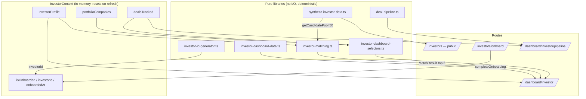
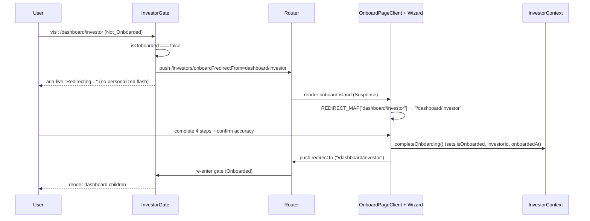
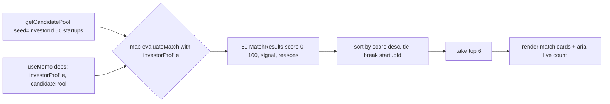

# Design Document — KITE Investor Suite (Prompt 4)

## Overview

The Investor Suite adds the investor side of the KITE two-sided marketplace on
top of the existing Next.js 14 / App Router project, reusing — never forking —
the patterns established in Prompts 1–3. It introduces:

- **Four routes**: Investor Connect (`/investors`, public), the Onboarding
  Wizard (`/investors/onboard`), the Investor Dashboard (`/dashboard/investor`),
  and the Deal Pipeline (`/dashboard/investor/pipeline`).
- **One session context**: `InvestorContext` (`src/context/InvestorContext.tsx`),
  a direct mirror of `RegistrationContext` — in-memory only, resets on refresh,
  with a throwing `useInvestor` and a non-throwing `useOptionalInvestor`.
- **One pure matching engine**: `src/lib/investor-matching.ts`, exposing
  `evaluateMatch` and `evaluateSchemeRelevance`.
- **Two pure synthetic modules**: `src/lib/synthetic-investor-data.ts` (public
  Connect data) and `src/lib/investor-dashboard-data.ts` (dashboard data), both
  hash-seeded through the existing `synthetic-prng.ts`.
- **One pure id generator**: `src/lib/investor-id-generator.ts`, producing
  `INV-YYYY-XXXXXX`, modeled on `kite-id-generator.ts`.
- **Pure pipeline helpers**: `filterDeals`, `dealsToCsv`, `computeStageAnalytics`
  in `src/lib/deal-pipeline.ts`, plus dashboard selectors in
  `src/lib/investor-dashboard-selectors.ts`.

The suite is **frontend-only and session-only**: no backend, no database, no
API, no network, and no persistence beyond in-memory React state (Req 1, 40).
Verified Karnataka ecosystem constants are canonical and never fabricated; every
investor number is synthetic, deterministic, and visibly labeled "illustrative
for preview" (Req 6, 40.4). Type extensions are additive (Req 3.1). All charts
import through the existing dynamic barrel (Req 36). Each route holds First Load
JS ≤ 150KB (Req 37) and targets WCAG 2.1 AA (Req 38).

### Design decisions and rationale

| Decision | Rationale | Requirements |
| --- | --- | --- |
| Mirror `RegistrationContext` exactly for `InvestorContext` | The session-only / reset-on-refresh / throwing+fallback contract is already proven and tested; mirroring keeps one mental model. | 1, 2 |
| Single shared `InvestorGate` for both gated routes | Dashboard and Pipeline share identical Not_Onboarded → redirect semantics; one component removes drift. | 17.2, 26.2 |
| `REDIRECT_MAP` guarded table in the onboard client island | Mirrors `RegisterPageClient`; prevents open-redirects from `redirectFrom`. | 16.6 |
| Matching engine is pure and split into documented sub-functions | Each scoring factor (sector/stage/geo/ticket) is independently testable and the total is deterministic. | 4, 5 |
| Scheme relevance via a pure RULES TABLE | Keeps relevance declarative, deterministic, and easy to extend without branching sprawl. | 5.2 |
| Reuse existing chart wrappers; add **one** new wrapper (`ChartBarHorizontalFunding`) | Three of four chart needs map cleanly onto existing wrappers; only the top-10-sectors-by-funding bar needs a rupee-valued horizontal bar that no existing wrapper expresses. | 13, 23, 36 |
| Kanban Move via native `<select>`, no drag-drop | Native control is keyboard- and SR-accessible by construction and avoids a JS DnD dependency. | 28.6, 29, 32.4 |
| Ticker via plain CSS animation | Keeps the animation library out of the bundle and honors the decorative-scroll a11y rule. | 10.4, 37.4, 38.3 |

## Architecture

### Module and route map

```
src/
  context/
    InvestorContext.tsx            ← session-only provider (mirror of RegistrationContext)
  lib/
    investor-id-generator.ts       ← INV-YYYY-XXXXXX (mirror of kite-id-generator)
    investor-matching.ts           ← evaluateMatch, evaluateSchemeRelevance (pure)
    investor-onboarding-validators.ts ← per-step validators (pure)
    synthetic-investor-data.ts     ← Connect data (pure, hash-seeded)
    investor-dashboard-data.ts     ← dashboard data (pure, hash-seeded)
    investor-dashboard-selectors.ts← six-KPI pure derivations
    deal-pipeline.ts               ← filterDeals, dealsToCsv, computeStageAnalytics (pure)
    synthetic-prng.ts              ← REUSED (seededRng/Int/Float/Pick/Shuffle)
  components/
    investors/                     ← public Investor Connect sections + onboarding wizard
    dashboard/investor/            ← dashboard gate, banner, header, KPI, matches, portfolio…
    dashboard/investor/pipeline/   ← kanban board, columns, cards, filter bar, analytics…
    charts/                        ← REUSED barrel (+ 1 new wrapper exported here)
  app/
    investors/page.tsx             ← Investor Connect (public)
    investors/onboard/page.tsx     ← Suspense → OnboardPageClient island
    dashboard/investor/page.tsx    ← InvestorGate → dashboard content
    dashboard/investor/pipeline/page.tsx ← InvestorGate → pipeline content
  types/index.ts                   ← additive investor types
```

> Note: `src/app/investors/page.tsx`, `co-invest`, `pipeline`, and `submit`
> already exist as foundation route stubs. The suite **replaces** the
> `/investors` stub with Investor Connect and **adds** `/investors/onboard`. The
> gated dashboard/pipeline live under `/dashboard/investor*`. The pre-existing
> `/investors/pipeline` and `/investors/submit` stubs are left untouched
> (footer links are repointed per Req 34).

### Data-flow diagram



### Gate / onboarding redirect flow



### Matched-startups pipeline



The candidate pool is seeded from a stable key (the investor id once onboarded,
otherwise a fixed key), so the 50 candidates and their scores are byte-stable
across re-renders. The whole derivation is wrapped in `useMemo` keyed on the
profile so unrelated re-renders never recompute it (Req 20.7).

### Component trees

`src/components/investors/` (Investor Connect + onboarding):

```
InvestorConnectPage (app/investors/page.tsx, client)
├─ InvestorHeroStrip                (Req 7)
├─ WhyKarnatakaSection              (Req 8)
├─ FeaturedOpportunitiesSection     (Req 9)  → OpportunityCard ×6
├─ LiveDealFlowSection (#deals)     (Req 10) → DealTicker (CSS marquee)
├─ KitvenCoInvestSection (#kitven-portfolio) (Req 11)
├─ BeyondBengaluruSection           (Req 12) → ClusterCard ×6 (REUSED)
├─ SectorPerformanceSection         (Req 13) → barrel charts ×2
├─ GiaInvestorsSection              (Req 14) → CountryCard ×6
└─ InvestorOnboardingCta            (Req 15)

OnboardPageClient (app/investors/onboard/page.tsx via Suspense)
└─ InvestorOnboardingWizard         (Req 16)
   ├─ OnboardingProgress
   ├─ OnboardStep01Identity / 02Firm / 03Thesis / 04Review
   └─ OnboardingSuccess (shows investorId)
```

`src/components/dashboard/investor/`:

```
InvestorDashboardPage (app/dashboard/investor/page.tsx, client)
└─ InvestorGate                     (Req 17.2/17.3)
   └─ InvestorDashboardContent
      ├─ InvestorPreviewBanner      (Req 17.4)
      ├─ InvestorHeaderStrip        (Req 18)
      ├─ InvestorKpiGrid            (Req 19) → StatCard ×6 (selectors)
      ├─ MatchedStartupsSection     (Req 20) → MatchCard ×6 (useMemo, aria-live)
      ├─ PortfolioSection           (Req 21) → table + expand + empty add-form
      ├─ ActivePipelineSection      (Req 22) → grouped bars
      ├─ KarnatakaSignalsSection    (Req 23) → barrel charts ×2 + KITVEN table
      ├─ SchemesForPortfolioSection (Req 24) → SchemeRelevanceCard ×6
      ├─ InvestorEventsSection      (Req 25.1)
      └─ InvestorResourcesSection   (Req 25.2)
```

`src/components/dashboard/investor/pipeline/`:

```
DealPipelinePage (app/dashboard/investor/pipeline/page.tsx, client)
└─ InvestorGate
   └─ DealPipelineContent
      ├─ PipelineHeaderStrip + AddDealForm   (Req 26)
      ├─ PipelineFilterBar (filterDeals)      (Req 27)
      ├─ KanbanBoard                          (Req 28)
      │  └─ KanbanColumn ×6 (region+aria-label+count)
      │     └─ DealCard (Move <select>, Remove, Add Note, days-in-stage)
      ├─ [dynamic] StageAnalyticsRow (computeStageAnalytics) (Req 30.1/30.5)
      ├─ [dynamic] RecentActivityList                        (Req 30.2/30.5)
      └─ PipelineExportButton (dealsToCsv Blob)              (Req 31)
```

## Components and Interfaces

### 1. InvestorContext (`src/context/InvestorContext.tsx`)

A direct mirror of `RegistrationContext`: in-memory React state only — NO
localStorage/sessionStorage/cookie/IndexedDB/network — so it resets to the
initial Not_Onboarded_State on every refresh (Req 1.1–1.3, 40.2–40.3).

#### State shape

```ts
interface InvestorState {
  investorProfile: InvestorProfile | null; // null until onboarding seeds it
  isOnboarded: boolean;                     // default false
}

const INITIAL_STATE: InvestorState = { investorProfile: null, isOnboarded: false };
```

`dealsTracked` and `portfolioCompanies` live **on** `investorProfile` (they are
fields of `InvestorProfile`, Req 3.8), so the mutators operate through the
profile. Before onboarding seeds a profile, mutators that need a profile seed a
minimal draft (mirroring `RegistrationContext.updateProfile`'s seed-on-null
pattern).

#### Context value and mutators (Req 2.8)

```ts
interface InvestorContextValue {
  investorProfile: InvestorProfile | null;
  isOnboarded: boolean;
  updateInvestorProfile: (partial: Partial<InvestorProfile>) => void; // merge, preserve untouched (2.1)
  completeOnboarding: () => void;            // set isOnboarded, gen investorId, stamp onboardedAt (2.2)
  addDeal: (deal: TrackedDeal) => void;      // append with manual order within currentStage (2.3)
  updateDealStage: (dealId: string, stage: DealStage) => void; // set that deal's currentStage (2.4)
  removeDeal: (dealId: string) => void;      // remove by id (2.5)
  addPortfolioCompany: (company: PortfolioCompany) => void; // append (2.6)
  resetInvestor: () => void;                 // back to INITIAL_STATE (2.7)
}
```

Mutator semantics (all via functional `setState`, no races):

- **`updateInvestorProfile(partial)`** — `{ ...current, ...partial }`, seeding
  from `partial` when the profile is null. Every untouched field is preserved
  (Req 2.1).
- **`completeOnboarding()`** — sets `isOnboarded: true`, generates
  `investorId = generateInvestorId()` (`INV-YYYY-XXXXXX`), and stamps
  `onboardedAt = new Date().toISOString()`; merges these onto the profile (Req
  2.2). `onboardedAt` is the **only** clock read in the suite and is a status
  stamp, not synthetic data.
- **`addDeal(deal)`** — appends to `investorProfile.dealsTracked`. The deal's
  **manual order within its `currentStage`** is assigned as the current count of
  deals already in that stage (a monotonically increasing per-stage index), so
  appended deals sort after existing ones (Req 2.3, 28.5).
- **`updateDealStage(dealId, stage)`** — maps over `dealsTracked`, changing only
  the matching deal's `currentStage` (and assigning it the next manual order in
  the destination stage); every other deal is referentially preserved (Req 2.4).
- **`removeDeal(dealId)`** — filters `dealsTracked` by id (Req 2.5).
- **`addPortfolioCompany(company)`** — appends to `portfolioCompanies` (Req 2.6).
- **Deal note storage** — notes are stored on the deal record's optional `notes`
  field. An `addDealNote(dealId, note)` helper is exposed through the same
  mutator surface (implemented as a targeted `updateInvestorProfile` over
  `dealsTracked`) so Req 30.4 ("store the note on that deal's record") is
  satisfied without a separate store.

> Manual-order + note storage live on `TrackedDeal` itself (`orderInStage:number`,
> `notes?: string`), keeping the kanban's within-stage ordering and notes inside
> the single session source of truth.

#### Hooks (Req 1.5, 1.6)

```ts
export function useInvestor(): InvestorContextValue {
  const ctx = useContext(InvestorContext);
  if (ctx === undefined) throw new Error("useInvestor must be used within an InvestorProvider");
  return ctx; // throwing variant (1.6)
}

const NOT_ONBOARDED_FALLBACK: InvestorContextValue = {
  investorProfile: null,
  isOnboarded: false,
  updateInvestorProfile: () => {}, completeOnboarding: () => {},
  addDeal: () => {}, updateDealStage: () => {}, removeDeal: () => {},
  addPortfolioCompany: () => {}, resetInvestor: () => {},
};

export function useOptionalInvestor(): InvestorContextValue {
  return useContext(InvestorContext) ?? NOT_ONBOARDED_FALLBACK; // non-throwing (1.5)
}
```

#### RootLayout wiring (Req 1.4)

`InvestorProvider` is added **additively** inside `RootLayout`, nested alongside
the existing providers — it wraps nothing the others need and is wrapped by
nothing it needs, so order among siblings is not load-bearing:

```tsx
<LanguageProvider>
  <RegistrationProvider>
    <InvestorProvider>            {/* additive (Req 1.4) */}
      <SiteChrome />
      <main id="main" className="flex-1 pt-16">{children}</main>
      <Footer />
      <AIAssistantButton />
      <Toaster />
    </InvestorProvider>
  </RegistrationProvider>
</LanguageProvider>
```

### 2. Investor ID generator (`src/lib/investor-id-generator.ts`)

A near-copy of `kite-id-generator.ts`, swapping the `KITE` prefix for `INV` and
reusing the same unambiguous 32-char alphabet (excludes O/0/I/1):

```ts
export const INV_ID_ALPHABET = 'ABCDEFGHJKLMNPQRSTUVWXYZ23456789';
export const INV_ID_PATTERN = /^INV-\d{4}-[ABCDEFGHJKLMNPQRSTUVWXYZ23456789]{6}$/;
export type Rng = () => number;

export function generateInvestorId(
  rng: Rng = Math.random,
  year: number = new Date().getFullYear(),
): string {
  let suffix = '';
  for (let i = 0; i < 6; i++) {
    const raw = Math.floor(rng() * INV_ID_ALPHABET.length);
    const index = Math.min(Math.max(raw, 0), INV_ID_ALPHABET.length - 1);
    suffix += INV_ID_ALPHABET[index];
  }
  return `INV-${year}-${suffix}`;
}
```

Pure and deterministic given an injected `rng`/`year` — fully testable for the
`INV-YYYY-XXXXXX` format property (Req 2.2).

### 3. Matching engine (`src/lib/investor-matching.ts`, pure)

No React, no I/O, no randomness. Same inputs → identical outputs (Req 4.9, 5.7).

#### Startup candidate shape (input)

The engine reads a minimal structural `StartupCandidate` (a synthetic shape; see
Data Models) carrying `kiteId`, `sector`, `stage`, `location`,
`askLakhs`, plus framing fields. `startupId` is **derived from `kiteId`** (Req
4.2): `startupId = candidate.kiteId`.

#### `evaluateMatch`

```ts
export function evaluateMatch(
  investor: InvestorProfile,
  startup: StartupCandidate,
): MatchResult {
  const sector = scoreSectorOverlap(investor, startup); // 0..40
  const stage  = scoreStageMatch(investor, startup);    // 0..30
  const geo    = scoreGeoMatch(investor, startup);      // 0..20
  const ticket = scoreTicketCompat(investor, startup);  // 0..10
  const score  = clamp(sector + stage + geo + ticket, 0, 100); // (4.3, 4.4)
  const signal = toSignal(score);                         // (4.5–4.7)
  const reasons = buildReasons({ sector, stage, geo, ticket, startup }); // non-empty (4.8)
  return { startupId: startup.kiteId, score, signal, reasons };
}

function toSignal(score: number): MatchSignal {
  if (score >= 80) return 'strong';   // Signal_StrongMatch (4.5)
  if (score >= 50) return 'possible'; // Signal_PossibleMatch, 50..79 (4.6)
  return 'out-of-thesis';             // Signal_OutOfThesis, <50 (4.7)
}
```

Documented sub-functions (each pure, each bounded by its weight):

```
scoreSectorOverlap(investor, startup) -> [0,40]
  // Full weight when the startup's sector is in investor.focusSectors.
  // Partial credit when it is an adjacent sector (a fixed ADJACENCY map);
  // 0 when unrelated. Returns 40 * fitRatio, rounded.

scoreStageMatch(investor, startup) -> [0,30]
  // 30 when startup.stage ∈ investor.focusStages (after mapping the startup's
  // funding stage to an InvestmentStage); 15 when one stage adjacent; else 0.

scoreGeoMatch(investor, startup) -> [0,20]
  // 20 when investor.geographicFocus covers the startup's location
  //   ("Karnataka", a specific cluster region, or "Karnataka Beyond Bengaluru"
  //    matching a non-Bengaluru location); 10 for a broad "India"/"Global"
  //    focus; else 0.

scoreTicketCompat(investor, startup) -> [0,10]
  // 10 when startup.askLakhs ∈ [ticketSizeMinLakhs, ticketSizeMaxLakhs];
  // 5 when within ±25% of the band; else 0.

buildReasons(parts) -> string[]   // ALWAYS length >= 1 (4.8)
  // One human sentence per factor, e.g. "Sector FinTech is a core focus (+40)".
  // Always includes at least an overall-fit sentence, so never empty even when
  // every factor scores 0.
```

`clamp(sector+stage+geo+ticket, 0, 100)` makes the score provably within
`[0,100]` for any inputs (Req 4.4); since the weights sum to exactly 100 the
clamp is defensive, not corrective.

#### `evaluateSchemeRelevance` — pure RULES TABLE

```ts
interface RelevanceRule {
  schemeId: string;
  isRelevant: (inv: InvestorProfile) => boolean;
  reason: (inv: InvestorProfile, relevant: boolean) => string; // never empty (5.6)
}

const RELEVANCE_RULES: readonly RelevanceRule[] = [
  {
    // KITVEN Fund-5 → relevant to ALL investors as a co-investor opportunity (5.3)
    schemeId: 'kitven-fund-5',
    isRelevant: () => true,
    reason: () => 'KITVEN Fund-5 co-invests alongside private investors (₹100 Cr corpus, 2–10% per deal, max 30% stake).',
  },
  {
    // Beyond Bengaluru Cluster Seed Fund → relevant when geo includes the cluster focus (5.4)
    schemeId: 'beyond-bengaluru-cluster-fund',
    isRelevant: (inv) => inv.geographicFocus.includes('Karnataka Beyond Bengaluru'),
    reason: (_inv, ok) => ok
      ? 'Your Beyond-Bengaluru geographic focus aligns with this cluster seed fund.'
      : 'This cluster seed fund targets Beyond-Bengaluru regions outside your current geographic focus.',
  },
  {
    // R&D Project Grant → relevant when focus sectors include Deep Tech (5.5)
    schemeId: 'rd-project-grant',
    isRelevant: (inv) => inv.focusSectors.includes('deep-tech'),
    reason: (_inv, ok) => ok
      ? 'Your deep-tech focus aligns with this triple-helix R&D grant for portfolio companies.'
      : 'This grant best fits deep-tech ventures, which are outside your stated focus sectors.',
  },
];

export function evaluateSchemeRelevance(
  investor: InvestorProfile,
  scheme: Scheme,
): RelevanceResult {
  const rule = RELEVANCE_RULES.find((r) => r.schemeId === scheme.id);
  if (rule) {
    const isRelevant = rule.isRelevant(investor);
    return { schemeId: scheme.id, isRelevant, reason: rule.reason(investor, isRelevant) };
  }
  // Sensible default: relevant when the scheme's sector/stage keywords overlap
  // the investor thesis; reason explains the overlap or its absence (never empty).
  const isRelevant = defaultRelevanceHeuristic(investor, scheme);
  return {
    schemeId: scheme.id,
    isRelevant,
    reason: isRelevant
      ? `${scheme.name} is broadly applicable to portfolio companies in your focus areas.`
      : `${scheme.name} does not strongly align with your current thesis.`,
  };
}
```

The table and default branch are total and side-effect-free, so identical inputs
always yield identical `RelevanceResult`s (Req 5.7), every result carries a
non-empty `reason` (Req 5.6), and KITVEN is always relevant (Req 5.3).

### 4. Synthetic modules (pure, hash-seeded)

Both modules carry the determinism contract in module-level comments (Req 6.5),
derive everything from `synthetic-prng.ts` seeded by string keys, and use **no
`Math.random` and no time/`Date`** (Req 6.3). Same seed key → identical output
(Req 6.4). Fixed label arrays (month names, etc.) are static strings, mirroring
`synthetic-dashboard-data.ts`.

#### `src/lib/synthetic-investor-data.ts` (Investor Connect)

```ts
// Determinism contract: every export is pure and hash-seeded from its key only;
// no Math.random, no Date/time, no I/O. Same key → deep-equal output.

getFeaturedOpportunities(): OpportunityCardData[]    // exactly 6 (Req 9.1)
getDealFlowTicker(): DealFlowEvent[]                 // exactly 20 (Req 10.2)
getCandidatePool(seedKey: string): StartupCandidate[]// exactly 50 (Req 20.2)
getSectorFundingTop10(): SectorFundingDatum[]        // exactly 10, desc by funding (Req 13.2)
getSectorCountGrowth(): SectorCountSeries            // top 5 sectors × 24 months (Req 13.3)
getClusterInvestorFraming(clusterId): ClusterFraming // soonicorn count + co-invest capacity (Req 12.2)
```

- `getFeaturedOpportunities` — 6 cards each seeded `featured|<i>`: company name,
  sector (from canonical `sectors`), stage, `askLakhs`, one-sentence pitch,
  location, all illustrative (Req 9.1, 9.2).
- `getDealFlowTicker` — 20 events seeded `ticker|<i>`: relative timestamp label
  (a fixed string like "2h ago", never computed from the clock), sector, stage,
  deal type, amount (Req 10.2).
- `getCandidatePool(seedKey)` — 50 `StartupCandidate`s seeded
  `candidate|<seedKey>|<i>`, each with a synthetic `kiteId` (via the seeded RNG
  fed into the KITE-id alphabet) plus sector/stage/location/ask + framing, used
  by the dashboard matcher (Req 20.2).
- `getSectorFundingTop10` — maps the top 10 canonical sectors to a seeded
  `fundingCrore`, sorted strictly non-increasing (tie-break by sectorId) →
  feeds the **new** `ChartBarHorizontalFunding` wrapper (Req 13.2).
- `getSectorCountGrowth` — for the top 5 sectors, a 24-point series of seeded
  startup counts → feeds `ChartLineFunding` (Req 13.3).

#### `src/lib/investor-dashboard-data.ts` (Dashboard)

```ts
// Same determinism contract as above.

getPortfolioSeed(seedKey: string): PortfolioCompany[]      // deterministic seed set
getKitvenCoInvestments(seedKey: string): KitvenCoInvestment[] // 3–4 rows (Req 23.4)
getEcosystemSignals(focusSectors, focusStages): EcosystemSignalsData // chart data (Req 23.2/23.3)
getLastLoginLabel(seedKey: string): string                 // synthetic label (Req 18.2)
getExitsThisYear(seedKey: string): number                  // synthetic count (Req 19.6)
getCurrentEstimatedValue(company): number                  // synthetic per-company value (Req 21.1)
getDaysInStage(dealId: string): number                     // synthetic days-in-stage (Req 28.3)
```

- `getKitvenCoInvestments` — a seeded count in `[3,4]` then that many rows of
  company/sector/stage/amount that match the investor thesis framing (Req 23.4).
- `getEcosystemSignals` — `focusSectorsFunding: FundingPoint[12]` (line) and
  `stageDistribution: ClusterCountDatum[]`-shaped data over `focusStages` (bar),
  both seeded from the focus arrays (Req 23.2, 23.3).
- `getLastLoginLabel` / `getExitsThisYear` — seeded fixed-string / integer
  labels, illustrative (Req 18.2, 19.6).

### 5. Onboarding wizard (`src/components/investors/`)

Mirrors `RegistrationWizard`: a single `useReducer`, a progress bar, per-step
validation, accuracy-gated submit, success screen showing the `investorId`.

#### Steps (Req 16.2)

1. **Identity** — `investorName`, `firmName`, `investorEmail`, `investorPhone`, `role`.
2. **Firm profile** — `firmType`, `assetsUnderManagement`, `foundedYear`.
3. **Investment thesis** — `focusSectors`, `focusStages`, `ticketSizeMinLakhs`,
   `ticketSizeMaxLakhs`, `geographicFocus`.
4. **Review & submit** — read-only summary + accuracy attestation checkbox.

#### Pure reducer (`investorWizardReducer`)

Same `(state, action) => state` shape as the registration reducer, exhaustive
over the action union, no side effects:

```ts
type InvestorWizardStep = 1 | 2 | 3 | 4;

interface InvestorWizardState {
  currentStep: InvestorWizardStep;
  profile: Partial<InvestorProfile>;
  errors: Record<InvestorWizardStep, WizardFieldErrors>;
  touched: Record<string, boolean>;
  submitted: boolean;
  accuracyConfirmed: boolean;
}

type InvestorWizardAction =
  | { type: 'SET_FIELD'; field: keyof InvestorProfile; value: unknown }
  | { type: 'BLUR_FIELD'; field: string }
  | { type: 'VALIDATE_STEP'; step: InvestorWizardStep }
  | { type: 'NEXT' } | { type: 'BACK' }
  | { type: 'GO_TO_STEP'; step: InvestorWizardStep }
  | { type: 'TOGGLE_ACCURACY'; value: boolean }
  | { type: 'SUBMIT' };
```

- `NEXT` no-ops when the current step has recorded errors or at the last step
  (Req 16.3); `BACK` no-ops at step 1.
- The controller uses validate-on-attempt: dispatch `VALIDATE_STEP` then `NEXT`,
  surfacing messages on an invalid step (Req 16.3).
- Submit is gated on `accuracyConfirmed` (Req 16.4): the Submit control is
  `aria-disabled` while unconfirmed (never native `disabled`, matching the
  registration wizard's SR-focusability rule).
- On submit: push the final draft via `updateInvestorProfile`, call
  `completeOnboarding()`, dispatch `SUBMIT`, then — if `redirectTo` is set —
  `router.push(redirectTo)` (Req 16.5, 16.6). With no `redirectTo`, render
  `OnboardingSuccess` showing the generated `investorId`.

#### Per-step validators (`src/lib/investor-onboarding-validators.ts`, pure)

`validateInvestorStep1..3` are `StepValidator`-shaped pure functions (step 4 has
no field validation — accuracy gates submit), mirroring
`registration-validators.ts`:

```
Step1: investorName ≥ 2 chars; investorEmail matches local@domain.tld;
       investorPhone = 10 digits after stripping +91/separators; role ∈ InvestorRole.
Step2: firmType ∈ FirmType; assetsUnderManagement finite ≥ 0; foundedYear in 1900..currentYear.
Step3: focusSectors non-empty (valid sector ids); focusStages non-empty (∈ InvestmentStage);
       ticketSizeMinLakhs ≥ 0; ticketSizeMaxLakhs ≥ ticketSizeMinLakhs; geographicFocus non-empty.
```

#### Onboard route + client island (Req 16.1, 16.6)

`app/investors/onboard/page.tsx` is a thin server component wrapping
`OnboardPageClient` in `<Suspense>` (because the island reads `useSearchParams`),
mirroring `register/page.tsx`. `OnboardPageClient` reads `redirectFrom` and
resolves it through a guarded `REDIRECT_MAP` (no open-redirects), mirroring
`RegisterPageClient`:

```ts
const REDIRECT_MAP: Record<string, string> = {
  'dashboard/investor': '/dashboard/investor',
  'dashboard/investor/pipeline': '/dashboard/investor/pipeline',
};
// redirectTo = redirectFrom ? REDIRECT_MAP[redirectFrom] : undefined;
```

### 6. Investor gate (`src/components/dashboard/investor/InvestorGate.tsx`)

A single shared gate used by **both** the dashboard and pipeline routes (Req
17.2/17.3, 26.2), mirroring `StartupGate` but reading `isOnboarded` from
`useInvestor` and taking the `redirectFrom` key as a prop so each route can pass
its own destination:

```tsx
export interface InvestorGateProps {
  redirectFrom: 'dashboard/investor' | 'dashboard/investor/pipeline';
  children: ReactNode;
}

export function InvestorGate({ redirectFrom, children }: InvestorGateProps) {
  const { isOnboarded } = useInvestor();
  const router = useRouter();
  useEffect(() => {
    if (!isOnboarded) router.push(`/investors/onboard?redirectFrom=${redirectFrom}`);
  }, [isOnboarded, redirectFrom, router]);

  if (!isOnboarded) {
    return (
      <div className="mx-auto max-w-7xl px-4 py-24 sm:px-6 lg:px-8">
        <p aria-live="polite" className="text-body text-muted">Redirecting you to investor onboarding…</p>
      </div>
    ); // Redirecting_State — no personalized flash (Req 17.3)
  }
  return <>{children}</>;
}
```

Because the context is in-memory, a refresh resets to Not_Onboarded and a
hard-loaded gated route always redirects (Req 40.3).

### 7. Deal Pipeline kanban (`src/components/dashboard/investor/pipeline/`)

- **Header** (`py-8`): title "Your Deal Pipeline" + subhead "managing N active
  deals across six stages" where N = Active_Deals count; "Add Deal" opens an
  inline `AddDealForm` that builds a synthetic `TrackedDeal` and calls `addDeal`
  (Req 26.3, 26.4).
- **Filter bar** — sector, stage range, ask range, date range, and a search
  input; every control has an accessible label (Req 27.3). Filtering is a PURE
  helper `filterDeals(deals, filters)` (see deal-pipeline.ts) called on change
  (Req 27.2).
- **Board** — six `KanbanColumn`s (Sourced, Screening, Diligence, Term-Sheet,
  Closed, Passed). Each column is a `role="region"` with an `aria-label` and a
  header showing stage name + count (Req 28.1, 28.2, 32.2). Cards within a stage
  are ordered by `orderInStage` (Req 28.5). Empty columns render a "Drop deals
  here / Add deal" placeholder (Req 28.4). NO drag-and-drop (Req 28.6).
- **DealCard** — tight, focusable (`tabIndex=0`, accessible name = company +
  stage), shows company, sector badge, ask, synthetic days-in-stage. On
  hover/focus it reveals a Move control (native `<select>` of target stages →
  `updateDealStage`) and a Remove button (→ `removeDeal`) (Req 29.1–29.3, 32.3,
  32.4), plus an inline "Add Note" input storing the note on the deal (Req 30.3,
  30.4). Within-stage manual reordering uses up/down buttons that adjust
  `orderInStage` (no DnD).
- **Analytics + activity** — `StageAnalyticsRow` (synthetic avg days/stage,
  conversion rates, weekly velocity via pure `computeStageAnalytics`) and
  `RecentActivityList` are **dynamically imported from the start** to protect
  First Load JS (Req 30.1, 30.2, 30.5, 37.2).
- **Export** — `PipelineExportButton` builds a CSV/text Blob via the pure
  `dealsToCsv(deals)` and downloads through a transient anchor, mirroring
  `ExportReportsSection` (no network) (Req 31).

#### Pure pipeline helpers (`src/lib/deal-pipeline.ts`)

```ts
export interface DealFilters {
  sector?: string;                       // exact sector id, or undefined = any
  stageRange?: { fromIndex: number; toIndex: number }; // inclusive over the 6-stage order
  askRange?: { minLakhs: number; maxLakhs: number };
  dateRange?: { fromIso: string; toIso: string };
  query?: string;                        // case-insensitive companyName substring
}

// Soundness: every returned deal satisfies EVERY active criterion;
// the result is always a subset of the input (Req 27.2).
export function filterDeals(deals: TrackedDeal[], filters: DealFilters): TrackedDeal[];

// Row count = deals.length + 1 (header row). Deterministic, no I/O (Req 31.2).
export function dealsToCsv(deals: TrackedDeal[]): string;

// Per-stage counts, conversion ratios in [0,1], velocity ≥ 0. Bounds always hold (Req 30.1).
export function computeStageAnalytics(deals: TrackedDeal[]): StageAnalytics;
```

### 8. Investor Dashboard (`src/components/dashboard/investor/`)

Gated by `InvestorGate` (redirectFrom `dashboard/investor`). Content:

- **Preview banner** (Req 17.4) — fixed disclaimer copy.
- **Header strip** (Req 18) — "Welcome back, {investorName}" + `firmName`
  caption; right side shows Investor ID, synthetic last-login (`getLastLoginLabel`),
  and a Status badge.
- **Six-KPI grid** (Req 19) — each KPI is a **pure derivation** in
  `investor-dashboard-selectors.ts`, rendered through the existing `StatCard`:

  | KPI | Selector | Source |
  | --- | --- | --- |
  | Portfolio Value | `selectPortfolioValue(profile)` | synthetic aggregate of `portfolioCompanies` (19.2) |
  | Active Deals | `selectActiveDealCount(profile)` | count of Active_Deals (19.3) |
  | Pipeline Value | `selectPipelineValue(profile)` | Σ `askLakhs` over Active_Deals (19.4) |
  | Portfolio Companies | `selectActiveCompanyCount(profile)` | count `currentStatus==='Active'` (19.5) |
  | Exits This Year | `selectExitsThisYear(profile)` | synthetic `getExitsThisYear` (19.6) |
  | Karnataka Allocation | `selectKarnatakaAllocation(profile)` | % of portfolio in Karnataka companies (19.7) |

  `Active_Deal` = `currentStage` not `Closed` and not `Passed`.

- **Matched startups** (Req 20) — `getCandidatePool(investorId)` (50) → map
  `evaluateMatch` → sort by score desc (tie-break `startupId`) → top 6, all
  inside a `useMemo` keyed on `investorProfile` (Req 20.7). Each `MatchCard`
  shows company, sector, stage, ask, location, the **match score as a large
  number**, a signal badge, and a View Details link (Req 20.4). A "See All
  Matches" link sits below (20.5). An `aria-live="polite"` region announces the
  match count on render (20.6).
- **Portfolio** (Req 21) — compact table (Company, Sector, Stage at Investment,
  Invested Amount, Invested Date, Current Status, Current Estimated Value
  [synthetic via `getCurrentEstimatedValue`]); rows expand with synthetic detail;
  when `portfolioCompanies` is empty, an inline "Add Portfolio Company" form
  calls `addPortfolioCompany` (21.3, 21.4).
- **Active pipeline** (Req 22) — groups `dealsTracked` by `currentStage` as
  small horizontal bars (count per stage); "Go to Pipeline" → `/dashboard/investor/pipeline`.
- **Karnataka signals** (Req 23) — three panels: focus-sectors funding line
  (`ChartLineFunding` via barrel), stage distribution bar (`ChartBarSectorStartups`
  via barrel), and a KITVEN co-investments table (`getKitvenCoInvestments`, 3–4
  rows).
- **Schemes for portfolio** (Req 24) — top 6 schemes ranked by
  `evaluateSchemeRelevance`; each `SchemeRelevanceCard` shows name, why-it-matters
  reason, max benefit, and a visual-only "Share with Portfolio" action.
- **Events** (Req 25.1) — three `EventCard`s filtered to investor categories
  (summit, demo-day, masterclass) from `events.ts`.
- **Resources** (Req 25.2) — Investment Memo Template (synthetic download),
  KITVEN Co-Investment Guide, Contact Investor Relations (helpline + email from
  `footer.ts`).

Below-the-fold sections render inside `LazySection` with reserved heights, and
chart sections come through the dynamic barrel so Recharts stays out of First
Load JS (Req 37.3), mirroring the startup dashboard page composition.

### 8b. Investor Connect (`src/components/investors/`)

Public route, no gate (Req 7.1). Nine sections + onboarding CTA:

1. **Hero strip** (`py-12`, dark bg) — headline "Investor Connect", subhead
   "Discover the Karnataka startup ecosystem from an investor's lens"; "Get
   Investor Access" → `/investors/onboard`; "View Live Deal Flow" → `#deals`
   anchor; Verified headline stats: 183 soonicorns, $79B since 2010, 21,000
   DPIIT startups, 46% of India's VC since 2016 (Req 7.2–7.5).
2. **Why Karnataka** — three Verified cards (Largest Tech Workforce 2.5M + 350K;
   Highest VC Concentration 46%; Soonicorn Capital 183), 3-col desktop / stacked
   mobile (Req 8).
3. **Featured Opportunities** — 6 `OpportunityCard`s from
   `getFeaturedOpportunities`, each with an `Illustrative_Label` corner label;
   3/2/1-col responsive (Req 9).
4. **Live Deal Flow** (`#deals`) — 20 events from `getDealFlowTicker`;
   `DealTicker` is a plain-CSS marquee on desktop (Ticker_Playing), a vertical
   list on mobile; hover pauses (Ticker_Paused) via a CSS
   `:hover { animation-play-state: paused }`; `Illustrative_Label` on the
   section; an `aria-live="polite"` region announces the deal activity **once**
   on first render — the decorative scroll is never announced (Req 10).
5. **Co-invest with KITVEN** (`#kitven-portfolio`) — Verified terms (₹100 Cr
   corpus, 2–10% per investment, max 30% stake); a visual-only "Submit
   Co-investment Proposal" ghost CTA referencing `eitbt.karnataka.gov.in/startup`;
   "View Active Co-investments" → `#kitven-portfolio` (Req 11).
6. **Beyond Bengaluru** — 6 `ClusterCard`s (REUSED) with investor framing
   (cluster name, focus sectors, synthetic soonicorn count, synthetic
   co-investment capacity from `getClusterInvestorFraming`); "View Deal Flow" →
   `/clusters/{id}` (Req 12).
7. **Sector Performance** — two charts via the barrel: top-10 sectors by funding
   (new `ChartBarHorizontalFunding`) and 24-month startup-count growth for top 5
   (`ChartLineFunding`); side-by-side desktop / stacked mobile (Req 13).
8. **International Investors Welcome** — 6 `CountryCard`s with a flag-icons SVG,
   country name, and a one-sentence Karnataka thesis; "Learn More" → `/gia`
   (Req 14).
9. **Get Investor Access** (centered) — "Begin Onboarding" → `/investors/onboard`;
   secondary line about the free Phase-2 verification process (Req 15).

**Verified-vs-synthetic labeling**: Verified sections (hero stats, Why
Karnataka, KITVEN terms) render canonical constants only; every synthetic
surface (opportunities, ticker, cluster framing counts, sector charts) carries a
visible `Illustrative_Label` (Req 6.6, 40.4). A small shared `IllustrativeBadge`
component provides the consistent corner/section label.

### 9. Navigation / footer / home integration

- **Navigation** (Req 33) — `src/data/navigation.ts`: add three links **under
  the existing "Connect" dropdown** (no new top-level item): "Investor Connect"
  → `/investors`, "Investor Dashboard" → `/dashboard/investor`, "Deal Pipeline"
  → `/dashboard/investor/pipeline`. The existing "Investor Connect" entry under
  "For Stakeholders"/"Connect" already points to `/investors`; the three links
  are added to the `Connect.children` array and flow into the mobile nav (which
  renders the same data source) automatically (Req 33.2).
- **Footer** (Req 34) — `src/data/footer.ts`: expand the existing "For
  Investors" column to include `/investors`, `/dashboard/investor`, and
  `/dashboard/investor/pipeline`. (The column already has an `/investors` entry
  and an `/investors/pipeline` entry; the two dashboard links are added and the
  pipeline link is pointed at `/dashboard/investor/pipeline` per the requirement.)
- **Home** (Req 35) — `src/data/quick-actions.ts`: the "Investor Connect" quick
  action already targets `/investors`; confirm it remains so and keep the
  eight-action grid count unchanged (no add/remove). This is a no-op-or-confirm,
  preserving the 8-grid invariant.

## Data Models

All types are appended **additively** to `src/types/index.ts`; no existing
export is modified or removed (Req 3.1). They compile under `strict` +
`noUncheckedIndexedAccess`.

### Enumerations (Req 3.2–3.5)

```ts
export type InvestorRole =
  | 'GP' | 'Partner' | 'Principal' | 'Associate'
  | 'Angel' | 'Family Office' | 'Corporate VC' | 'Government Fund';

export type FirmType =
  | 'VC' | 'Angel Network' | 'Family Office'
  | 'Corporate VC' | 'Government Fund' | 'Accelerator Fund';

export type InvestmentStage =
  | 'Pre-Seed' | 'Seed' | 'Series A' | 'Series B Plus' | 'Growth';

export type DealStage =
  | 'Sourced' | 'Screening' | 'Diligence' | 'Term-Sheet' | 'Closed' | 'Passed';

export type PortfolioStatus = 'Active' | 'Exited' | 'Written-Off' | 'Folded';

/** Canonical six-stage order; index used by stage-range filtering and analytics. */
export const DEAL_STAGE_ORDER: readonly DealStage[] =
  ['Sourced', 'Screening', 'Diligence', 'Term-Sheet', 'Closed', 'Passed'];
```

### Core records (Req 3.6–3.8)

```ts
export interface PortfolioCompany {
  id: string;
  companyName: string;
  sector: string;                 // Sector id
  stage: InvestmentStage;         // stage at investment
  investedAmountLakhs: number;
  investedDate: string;           // ISO 8601
  currentStatus: PortfolioStatus;
  location?: LocationKarnataka;   // used by Karnataka-allocation KPI
}

export interface TrackedDeal {
  id: string;
  companyName: string;
  sector: string;                 // Sector id
  stage: InvestmentStage;         // the startup's funding stage
  askLakhs: number;
  currentStage: DealStage;        // kanban column
  orderInStage: number;           // manual order within currentStage (Req 2.3, 28.5)
  notes?: string;                 // Add-Note storage (Req 30.4)
}

export interface InvestorProfile {
  // Identity (Step 1)
  investorName: string;
  firmName: string;
  investorEmail: string;
  investorPhone: string;
  role: InvestorRole;
  // Firm (Step 2)
  firmType: FirmType;
  assetsUnderManagement: number;  // lakhs
  foundedYear: number;
  // Thesis (Step 3)
  focusSectors: string[];         // Sector ids
  focusStages: InvestmentStage[];
  ticketSizeMinLakhs: number;
  ticketSizeMaxLakhs: number;
  geographicFocus: string[];      // e.g. 'Karnataka', 'Karnataka Beyond Bengaluru', 'India'
  // Holdings / pipeline
  portfolioCompanies: PortfolioCompany[];
  dealsTracked: TrackedDeal[];
  // Status (set by completeOnboarding)
  isOnboarded: boolean;
  investorId: string;             // INV-YYYY-XXXXXX
  onboardedAt: string;            // ISO 8601
}
```

### Context contract (Req 3.9)

```ts
export interface InvestorContextValue {
  investorProfile: InvestorProfile | null;
  isOnboarded: boolean;
  updateInvestorProfile: (partial: Partial<InvestorProfile>) => void;
  completeOnboarding: () => void;
  addDeal: (deal: TrackedDeal) => void;
  updateDealStage: (dealId: string, stage: DealStage) => void;
  removeDeal: (dealId: string) => void;
  addPortfolioCompany: (company: PortfolioCompany) => void;
  resetInvestor: () => void;
}
```

### Matching results (Req 3, 4, 5)

```ts
export type MatchSignal = 'strong' | 'possible' | 'out-of-thesis';

export interface MatchResult {
  startupId: string;              // derived from startup.kiteId (4.2)
  score: number;                  // integer in [0,100] (4.4)
  signal: MatchSignal;            // strong ≥80 / possible 50–79 / out-of-thesis <50 (4.5–4.7)
  reasons: string[];              // non-empty (4.8)
}

export interface RelevanceResult {
  schemeId: string;
  isRelevant: boolean;
  reason: string;                 // non-empty (5.6)
}
```

### Synthetic shapes (additive return types)

```ts
export interface StartupCandidate {
  kiteId: string;                 // startupId source (4.2)
  companyName: string;
  sector: string;                 // Sector id
  stage: InvestmentStage;
  askLakhs: number;
  location: LocationKarnataka;
  pitch: string;                  // one-sentence framing
}

export interface OpportunityCardData {
  id: string;
  companyName: string;
  sector: string;
  stage: InvestmentStage;
  askLakhs: number;
  pitch: string;
  location: LocationKarnataka;
}

export interface DealFlowEvent {
  id: string;
  timestampLabel: string;         // fixed relative label, NOT clock-derived
  sector: string;
  stage: InvestmentStage;
  dealType: string;               // e.g. "Seed round", "Bridge"
  amountLakhs: number;
}

export interface SectorFundingDatum {            // feeds ChartBarHorizontalFunding
  sectorId: string;
  name: string;
  fundingCrore: number;
}

export interface SectorCountSeries {             // feeds ChartLineFunding (24 mo × top 5)
  months: string[];                              // 24 fixed labels
  series: { sectorId: string; name: string; counts: number[] }[]; // length 5, counts length 24
}

export interface ClusterFraming {
  clusterId: string;
  soonicornCount: number;
  coInvestCapacityCrore: number;
}

export interface KitvenCoInvestment {
  id: string;
  companyName: string;
  sector: string;
  stage: InvestmentStage;
  amountLakhs: number;
}

export interface EcosystemSignalsData {
  focusSectorsFunding: FundingPoint[];           // 12 points (reuses FundingPoint)
  stageDistribution: { stage: InvestmentStage; count: number }[];
}

export interface StageAnalytics {
  perStage: { stage: DealStage; count: number; avgDaysInStage: number }[];
  conversion: { fromStage: DealStage; toStage: DealStage; rate: number }[]; // rate ∈ [0,1]
  velocityThisWeek: number;                      // ≥ 0
}
```

### Chart reuse and the one new wrapper (Req 36)

All charts import through `src/components/charts/index.ts`; nothing imports
`recharts` directly (Req 36.1).

| Need | Wrapper | Reuse / New | Data shape |
| --- | --- | --- | --- |
| Connect: startup-count growth, top 5 × 24mo (13.3) | `ChartLineFunding` | REUSE | `FundingPoint[]` per series |
| Dashboard: focus-sectors funding trend, 12mo (23.2) | `ChartLineFunding` | REUSE | `FundingPoint[]` |
| Dashboard: stage distribution bar (23.3) | `ChartBarSectorStartups` | REUSE | `ClusterCountDatum`-shaped (stage→count) |
| Connect: top-10 sectors by **funding (₹ Cr)** horizontal bar (13.2) | `ChartBarHorizontalFunding` | **NEW** | `SectorFundingDatum[]` |

**New-wrapper justification**: the top-10-sectors-by-funding chart is a
horizontal bar of **rupee-crore funding by sector name**. The existing
horizontal-bar wrappers express different domains — `ChartBarHorizontalSchemes`
is keyed on `schemeName`/`rupees` (scheme disbursement) and
`ChartBarHorizontalSectorGrowth` is keyed on `name`/`growthPct` with a `%` unit
and accent color (growth percentage). Neither expresses "funding ₹ Cr by sector"
with the correct axis label/unit and data key, so `ChartBarHorizontalFunding`
(data key `fundingCrore`, category `name`, "₹ Cr" framing) is a genuinely new
type and is added as a new file exported from the barrel via `next/dynamic`
exactly like its siblings (Req 36.3). All other needs reuse existing wrappers
(Req 36.2).

## Correctness Properties

*A property is a characteristic or behavior that should hold true across all
valid executions of a system — essentially, a formal statement about what the
system should do. Properties serve as the bridge between human-readable
specifications and machine-verifiable correctness guarantees.*

These properties are derived from the prework classification above. Each is
universally quantified, implemented as a single `fast-check` property test with
`numRuns: 100`, and tagged
`Feature: kite-investor-suite, Property {n}: {text}`. The pure targets
(matching engine, id generator, synthetic modules, selectors, pipeline helpers,
context reducer logic) make these cheaply runnable at 100+ iterations.

### Property 1: Match score is always within [0,100]

*For any* `InvestorProfile` and *any* `StartupCandidate`, `evaluateMatch`
returns a `score` that is an integer in the inclusive range 0 to 100 (the sum of
sector ≤40, stage ≤30, geo ≤20, ticket ≤10, clamped).

**Validates: Requirements 4.3, 4.4**

### Property 2: Signal bins match the score thresholds

*For any* `InvestorProfile` and *any* `StartupCandidate`, the returned `signal`
is `strong` iff `score ≥ 80`, `possible` iff `50 ≤ score ≤ 79`, and
`out-of-thesis` iff `score < 50`.

**Validates: Requirements 4.5, 4.6, 4.7**

### Property 3: Match reasons are never empty

*For any* `InvestorProfile` and *any* `StartupCandidate` (including ones that
score 0 on every factor), `evaluateMatch` returns a `reasons` array with length
≥ 1.

**Validates: Requirements 4.8**

### Property 4: evaluateMatch is deterministic and derives startupId from kiteId

*For any* `InvestorProfile` and *any* `StartupCandidate`, calling
`evaluateMatch` twice with identical inputs yields deep-equal `MatchResult`s,
and `result.startupId === candidate.kiteId`.

**Validates: Requirements 4.1, 4.2, 4.9**

### Property 5: evaluateSchemeRelevance is deterministic with a non-empty reason

*For any* `InvestorProfile` and *any* `Scheme`, two calls with identical inputs
yield deep-equal `RelevanceResult`s, and every result's `reason` is a non-empty
string.

**Validates: Requirements 5.6, 5.7**

### Property 6: KITVEN Fund-5 is relevant to every investor

*For any* `InvestorProfile`, `evaluateSchemeRelevance(investor, kitvenFund5)`
returns `isRelevant === true`.

**Validates: Requirements 5.3**

### Property 7: Generated investor ids match the INV-YYYY-XXXXXX format

*For any* seeded `rng` and *any* four-digit `year`, `generateInvestorId` returns
a string matching `INV_ID_PATTERN` (`INV-YYYY-` + six characters from the
unambiguous alphabet, excluding O/0/I/1).

**Validates: Requirements 2.2**

### Property 8: Synthetic generators are deterministic for a given seed key

*For any* seed key, each synthetic generator in `synthetic-investor-data.ts` and
`investor-dashboard-data.ts` returns deep-equal output on repeated calls, using
no `Math.random` and no time-dependent value.

**Validates: Requirements 6.3, 6.4**

### Property 9: Synthetic generators produce the documented cardinalities

*For any* seed key, `getFeaturedOpportunities` returns exactly 6,
`getDealFlowTicker` exactly 20, `getCandidatePool` exactly 50,
`getSectorFundingTop10` exactly 10 (ordered non-increasing by `fundingCrore`),
`getSectorCountGrowth` exactly 5 series each of 24 points, and
`getKitvenCoInvestments` between 3 and 4 rows inclusive.

**Validates: Requirements 6.1, 6.2, 9.1, 10.2, 13.2, 13.3, 20.2, 23.4**

### Property 10: updateInvestorProfile merge preserves untouched fields

*For any* base `InvestorProfile` and *any* `Partial<InvestorProfile>`, the merged
profile equals the base for every key not present in the partial, and equals the
partial's value for every key it contains.

**Validates: Requirements 2.1**

### Property 11: Append mutators grow their collection by one and contain the item

*For any* current `InvestorProfile` and *any* new item, `addDeal` increases
`dealsTracked.length` by exactly 1 (with the new deal present), and
`addPortfolioCompany` increases `portfolioCompanies.length` by exactly 1 (with
the new company present).

**Validates: Requirements 2.3, 2.6**

### Property 12: updateDealStage changes only the targeted deal

*For any* `dealsTracked` list and *any* existing `dealId` + target `DealStage`,
after `updateDealStage` the targeted deal's `currentStage` equals the target and
every other deal is unchanged (same id, sector, ask, and original stage).

**Validates: Requirements 2.4**

### Property 13: removeDeal removes exactly the targeted deal

*For any* `dealsTracked` list and *any* existing `dealId`, after `removeDeal` the
list length decreases by exactly 1, the removed id is absent, and every other
deal remains.

**Validates: Requirements 2.5**

### Property 14: Active-deal selectors are sound

*For any* `dealsTracked` list, `selectActiveDealCount` equals the number of
deals whose `currentStage` is neither `Closed` nor `Passed`, and
`selectPipelineValue` equals the sum of `askLakhs` over exactly those active
deals.

**Validates: Requirements 19.3, 19.4**

### Property 15: Active portfolio count is sound

*For any* `portfolioCompanies` list, `selectActiveCompanyCount` equals the number
of companies whose `currentStatus` is `Active`.

**Validates: Requirements 19.5**

### Property 16: Karnataka allocation is a valid percentage

*For any* `portfolioCompanies` list, `selectKarnatakaAllocation` returns a value
in the inclusive range 0 to 100, equal to 0 when the list is empty.

**Validates: Requirements 19.7**

### Property 17: Top matches are the highest scorers in non-increasing order

*For any* candidate pool, selecting the top six (sort by `score` desc, tie-break
`startupId`) returns at most six results, ordered non-increasing by `score`, and
no excluded candidate has a score greater than any included one.

**Validates: Requirements 20.3**

### Property 18: filterDeals is sound and returns a subset

*For any* `dealsTracked` list and *any* `DealFilters`, every deal in the result
satisfies every active criterion (sector, stage range, ask range, date range,
query substring), and the result is a subset of the input (no fabricated or
duplicated deals).

**Validates: Requirements 27.2**

### Property 19: dealsToCsv row count is deterministic

*For any* `dealsTracked` list, `dealsToCsv` returns text whose line count equals
`deals.length + 1` (one header row plus one row per deal).

**Validates: Requirements 31.2**

### Property 20: Stage analytics stay within bounds

*For any* `dealsTracked` list, `computeStageAnalytics` returns per-stage counts
that sum to `deals.length`, conversion `rate` values within the inclusive range
0 to 1, and a `velocityThisWeek` that is ≥ 0.

**Validates: Requirements 30.1**

### Property 21: Within-stage ordering follows the manual order

*For any* `dealsTracked` list, the cards rendered for a given `DealStage` appear
in non-decreasing `orderInStage` order, and the set of deals shown in a stage is
exactly the deals whose `currentStage` equals that stage.

**Validates: Requirements 28.5**

### Property 22: Signal badge style is never danger

*For any* `MatchSignal`, the badge style resolver returns `success` for
`strong`, `warning` for `possible`, and `muted` for `out-of-thesis`, and never
returns a `danger` style for any signal.

**Validates: Requirements 39.4**

## Error Handling

The suite is frontend-only with no network or storage, so error handling is
about defensive purity and graceful degradation, not I/O failure recovery.

- **Context misuse** — `useInvestor` throws a descriptive error when called
  outside `InvestorProvider` (Req 1.6). `useOptionalInvestor` returns a safe
  Not_Onboarded fallback so isolated islands (e.g. component tests) never crash
  (Req 1.5).
- **Null profile guards** — gated content reads `investorProfile` only inside
  `InvestorGate`'s Onboarded branch, but every consumer still null-guards
  (`if (!investorProfile) return null;`) to stay total under
  `noUncheckedIndexedAccess`.
- **Matching engine totality** — `evaluateMatch` clamps the score to `[0,100]`
  and `buildReasons` always emits at least one sentence, so no input (empty
  focus arrays, zero ticket band, unknown sector) produces an out-of-range score
  or empty reasons. `evaluateSchemeRelevance` always falls through to a default
  branch with a non-empty reason for unknown scheme ids.
- **Synthetic determinism guards** — seeded helpers (`seededInt`, `seededPick`)
  clamp indices defensively, and generators never read the clock or
  `Math.random`, so output cannot drift or throw on edge seeds.
- **Pipeline mutators** — `updateDealStage`/`removeDeal`/`addDealNote` operate by
  id; a non-matching id is a no-op (the list is returned unchanged) rather than
  an exception, keeping the reducer total.
- **Filter/CSV/analytics** — `filterDeals` treats absent filter fields as "any";
  `dealsToCsv` escapes commas/quotes/newlines in field values so the row count
  invariant holds; `computeStageAnalytics` guards division by zero (conversion
  rate is 0 when the source stage is empty).
- **Redirect safety** — `OnboardPageClient` resolves `redirectFrom` only through
  the guarded `REDIRECT_MAP`; unknown/absent keys yield `undefined`, falling back
  to the success screen (no open-redirect).
- **Charts / lazy sections** — chart wrappers render a `ChartEmpty` state for
  empty data; `LazySection` renders children eagerly when `IntersectionObserver`
  is unavailable (SSR/test), so content never hides behind an unresolved
  skeleton.

## Testing Strategy

### Dual approach

- **Property tests** (`fast-check`, `numRuns: 100`) verify the 22 universal
  properties above against the pure modules (matching engine, id generator,
  synthetic modules, selectors, pipeline helpers, context reducer logic, signal
  badge mapping).
- **Unit / component tests** verify concrete examples, edge cases, rendering,
  wiring, and a11y (the EXAMPLE / EDGE_CASE / SMOKE items from the prework).
- **Integration / e2e tests** verify the gate→onboard→redirect round-trip,
  matching-drives-section, and stage-transition flows across context + routes.

Property tests are tagged in code as
`// Feature: kite-investor-suite, Property N: <text>` and reference their design
property. Unit tests are kept lean — property tests carry the broad input
coverage; unit tests focus on specific examples, integration points, and edge
cases.

### Phase-aligned test architecture

Implementation is phased A→E (A foundation; B connect+onboard; C dashboard; D
pipeline; E integration/polish). Tests are written alongside each phase.

| Phase | Test file(s) | Type | Covers (Properties / Reqs) |
| --- | --- | --- | --- |
| A | `investor-matching.pbt.test.ts` | PBT ×100 | P1–P6 (match score/signal/reasons/determinism/startupId; relevance determinism+reason; KITVEN) — Req 4, 5 |
| A | `investor-id-generator.pbt.test.ts` | PBT ×100 | P7 (INV id format) — Req 2.2 |
| A | `synthetic-investor-data.pbt.test.ts` | PBT ×100 | P8, P9 (determinism + cardinalities) — Req 6, 9.1, 10.2, 13.2, 13.3, 20.2 |
| A | `investor-dashboard-data.pbt.test.ts` | PBT ×100 | P8, P9 (determinism + 3–4 KITVEN rows) — Req 6, 23.4 |
| A | `InvestorContext.test.tsx` + `InvestorContext.pbt.test.tsx` | unit + PBT ×100 | P10–P13 (merge/append/updateStage/remove); examples 1.1/1.3/1.5/1.6/2.2/2.7/2.8 — Req 1, 2 |
| A | `investor-types.test-d.ts` | type (tsd/tsc) | additive types compile — Req 3 |
| B | `InvestorConnect.test.tsx` | component | sections 7–15 render, copy, labels, illustrative badges — Req 7–15 |
| B | `investor-connect.e2e.test.tsx` | e2e | hero "View Live Deal Flow" → `#deals` anchor; CTAs → `/investors/onboard` — Req 7.3/7.4, 15.2 |
| B | `InvestorOnboardingWizard.test.tsx` | component | 4 steps, progress, validate-blocks-advance, accuracy-gated submit, success investorId — Req 16 |
| B | `investor-onboarding-validators.test.ts` | unit + edge | per-step validation rules + edge cases — Req 16.3 |
| B | `onboard-redirect.e2e.test.tsx` | e2e | REDIRECT_MAP round-trip for both destinations — Req 16.6 |
| C | `InvestorDashboard.test.tsx` | component | banner, header, KPI grid, sections render under gate — Req 17–25 |
| C | `investor-dashboard-selectors.pbt.test.ts` | PBT ×100 | P14–P16 (active-deal selectors, active company count, allocation bound) — Req 19 |
| C | `matched-startups.pbt.test.ts` | PBT ×100 | P17 (top-6 highest, ordered) — Req 20.3 |
| C | `portfolio-mutation.test.tsx` | component+integration | empty add-form → `addPortfolioCompany` grows table — Req 21.3/21.4 |
| C | `matching-drives-section.test.tsx` | integration | profile thesis change re-derives matched startups + schemes ranking — Req 20, 24 |
| C | `signal-badge.pbt.test.ts` | PBT ×100 | P22 (never danger) — Req 39.4 |
| D | `DealPipeline.test.tsx` | component | six columns, counts, empty placeholder, focusable cards, Move select, Remove — Req 26–29, 32 |
| D | `deal-pipeline.pbt.test.ts` | PBT ×100 | P18 (filterDeals), P19 (dealsToCsv rows), P20 (analytics bounds), P21 (within-stage order) — Req 27, 30.1, 31.2, 28.5 |
| D | `stage-transition.test.tsx` | integration | Move select → `updateDealStage` moves card across columns; Remove → `removeDeal` — Req 29 |
| D | `pipeline-filter.test.tsx` | component | each filter + search narrows the board; labels present — Req 27 |
| E | `investor-suite.e2e.test.tsx` | e2e | onboard → dashboard → pipeline full journey incl. gate redirect — Req 16, 17, 26 |
| E | `investor-a11y.test.tsx` | a11y (axe) | contrast/focus/keyboard, accessible names, aria-live regions — Req 32, 38 |
| E | `investor-responsive.test.tsx` | responsive | hero/cards/charts/ticker at mobile/tablet/desktop — Req 8.5, 9.4, 10.3, 13.4 |
| E | `investor-perf.test.tsx` | static-graph perf | First Load JS ≤150KB; charts/analytics/activity not in initial graph — Req 37 |
| E | `investor-no-io.smoke.test.ts` | smoke | no localStorage/sessionStorage/cookie/fetch/IndexedDB touched; ticker uses CSS only — Req 1.2, 10.4, 40 |

### Property-test configuration

- Library: `fast-check` (already a dependency; used by existing PBTs).
- `numRuns: 100` minimum per property test (broad randomized input coverage).
- Each property test references its design property number in a tag comment.
- Generators reuse canonical data where shape matters (sector ids, scheme ids,
  `DealStage`/`InvestmentStage` unions) and randomize numeric/string fields,
  including edge cases (empty focus arrays, zero/equal ticket bands, empty deal
  lists, non-Karnataka locations) so signal bins, bounds, and subset/soundness
  properties are exercised at their boundaries.

## Bundle and Performance Strategy

Each investor route holds First Load JS ≤ 150KB (Req 37.1), mirroring the
Prompt-3 page composition.

- **Charts only via the barrel** — every chart (`ChartLineFunding`,
  `ChartBarSectorStartups`, the new `ChartBarHorizontalFunding`) is imported from
  `src/components/charts/index.ts`, which re-exports through `next/dynamic`
  (`ssr: false`) with a reserved-height `ChartSkeleton`. Recharts therefore never
  enters any route's initial bundle (Req 37.3, 36.1).
- **Pipeline analytics + activity dynamic from the start** — `StageAnalyticsRow`
  and `RecentActivityList` are `next/dynamic`-imported with reserved-height
  fallbacks, keeping their code (and `computeStageAnalytics`) out of the
  pipeline route's First Load JS (Req 30.5, 37.2).
- **Below-the-fold sections dynamic-imported** — the Connect and Dashboard
  routes wrap below-the-fold sections in `next/dynamic` + `LazySection` (reserved
  `minHeight`, no CLS), exactly like `dashboard/startup/page.tsx`. Above-the-fold
  content (hero/header/KPI) is eager.
- **Ticker plain CSS** — `DealTicker` uses a CSS keyframe marquee with
  `animation-play-state: paused` on `:hover`; no framer-motion / react-spring
  (Req 10.4, 37.4).
- **Onboard island** — `/investors/onboard` is a thin server page + `<Suspense>`
  client island; wizard steps may be `next/dynamic`-split like the registration
  wizard if needed to stay within budget.

## Visual and Accessibility Design

Follows the established KITE visual system (Req 39.1): `rounded-xl shadow-sm
border` cards, `py-16`/`md:py-24` content sections, `py-8`/`py-12` header strips,
`max-w-7xl` containers, Plus Jakarta Sans headings, Inter body, Lucide icons
only, no gradients/blobs/emoji/glow/glassmorphism (Req 39.2).

- **Typography tokens** — use `text-display/h1/h2/h3/body/caption` only; there is
  no `text-h4` (use `text-lg`). Palette tokens:
  `primary/accent/dark/surface/card/muted/border/success/warning/danger`.
- **Match-score typography** (Req 39.3) — the match score is the largest numeric
  moment on a `MatchCard`: large, bold Plus Jakarta Sans in `text-accent` (or
  `text-primary`), visually dominant over the rest of the card.
- **Signal badges** (Req 39.4) — `success` (strong), `warning` (possible),
  `muted` (out-of-thesis). The `danger` style is NEVER used for a match signal;
  this mapping is the subject of Property 22.
- **Kanban a11y** (Req 32) — each column is `role="region"` with an `aria-label`
  (stage name + count); each `DealCard` is focusable with an accessible name
  (company + stage); the Move control is a native `<select>` (keyboard- and
  SR-operable by construction); the board is fully keyboard-navigable with no
  drag-and-drop.
- **Chart a11y** — charts inherit `ChartFrame`'s `role="group"` + `aria-label` +
  sr-only `<figcaption>` prose summary, so SR users get the headline without
  parsing the SVG.
- **Gate aria-live** (Req 17.3, 38.3) — the Redirecting_State renders an
  `aria-live="polite"` "Redirecting…" message and no personalized content.
- **Matched-startups aria-live** (Req 20.6) — an `aria-live="polite"` region
  announces the match count when the section renders.
- **Ticker aria-live-once** (Req 10.7, 38.3) — the deal-flow section announces
  activity through an `aria-live="polite"` region on first render only; the
  decorative CSS scroll is never announced (the live region content is static
  after mount).
- **WCAG 2.1 AA** (Req 38.1, 38.2) — color contrast, visible focus, keyboard
  operability across all four routes; accessible names for every interactive
  control (filter inputs, Move selects, Connect buttons, CTA links). Full
  conformance still requires manual AT testing and expert review.
