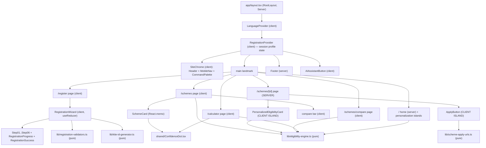
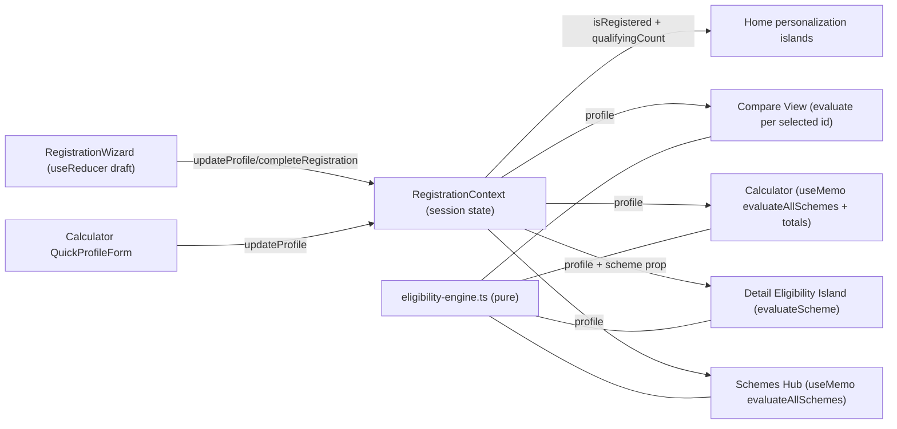

# Design Document

## Overview

This document specifies the design for the **second slice** of **KITE — Karnataka Innovation & Technology Ecosystem** (Prompt 2): the **Registration, Schemes & Benefits, and Policy Calculator** experience. It builds directly on top of the delivered foundation/home slice (`.kiro/specs/kite-foundation-home/`) and reuses its Next.js 14 (App Router) project, TypeScript strict mode, Tailwind CSS, shadcn/ui primitives, fonts (Inter body, Plus Jakarta Sans headings), KITE Design System tokens, and the global layout (`SiteChrome`, `Footer`, `AIAssistantButton`, `CommandPalette`, `MobileNav`).

This slice delivers four user-facing capability groups plus their supporting pure logic and shared state:

1. **Startup Registration** — a six-step guided wizard at `/register` that captures a startup profile and issues a session-scoped KITE ID.
2. **Schemes & Benefits Hub** — a filterable, comparable catalogue at `/schemes`, editorial detail pages at `/schemes/[id]`, and a side-by-side compare view at `/schemes/compare`, all personalized when a profile exists.
3. **Policy Calculator** — a benefit-estimation experience at `/calculator` driven by a pure eligibility engine.
4. **Home page personalization** — surgical, additive touches to the existing home page that reflect a registered profile.

### Frontend-Only, Session-Only (absolute constraint)

This slice is **frontend-only**. There is **no backend, no database, no API, no network call, and no persistence**. All registration and profile state lives in **React Context** for the duration of the browser session and **resets on page refresh**. The application SHALL NOT read from or write to `localStorage`, `sessionStorage`, cookies, or IndexedDB for any content covered by this slice (Req 1.8, 25.1–25.4). Displayed scheme/sector/contact content is sourced verbatim from the canonical foundation data modules `src/data/schemes.ts` (22 schemes), `src/data/sectors.ts` (20 sectors), and `src/data/footer.ts` (Req 25.5). New types are added **additively** to `src/types/index.ts` (Req 2.7).

### Design Goals (inherited from the foundation slice)

- **Government-grade visual language**: gov.uk clarity + Stripe polish + Y Combinator data density. Editorial, flat, data-dense.
- **Zero AI-template aesthetic**: no gradients, no decorative blobs, no glassmorphism, no neon, no emoji, no glow (except the existing AI button). Lucide icons only.
- **Type safety**: TypeScript strict mode, zero `any`; every shape backed by an interface in `src/types/`.
- **Accessibility-first**: WCAG 2.1 AA baked in, not retrofitted (Req 27).
- **Performance**: each route ≤150KB First Load JS (Req 28); all eligibility/filtering computed on the client with no network call.

### Non-Negotiable Stack (this slice)

| Concern | Choice |
|---|---|
| Framework | Next.js 14 App Router, TypeScript strict mode (inherited) |
| Styling | Tailwind CSS + shadcn/ui primitives already installed in `src/components/ui/` |
| Forms | **No new form library.** Wizard uses a single `useReducer` + shadcn `input`/`select`/`checkbox`/`slider`/`radio-group` primitives |
| Icons | Lucide React (20×20 default, no emoji) |
| State | `RegistrationContext` (session-only, in-memory React state) for shared profile; local component state elsewhere |
| Pure logic | Plain TypeScript modules in `src/lib/` — no React, no side effects, no async, no deps |
| Property testing | `fast-check` + Vitest (inherited), minimum 100 runs per property |
| Data | Typed TS files in `src/data/` — no fetch, no API, no storage |

### Visual Discipline (binding, Req 26)

- **NO gradient backgrounds, blobs, glassmorphism, neon, emoji, or glow** (other than the existing AI button).
- Cards: `rounded-xl` + `shadow-sm` + `border border-border`.
- Section padding `py-16 md:py-24`; compact heroes `py-12`.
- Container `max-w-7xl mx-auto px-4 sm:px-6 lg:px-8`, except the `max-w-3xl` wizard.
- Karnataka palette used sparingly; semantic tokens (`success`/`warning`/`muted`/`danger`) drive the Confidence_Dot colors.

## Architecture

### Provider Placement (LOCKED)

`RegistrationContext` is a **client component** at `src/context/RegistrationContext.tsx`. It wraps the **entire application inside `RootLayout`**, at the **same level as `LanguageProvider` and ABOVE `SiteChrome`** so that the header, every page, and the footer can read the session profile. Its state is **in-memory React state only**:

- **NO persistence** of any kind — NO `localStorage`, NO `sessionStorage`, NO cookies, NO IndexedDB, NO API call.
- State initializes to `{ registrationProfile: null, isRegistered: false }` (Req 1.2) and **resets to that initial state on every page refresh** (Req 1.9, 25.4). This is a direct consequence of holding state in React only — a refresh remounts the provider.
- Reading context outside the provider throws a usage error rather than silently returning `undefined` (Req 1.10).

```tsx
// app/layout.tsx (revised composition — additive change)
<html>
  <body className="flex min-h-screen flex-col font-sans">
    <LanguageProvider>
      <RegistrationProvider>      {/* NEW: same level as LanguageProvider, ABOVE SiteChrome */}
        <SiteChrome />
        <main id="main" className="flex-1 pt-16">{children}</main>
        <Footer />
        <AIAssistantButton />
        <Toaster />
      </RegistrationProvider>
    </LanguageProvider>
  </body>
</html>
```

### High-Level Component Tree

Pages remain React Server Components by default; interactivity is isolated into Client Components marked `"use client"`. The eligibility engine and all `src/lib/*` modules are pure and tree-shaken into route bundles. No server data fetching — data modules are imported directly.



### Server-First Boundary Strategy

The design is **server-first; client only where necessary**. Each component is classified explicitly in the table below with its rationale.

| Component / Page | Rendering | Rationale |
|---|---|---|
| `RegistrationContext` provider | **Client** | Holds React state; exposes hooks; must be a client boundary (Req 1.1) |
| `/register` page + `RegistrationWizard` controller | **Client** | Multi-step + form/reducer state, focus management, clipboard (Req 3) |
| `RegistrationStep01..06`, `RegistrationProgress`, `RegistrationSuccess` | **Client** | Render reducer slices, dispatch on change/blur, focus first input |
| `/schemes` Schemes Hub page | **Client** | Filter/search/compare-selection state; reads context (Req 12, 13, 14) |
| `SchemeCard` | **Client** (memoized) | Expanders, compare checkbox, tooltip; `React.memo` |
| `/schemes/[id]` Scheme Detail page | **Server (default)** | Editorial content is static, sourced from `schemes.ts` (Req 16) |
| `PersonalizedEligibilityCard` (detail island) | **Client island** | Reads `RegistrationContext`, calls engine (Req 16.8, 16.9) |
| `ApplyButton` (detail/compare/card island) | **Client island** | Opens external URL in new tab; small interactive control (Req 23) |
| `/schemes/compare` Compare View page | **Client** | Reads `useSearchParams`, remove-column updates URL (Req 17) |
| `/calculator` page + quick-profile form | **Client** | Reads context, dynamic totals, `aria-live` updates (Req 20, 21) |
| `ConfidenceDot` | **Client** (presentational, rendered inside client trees) | Shared primitive used by client surfaces |
| Home personalization banner + Quick Actions badge | **Client islands** | Read `isRegistered` from context (Req 24) |
| `src/lib/*` modules | **N/A (pure TS)** | No React; imported by both server and client code |

### Routing Changes

| Route | Foundation state | This slice |
|---|---|---|
| `/register` | stub | Full `RegistrationWizard` (replaces stub) |
| `/schemes` | `StubPage` | Full Schemes Hub (replaces stub) |
| `/schemes/[id]` | `StubPage` (humanized fallback) | Full editorial detail + `notFound()` for unknown ids (replaces stub) |
| `/schemes/compare` | does not exist | **New** Compare View page |
| `/calculator` | `StubPage` | Full Policy Calculator (replaces stub) |

**Navigation:** `src/data/navigation.ts` already lists "Policy Calculator" → `/calculator` under the "Schemes & Benefits" dropdown. **Confirmed present — no navigation change is required.** (The foundation nav also exposes `/schemes`, `/schemes/elevate`, `/schemes/kitven`; the `[id]` page now resolves real ids and 404s unknown ones — see Reconciliation Notes.)

## Components and Interfaces

### File Structure (every new file + one-line purpose)

```
src/
├── context/
│   └── RegistrationContext.tsx        # CLIENT provider: session profile state, hooks, zone/eligibility derivation
├── lib/
│   ├── eligibility-engine.ts          # PURE: evaluateScheme, evaluator map, evaluateAllSchemes, benefit constants
│   ├── registration-validators.ts     # PURE: one validate function per wizard step (Steps 1–5)
│   ├── kite-id-generator.ts           # PURE: generateKiteId(rng?) → "KITE-YYYY-XXXXXX" (ambiguous chars excluded)
│   └── scheme-apply-urls.ts           # PURE: resolveApplyUrl(schemeId) → external portal URL
├── components/
│   ├── registration/
│   │   ├── RegistrationWizard.tsx     # CLIENT controller: single useReducer, step routing, focus, submit
│   │   ├── RegistrationProgress.tsx   # CLIENT: 6-segment progressbar header (role="progressbar")
│   │   ├── RegistrationStep01Founder.tsx     # CLIENT: founder name/email/phone/age
│   │   ├── RegistrationStep02Company.tsx     # CLIENT: company name, DPIIT, GST, incorporation date, stage
│   │   ├── RegistrationStep03Team.tsx        # CLIENT: team size, women stake/%, SC/ST founder
│   │   ├── RegistrationStep04Sectors.tsx     # CLIENT: primary + up-to-3 secondary sectors
│   │   ├── RegistrationStep05Location.tsx    # CLIENT: location, funding stage, funding raised
│   │   ├── RegistrationStep06Review.tsx      # CLIENT: per-section review cards + accuracy checkbox
│   │   └── RegistrationSuccess.tsx           # CLIENT: KITE ID callout + copy + 3 CTA cards
│   ├── schemes/
│   │   ├── SchemesHub.tsx              # CLIENT: filter/search/compare orchestration, personalization banner
│   │   ├── SchemeCard.tsx             # CLIENT (React.memo): card facts, expanders, compare checkbox, corner dot
│   │   ├── SchemeFilters.tsx          # CLIENT: type tabs, sector/stage multiselects, status filter, search
│   │   ├── CompareBar.tsx             # CLIENT: fixed bottom bar, count live region, Compare/Clear
│   │   ├── PersonalizationBanner.tsx  # CLIENT: registered/unregistered hub banner + reset + quick-filters
│   │   ├── SchemeDetailContent.tsx    # SERVER: editorial sections (intro, glance, eligibility, docs, timeline, FAQ)
│   │   ├── SchemeDetailSidebar.tsx    # SERVER: Key Facts, Related Schemes, Talk to KITS, Last Updated
│   │   ├── PersonalizedEligibilityCard.tsx   # CLIENT ISLAND: reads context, colored eligibility card / register banner
│   │   ├── ApplyButton.tsx            # CLIENT ISLAND: opens resolveApplyUrl(id) in new tab + disclaimer
│   │   ├── CompareView.tsx            # CLIENT: reads useSearchParams, semantic compare table, remove columns
│   │   └── CompareRow.tsx             # CLIENT: one comparison row (Type/Status/Amount/.../Your Eligibility)
│   ├── calculator/
│   │   ├── CalculatorEntry.tsx        # CLIENT: entry card (Use My Registration / Use Quick Profile)
│   │   ├── QuickProfileForm.tsx       # CLIENT: compressed engine-only fields → updateProfile
│   │   ├── CalculatorResults.tsx      # CLIENT: total, confidence meter, grouped breakdown (aria-live)
│   │   └── CalculatorBreakdownRow.tsx # CLIENT: scheme row with ConfidenceDot + benefit + reasons expander
│   └── shared/
│       └── ConfidenceDot.tsx          # Shared 10px status dot primitive (aria-label, never color-only)
└── app/
    ├── register/page.tsx              # Replaces stub → renders RegistrationWizard
    ├── schemes/page.tsx               # Replaces stub → renders SchemesHub
    ├── schemes/[id]/page.tsx          # Replaces stub → SERVER detail + client islands, notFound() on miss
    ├── schemes/compare/page.tsx       # NEW → renders CompareView (Suspense around useSearchParams)
    └── calculator/page.tsx            # Replaces stub → renders Calculator (entry/results)
```

Additive type extensions live in `src/types/index.ts` (see Data Models). Test files live under `__tests__` dirs (see Test Architecture).

## Data Models

All new types are appended to `src/types/index.ts` **additively** — no existing exported type is removed or altered (Req 2.7). Under TypeScript strict mode the additions compile with zero errors (Req 2.8).

### Type Definitions

```typescript
// src/types/index.ts (ADDITIVE — appended below the existing foundation types)

// --- Enumerations (Req 2.2–2.5) ---
export type Zone = 'Zone 1' | 'Zone 2' | 'Zone 3';

export type FundingStage =
  | 'Bootstrapped' | 'Pre-Seed' | 'Seed' | 'Series A' | 'Series B Plus';

export type CurrentStage =
  | 'Idea' | 'PoC' | 'Early Revenue' | 'Growth' | 'Scale';

export type LocationKarnataka =
  | 'Bengaluru Urban'
  | 'Bengaluru Rural'
  | 'Mysuru'
  | 'Mangaluru'
  | 'Hubballi-Dharwad-Belagavi'
  | 'Kalaburagi'
  | 'Shivamogga'
  | 'Tumakuru'
  | 'Other Karnataka';

export type EligibilityStatus =
  | 'definitely-eligible'
  | 'likely-eligible'
  | 'check-requirements'
  | 'not-eligible';

// --- Registration profile (Req 2.1) ---
export interface RegistrationProfile {
  // Founder (Step 1)
  founderName: string;
  founderEmail: string;
  founderPhone: string;
  founderAge: number;
  // Company (Step 2)
  companyName: string;
  dpiitRecognized: boolean;
  gstRegistered: boolean;
  incorporationDate: string;        // ISO 8601
  currentStage: CurrentStage;
  // Team (Step 3)
  teamSize: number;
  womenFounderStake: number;        // 0..100
  womenEmployeePercentage: number;  // 0..100
  scStFounder: boolean;
  // Sector (Step 4)
  primarySector: string;            // Sector id
  secondarySectors: string[];       // Sector ids, max 3, excludes primary
  // Location & funding (Step 5)
  location: LocationKarnataka;
  fundingStage: FundingStage;
  fundingRaised: number;            // in lakhs, >= 0
  // Status (set by completeRegistration)
  isRegistered: boolean;
  kiteId: string;
  registeredAt: string;             // ISO 8601
}

// --- Eligibility result (Req 2.6, 19.1) ---
export interface EligibilityResult {
  schemeId: string;
  status: EligibilityStatus;
  reasons: string[];
  estimatedBenefit: number;         // rupees, >= 0
  confidence: number;               // 0..1 inclusive
}

// --- Context contract (Req 1.3) ---
export interface RegistrationContextValue {
  registrationProfile: RegistrationProfile | null;
  isRegistered: boolean;
  zone: Zone | null;                              // derived from location (Req 1.7)
  qualifyingCount: number;                        // schemes definitely/likely eligible (Req 12.4)
  updateProfile: (partial: Partial<RegistrationProfile>) => void;  // merge (Req 1.4)
  completeRegistration: () => void;               // set isRegistered, kiteId, registeredAt (Req 1.5)
  resetRegistration: () => void;                  // back to null/false (Req 1.6)
  evaluate: (scheme: Scheme) => EligibilityResult | null; // null when no profile
}

// --- Wizard reducer types (see Wizard Reducer Spec) ---
export type WizardStep = 1 | 2 | 3 | 4 | 5 | 6;

export type WizardFieldErrors = Record<string, string>;

export interface WizardState {
  currentStep: WizardStep;
  profile: Partial<RegistrationProfile>;          // cross-step draft
  errors: Record<WizardStep, WizardFieldErrors>;  // per-step validation output
  touched: Record<string, boolean>;               // fieldName -> blurred?
  submitted: boolean;                             // true after completeRegistration
}

export type WizardAction =
  | { type: 'SET_FIELD'; field: keyof RegistrationProfile; value: unknown }
  | { type: 'BLUR_FIELD'; field: string }
  | { type: 'VALIDATE_STEP'; step: WizardStep }
  | { type: 'NEXT' }
  | { type: 'BACK' }
  | { type: 'GO_TO_STEP'; step: WizardStep }      // Edit from Review
  | { type: 'TOGGLE_ACCURACY'; value: boolean }
  | { type: 'SUBMIT' };

// Helper types
export type StepValidator = (profile: Partial<RegistrationProfile>) => WizardFieldErrors;
export type SchemeEvaluator = (profile: RegistrationProfile, scheme: Scheme) => EligibilityResult;
```

### Derived Data — Zone (Req 1.7)

Zone is derived purely from `location`:

| Location | Zone |
|---|---|
| Bengaluru Urban | Zone 3 |
| Bengaluru Rural, Mysuru, Mangaluru, Hubballi-Dharwad-Belagavi | Zone 2 |
| Kalaburagi, Shivamogga, Tumakuru, Other Karnataka | Zone 1 |

Implemented as a pure total function `deriveZone(location: LocationKarnataka): Zone` exported from `eligibility-engine.ts` (used by both the context and the engine).

### Canonical Source Data (unchanged)

Scheme content (name, type, amount, maxBenefit, duration, eligibility, documents, status, note) is read from `src/data/schemes.ts` (22 schemes). Sector options from `src/data/sectors.ts` (20 sectors). Contact `tel:`/`mailto:` for the "Talk to KITS" card from `src/data/footer.ts`. None of these values are fabricated or altered (Req 25.5).

## Module Specifications

### `src/lib/eligibility-engine.ts` (pure)

**Constraints (Req 18.1):** pure TypeScript, **no React, no side effects, no async, no external dependencies**. Same input always yields the same output. Imported by the Hub, Detail island, Compare view, Calculator, and Home banner.

**Module structure:**

```typescript
// 1. Benefit constants — documented numeric max-benefit map (Req 19.2, 19.3).
//    estimatedBenefit must NOT come from free-text parsing of scheme.maxBenefit.
//    Each scheme id maps to its maximum benefit in RUPEES.

// Equity-instrument schemes have no fixed rupee benefit. Per Req 19.3 we use a
// documented placeholder valuation: 10% of ₹1 crore = ₹10,00,000.
export const EQUITY_BENEFIT_PLACEHOLDER_RUPEES = 0.10 * 1_00_00_000; // ₹10,00,000

export const SCHEME_MAX_BENEFIT_RUPEES: Record<string, number> = {
  'sgst-reimbursement': 1_00_00_000,        // capped at 100% FCI — representative cap
  'patent-subsidy': 15_00_000,              // ₹15 lakh/year
  'global-karnataka': 5_00_000,             // ₹5 lakh/year
  'quality-certification': 6_00_000,        // ₹6 lakh total
  'pf-esi-reimbursement': 12_00_000,        // ₹12 lakh per company
  'cloud-storage': 1_00_000,                // ₹1 lakh/year
  'rd-project-grant': 1_00_00_000,          // ₹1 crore
  'internship-support': 5_000 * 3 * 6,      // ₹5k × 3 interns × 6 months = ₹90,000
  'elevate': 50_00_000,                     // ₹50 lakh
  'elevate-unnati': 50_00_000,              // ₹50 lakh
  'rgep': 3_00_000,                         // ₹3 lakh total
  'grand-challenge-karnataka': 50_00_000,   // ₹50 lakh (Phase 2B winner)
  'kitven-fund-5': EQUITY_BENEFIT_PLACEHOLDER_RUPEES,            // equity
  'beyond-bengaluru-cluster-fund': EQUITY_BENEFIT_PLACEHOLDER_RUPEES, // equity
  'alternate-investment-bridge': EQUITY_BENEFIT_PLACEHOLDER_RUPEES,   // equity/bridge
  'new-incubation-centers': 50_00_000,      // ₹50 lakh
  'incubation-expansion': 25_00_000,        // ₹25 lakh
  'nain-2': 5_00_000,                       // ₹5 lakh per project
  'preferential-market-access': 50_00_000,  // ₹50 lakh limited tender
  'kan': 0,                                 // non-monetary acceleration
  'tto': 25_00_000,                         // ₹25 lakh
  'grassroot-innovation': 4_00_000,         // ₹4 lakh per innovator
};

// 2. Status → derived numbers (Req 19.2, 19.4). Single source of the mapping.
export function benefitForStatus(status, maxRupees): number;  // full / half / 0
export function confidenceForStatus(status): number;          // 1 / 0.7 / 0.3 / 0

// 3. Ordinal helpers for the rules.
const STAGE_ORDER: Record<CurrentStage, number>;     // Idea<PoC<Early Revenue<Growth<Scale
const FUNDING_ORDER: Record<FundingStage, number>;   // Bootstrapped<Pre-Seed<Seed<Series A<Series B Plus
export function deriveZone(location): Zone;

// 4. Per-scheme evaluator MAP, indexed by scheme id. Each entry is a pure
//    function encoding that scheme's rules (Req 18.2–18.12).
export const SCHEME_EVALUATORS: Record<string, SchemeEvaluator>;

// 5. DEFAULT evaluator — schemes with no explicit entry return
//    'check-requirements' with a generic reason (Req 19.5).
export const defaultEvaluator: SchemeEvaluator;

// 6. Primary entry point — picks the scheme's evaluator or the default,
//    then guarantees a well-formed result via a final normalizer.
export function evaluateScheme(profile: RegistrationProfile, scheme: Scheme): EligibilityResult;

// 7. Batch — used by the Calculator and Hub count.
export function evaluateAllSchemes(profile: RegistrationProfile): Record<string, EligibilityResult>;

// 8. Totals (Req 19.7) — sum of estimatedBenefit over QUALIFYING schemes
//    (status definitely- or likely-eligible).
export function totalEstimatedBenefit(results: Record<string, EligibilityResult>): number;
export function weightedAverageConfidence(results: Record<string, EligibilityResult>): number;
```

**Evaluator-map pattern.** `evaluateScheme` looks up `SCHEME_EVALUATORS[scheme.id]`; if absent it calls `defaultEvaluator`. Every evaluator returns through a shared `makeResult(schemeId, status, reasons)` helper that computes `estimatedBenefit` and `confidence` from the status mapping and the benefit constant, and **guarantees**: `schemeId === scheme.id`, `status` ∈ the four values, `reasons` non-empty whenever status ≠ `definitely-eligible`, `estimatedBenefit ≥ 0`, and `confidence ∈ [0,1]` (Req 19.1, 19.5, 19.6, 30.2–30.6). This makes the well-formedness invariants structural, not per-evaluator.

**Representative encoded rules (Req 18.2–18.12):**

| Scheme id | Rule for `definitely-eligible` / qualifying (Req) |
|---|---|
| `sgst-reimbursement` | `dpiitRecognized && gstRegistered && stage ≥ Early Revenue` (18.2) |
| `patent-subsidy` | `dpiitRecognized` (any stage) (18.3) |
| `elevate` | `stage ∈ {Idea, PoC} && fundingStage ≤ Pre-Seed` (18.4) |
| `elevate-unnati` | ELEVATE rule **and** `scStFounder === true` (18.5) |
| women-led schemes | qualifying when `womenFounderStake ≥ 51 || womenEmployeePercentage ≥ 51` (18.6) |
| `rgep` | qualifying when `founderAge ≤ 30` (18.7) |
| `new-incubation-centers` | qualifying only when `deriveZone(location) ∈ {Zone 1, Zone 2}` (excludes Bengaluru Urban) (18.8) |
| `beyond-bengaluru-cluster-fund` | qualifying only when `location !== 'Bengaluru Urban'` (18.9) |
| `kitven-fund-5` | qualifying only when `stage ≥ Early Revenue` (18.10) |
| `internship-support` | qualifying based on `dpiitRecognized === true` (18.11) |
| `nain-2` | student-team status unknown → `check-requirements`; otherwise `not-eligible` when criterion unmet (18.12) |

Schemes between full-`definitely-eligible` and disqualified resolve to `likely-eligible` (partial match) or `check-requirements` (insufficient signal), with human-readable `reasons` explaining the gap.

### `src/lib/kite-id-generator.ts` (pure)

```typescript
// Unambiguous alphabet: A–Z + 2–9, EXCLUDING look-alikes O, 0, I, 1.
export const KITE_ID_ALPHABET = 'ABCDEFGHJKLMNPQRSTUVWXYZ23456789'; // 32 chars, no O/0/I/1
export const KITE_ID_PATTERN = /^KITE-\d{4}-[ABCDEFGHJKLMNPQRSTUVWXYZ23456789]{6}$/;

export type Rng = () => number; // returns [0,1)

// Deterministic given an injectable rng (for tests); defaults to Math.random.
// YYYY = current calendar year (Req 29.3); XXXXXX = 6 chars drawn from the
// unambiguous alphabet (Req 29.1).
export function generateKiteId(rng: Rng = Math.random, year = new Date().getFullYear()): string;
```

The injectable `rng`/`year` make the generator deterministic and fully testable; the format property test (Property 1) drives 100+ runs with arbitrary rng streams and asserts `KITE_ID_PATTERN.test(id)` always holds (Req 29.2).

### `src/lib/scheme-apply-urls.ts` (pure)

```typescript
export const DEFAULT_APPLY_URL = 'https://eitbt.karnataka.gov.in/startup';

const APPLY_URL_MAP: Record<string, string> = {
  'kitven-fund-5': 'https://kitven.in',                                   // Req 23.2
  'kan': 'https://karnatakadigital.in/acceleration-network',              // Req 23.3
  'elevate': 'https://eitbt.karnataka.gov.in/elevate',                    // Req 23.4
  'elevate-unnati': 'https://eitbt.karnataka.gov.in/elevate',             // Req 23.4 (ELEVATE family)
};

// Total function: every scheme id returns a valid absolute https URL (Req 23.5).
export function resolveApplyUrl(schemeId: string): string;
```

All "Apply Now" controls render the resolved URL with `target="_blank" rel="noopener noreferrer"` and an inline disclaimer that the link redirects to an official portal while this site is a frontend preview (Req 23.1, 23.6).

### `src/lib/registration-validators.ts` (pure)

One pure validator per step (Steps 1–5); Step 6 has no field validation beyond the accuracy checkbox (handled in the reducer). Each returns a `WizardFieldErrors` record mapping invalid field → message, or `{}` when valid (Req 11.1–11.5).

```typescript
export const validateStep1: StepValidator; // founderName ≥2 trimmed; email pattern; phone =10 digits after stripping +91/separators; age 18..80
export const validateStep2: StepValidator; // companyName ≥2; dpiit/gst explicit; incorporationDate present & not future; currentStage ∈ enum
export const validateStep3: StepValidator; // teamSize 1..5000; stakes 0..100
export const validateStep4: StepValidator; // primarySector valid id; secondarySectors ≤3 & exclude primary
export const validateStep5: StepValidator; // location ∈ enum; fundingStage ∈ enum; fundingRaised ≥0
```

Validators are pure: same input → same output, no argument mutation, no I/O, no storage/network access (Req 11.4). They encode exactly the rules in Requirements 4–8 (Req 11.5), and the wizard's Continue gating reuses them so UI and tests share one rule set.

## Component Specifications

### Registration

**`RegistrationWizard.tsx` (Client controller).** Renders inside a `max-w-3xl` centered container (Req 3.1). Holds the **single `useReducer`** (see Wizard Reducer Spec). Renders `RegistrationProgress` + the active step component + Back/Continue controls. Routes steps 1→6; on the success transition renders `RegistrationSuccess` instead of step content. Each step receives its **state slice** (`profile` fields, that step's `errors`, `touched`) plus a `dispatch` callback — no per-field `useState`. On `NEXT` with a valid step, it pushes the step's fields into the shared draft and advances; on submit it calls `completeRegistration()` from context (Req 3.8, 9.5).

**`RegistrationProgress.tsx` (Client).** Header showing "Step N of 6" + step title and a six-segment bar. Active/completed segments use the accent token; future segments use muted (Req 3.3). Implemented as `role="progressbar"` with `aria-valuenow={currentStep}`, `aria-valuemin={1}`, `aria-valuemax={6}` (Req 27.1).

**Step components (Client).** Each renders only its fields and wires `onChange → SET_FIELD`, `onBlur → BLUR_FIELD`. Field errors display **only after blur** (driven by `touched`) inside an adjacent `aria-live="polite"` region, with the input `aria-describedby` linking to the error node (Req 27.3). Specifics:
- **Step01Founder** — name, email, phone, age (Req 4).
- **Step02Company** — company name, DPIIT Yes/No, GST Yes/No (radio groups requiring explicit selection), incorporation date, current-stage select (Req 5).
- **Step03Team** — team size; `womenFounderStake` and `womenEmployeePercentage` sliders (0–100); SC/ST founder toggle. Shows the women-led unlock note when either stake ≥51 and the ELEVATE Unnati note when SC/ST is selected (Req 6.4, 6.5).
- **Step04Sectors** — single-select primary (20 sectors, source order); multi-select secondary excluding primary, capped at 3 (a 4th selection is prevented); changing primary to a sector already in secondary removes it from secondary (Req 7).
- **Step05Location** — location select (9 values), funding-stage select (5 values), funding-raised number in lakhs defaulting to 0 (Req 8).
- **Step06Review** — one review card per section with an Edit control (`GO_TO_STEP`), plus the required accuracy checkbox; the "Submit Registration" control is gated on the checkbox (Req 9).

**`RegistrationSuccess.tsx` (Client).** Centered success state: success-token check icon + "Registration Complete" headline; KITE ID callout with a Copy control (writes to clipboard, shows a confirmation toast); exactly three CTA cards — "See Schemes You Qualify For" → `/schemes`, "Calculate Your Benefits" → `/calculator`, "Explore the Ecosystem" → `/`; and a disclaimer that registration is a session-only frontend preview not submitted to any government system (Req 10).

### Schemes

**`SchemesHub.tsx` (Client).** Orchestrates `PersonalizationBanner`, `SchemeFilters`, the memoized card grid, and `CompareBar`. Compact dark hero `py-12` (Req 12.1). Owns filter state (type tab, secondary-sector multiselect, stage multiselect, status filter, search text) and the `compareSelection: string[]` (max 3). Reads `RegistrationContext`; when registered, computes `evaluateAllSchemes(profile)` **once** via `useMemo` and passes each card its precomputed `EligibilityResult` (see Memoization Boundaries). The visible set is derived by composing all active filters (AND semantics) over the 22 schemes (Req 13.7); zero matches show a "no schemes match" message with filters still visible (Req 13.9).

**`PersonalizationBanner.tsx` (Client).** Registered: accent-bordered banner "Personalized for {kiteId}", "You qualify for X of 22 schemes" (X = count of definitely/likely eligible), a Reset control (`resetRegistration`), and three quick-filter chips ("Show Only Eligible", "Show All", "Compare Selected") (Req 12.2–12.4, 12.6). Unregistered: muted banner with a "Register Now" control → `/register` (Req 12.5).

**`SchemeCard.tsx` (Client, `React.memo`).** Name, type badge, status badge, benefit line (`amount` + `maxBenefit`), duration caption; eligibility truncated to two lines with expand; documents expander; "View Details" → `/schemes/[id]`; "Apply Now" island (new tab, `rel="noopener noreferrer"`); Compare checkbox bound to the selection. When registered, a corner `ConfidenceDot` colored by status with a tooltip exposing reasons; when unregistered, no dot (Req 15).

**`SchemeFilters.tsx` (Client).** Three type tabs (All / Fiscal Incentives / Grant-in-Aid), secondary-sector multiselect, stage multiselect, status filter (All / Open / Upcoming), and search input. Defaults: All type + All status, all 22 shown (Req 13.1, 13.2). Search is case-insensitive substring over scheme name (Req 13.6).

**`CompareBar.tsx` (Client).** Fixed to the viewport bottom while 1–3 schemes are selected; shows count, Compare, Clear. A 4th add is rejected with a toast and the selection stays at 3 (Req 14.3). Clear empties the selection and hides the bar (Req 14.4, 14.6). Compare serializes the selection into search params and navigates to `/schemes/compare` (Req 14.5). Fully keyboard reachable/operable (Req 14.7, 27.4); a polite live region announces the selected count.

**Scheme Detail page (`/schemes/[id]`, SERVER) + islands.** Resolves the `[id]` param in a fixed order: (1) direct match against `schemes.ts` by `id`; (2) `SCHEME_ID_ALIASES` lookup — a documented backward-compatibility map (`kitven` → `kitven-fund-5`, `gck` → `grand-challenge-karnataka`) so foundation-era nav/footer links keep resolving; (3) `notFound()` when neither matches (Req 16.10). The alias map carries a code comment explaining its backward-compatibility purpose. Two-column layout (main + sticky sidebar) on desktop, single column + sticky bottom action bar on mobile (Req 16.1). `SchemeDetailContent` (server) renders breadcrumb, name heading, type/status badges, editorial intro, a "Benefit at a Glance" trio (amount/maxBenefit/duration), eligibility bullets, numbered documents, a 4–5 step process timeline that differs by `type` (illustrative founder-judgment guidance, not canonical data), and a 5–7 entry FAQ accordion (Req 16.2–16.6). `SchemeDetailSidebar` (server) renders the Apply control, Key Facts (id, type, status, owner "Karnataka EITBT Department", note when present), exactly three same-`type` Related Schemes cards, a "Talk to KITS" card with `tel:`/`mailto:` from `footer.ts`, and a Last Updated line (Req 16.7).

**`PersonalizedEligibilityCard.tsx` (CLIENT ISLAND).** Rendered inside the server detail page; receives the resolved `scheme` as a **prop** (so the server passes canonical data down). Reads `RegistrationContext`: unregistered → a small "register to see your eligibility" banner (Req 16.9); registered → calls `evaluateScheme(profile, scheme)` and renders a card whose border color encodes the status, with a "Your Eligibility" title, a reasons paragraph, and an estimated-benefit line in rupees (Req 16.8). This is the server-component-with-client-island pattern: static editorial stays on the server; only the personalized fragment ships JS.

**`ApplyButton.tsx` (CLIENT ISLAND).** Receives `schemeId`; opens `resolveApplyUrl(schemeId)` in a new tab with `rel="noopener noreferrer"`; renders the inline official-portal disclaimer (Req 23).

**Compare View page (`/schemes/compare`, CLIENT).** `CompareView` reads scheme ids from `useSearchParams` (Req 17.1), wrapped in a `<Suspense>` boundary as required for `useSearchParams` in the App Router. With 2–3 valid ids it renders a semantic `<table>` with one column per scheme and programmatically associated row/column headers (Req 17.2, 27.5). Column headers show name + Remove; removing a column updates the URL search params (Req 17.3, 17.4). Rows: Type, Status, Amount, Max Benefit, Duration, Eligibility (bulleted), Documents (numbered) (Req 17.5); when registered, an extra "Your Eligibility" row with a per-column `ConfidenceDot` + reasons (Req 17.6). "Back to Schemes" → `/schemes` and a per-column Apply island (Req 17.7). Fewer than two valid ids → a prompt to select schemes with a link back to `/schemes` (Req 17.8).

### Calculator

**Calculator page (`/calculator`, CLIENT).** Compact hero (Req 20.1). When no profile exists, renders `CalculatorEntry`: a centered card with "Use My Registration" → `/register` and "Use Quick Profile" revealing `QuickProfileForm` (Req 20.2). The quick-profile form captures **only the fields the engine uses** (DPIIT, GST, current stage, founder age, women stakes, SC/ST, location, funding stage) and on save calls `updateProfile`, entering Profile_Set_State with `isRegistered` still false (Req 20.3, 20.4). While in Profile_Set_State or Registered_State it renders `CalculatorResults` instead of the entry card (Req 20.5).

**`CalculatorResults.tsx` (Client).** Profile summary row with Edit; total benefits as a large bold Plus Jakarta Sans number formatted in crore/lakh units with "Across X schemes you qualify for" (Req 21.2); a thin confidence meter labeled High (>0.8) / Medium (>0.5..0.8) / Low (≤0.5) from the weighted-average confidence (Req 21.3); a status-grouped breakdown with Definitely/Likely expanded and Check Requirements/Not Eligible collapsed by default (Req 21.4); per-row scheme name + `ConfidenceDot` + estimated benefit + reasons expander (Req 21.5); "Update Profile" and "Apply to Eligible Schemes" (→ `/schemes` filtered to eligible) controls (Req 21.6). No PDF, no multi-year projections (Req 21.7). The total + confidence label live inside an `aria-live="polite"` region (Req 21.6 a11y, 27.6). Eligibility is computed once per profile change via `useMemo(() => evaluateAllSchemes(profile), [profile])`.

### Shared

**`ConfidenceDot.tsx`.** `props { status: EligibilityStatus; showLabel?: boolean }`. Default: a 10px circular dot (Req 22.1) colored green (`success`) / yellow (`warning`) / gray (`muted`) / red (`danger`) for definitely / likely / check-requirements / not-eligible (Req 22.2), with a non-empty `aria-label` naming the status. With `showLabel`, renders the dot plus inline status text. **Color is never the sole signal** — the meaning is always carried by `aria-label` or visible label (Req 22.3). Used identically in hub card corners, the detail eligibility card, calculator rows, and compare cells (Req 22.4).

## Data Flow

Registration data flows one way, from the wizard into the shared context, then out to every personalized surface:



- The wizard accumulates a `Partial<RegistrationProfile>` draft in its reducer; only on step advance / submit does it write through `updateProfile` / `completeRegistration` (Req 3.8, 9.5). `updateProfile` **merges** the partial into the current profile, preserving untouched fields (Req 1.4).
- The Calculator's quick profile writes the same shape via `updateProfile` but never sets `isRegistered` (Req 20.4).
- Consumers never mutate the engine's inputs; the engine is pure, so identical profiles always produce identical results, which makes memoization safe.

## Wizard Reducer Specification

A **single typed, pure `useReducer`** governs all wizard state (no per-field `useState`). State shape and action union are defined in Data Models (`WizardState`, `WizardAction`).

- **`currentStep`** — the active step (1–6); drives the progress bar and which step component renders.
- **`profile`** — the cross-step `Partial<RegistrationProfile>` draft accumulated as the visitor types.
- **`errors`** — per-step `WizardFieldErrors`, recomputed by `VALIDATE_STEP` using the matching pure validator.
- **`touched`** — a `Record<fieldName, boolean>`; a field's error is **rendered only after its blur** sets `touched[field] = true`, so visitors are not scolded before they finish typing.
- **`submitted`** — set by `SUBMIT`, triggering the success transition.

Reducer behavior:
- `SET_FIELD` updates `profile[field]`; for Step 4, setting `primarySector` also drops that id from `secondarySectors`, and adding a 4th secondary is ignored (Req 7.5, 7.6).
- `BLUR_FIELD` marks `touched[field]`.
- `VALIDATE_STEP` writes `errors[step]` from `validateStepN(profile)`.
- `NEXT` is a no-op when the current step's errors are non-empty (Continue is gated); otherwise increments `currentStep`.
- `BACK` decrements `currentStep` (no-op at step 1); all entered values are retained because the draft is never cleared (Req 3.9).
- `GO_TO_STEP` jumps to a step (Review "Edit"), retaining values (Req 9.2).
- `TOGGLE_ACCURACY` flips the Step 6 accuracy flag that gates submit.
- `SUBMIT` sets `submitted` and is the controller's signal to call `completeRegistration()`.

The reducer is a **pure function** `(state, action) => state` with an exhaustively typed `WizardAction` union (compiler-checked switch), making it unit-testable in isolation.

## URL vs React State Split (LOCKED)

| State | Lives in | Rationale |
|---|---|---|
| Schemes Hub filters (type, sectors, stage, status, search) | **React component state** (NOT URL) | This slice has **no shareable/deep-linkable filters**; keeping them in state avoids router churn and keeps the Hub bundle lean (Req 13) |
| Compare-bar selection (`compareSelection: string[]`) | **Hub React state** | Transient pre-navigation selection |
| Compare View selected scheme ids | **URL search params** (`useSearchParams`) | The compare view is explicitly shareable (Req 17.1); ids are the canonical source there |

On "Compare", the Hub **serializes** its `compareSelection` into search params (e.g. `?ids=elevate,kitven-fund-5`) when navigating to `/schemes/compare`. The Compare View then reads ids **only** from the URL, and its Remove control **writes back** to the URL (Req 17.4) — the URL is the single source of truth on that page. The Hub never reads filters from the URL.

## Accessibility Specification (Req 27)

- **Wizard progress bar**: `role="progressbar"` with `aria-valuenow={currentStep}`, `aria-valuemin={1}`, `aria-valuemax={6}` (Req 27.1).
- **Step structure**: each step heading carries an `id`; the step container uses `aria-labelledby` referencing that id, giving each step a programmatic name.
- **Field errors**: rendered in `aria-live="polite"` regions placed adjacent to their fields; each field links to its error via `aria-describedby` (field → error id) so SRs announce errors as they appear (Req 27.3).
- **Continue control**: when invalid, uses `aria-disabled="true"` (NOT the `disabled` attribute) so screen-reader users can still focus it and hear why it is unavailable; activation is suppressed in the handler (Req 3.10, 27.2).
- **Focus management**: advancing to a step moves keyboard focus to that step's first input (Req 3.11, 27.1).
- **Compare bar**: a polite live region announces the selected count as it changes (Req 27.4); the bar is fully keyboard reachable/operable.
- **Compare View**: a semantic `<table>` with `<th scope="col">` per scheme and `<th scope="row">` per attribute row for programmatic header association (Req 27.5).
- **Calculator**: the total benefits value and the confidence label are wrapped in an `aria-live="polite"` region so updates are announced (Req 27.6).
- **ConfidenceDot**: never color-only; status conveyed via `aria-label`/label text (Req 22.3, 27.8).
- **Contrast & names**: ≥4.5:1 normal text, ≥3:1 large text (Req 27.7); every label-less interactive control exposes a non-empty accessible name (Req 27.8).
- **Reduced motion**: this slice adds no new animation; it inherits the global `prefers-reduced-motion: reduce` rule in `globals.css` that disables transitions/animations. Step transitions render their final state instantly under reduced motion, and the confidence meter fills without animating.

## Memoization Boundaries (Req 28)

- **Scheme cards**: `SchemeCard` is wrapped in `React.memo`; with 22 cards this prevents re-render storms when only filter or selection state changes.
- **Hub eligibility**: computed **once per profile change** via `useMemo(() => evaluateAllSchemes(profile), [profile])` at the Hub level — **not per card**. Each card receives its precomputed `EligibilityResult` as a prop.
- **Compare View**: computes eligibility **once at mount** for the selected schemes (and when the id set changes), not per render.
- **Calculator**: `useMemo(() => evaluateAllSchemes(profile), [profile])`, with totals/weighted confidence derived from that memoized map.
- The engine's purity guarantees referential stability of results for a stable profile, so these memos are correct and cheap.

## Bundle Budget Allocation (Req 28)

Target: **≤150KB First Load JS per route**; `/schemes/compare` is counted independently (Req 28.5).

| Route | Notable client weight | Risk |
|---|---|---|
| `/register` | wizard controller + 6 steps + shadcn input/select/slider/checkbox/radio | **Watch** — keep steps in one client tree, no new form lib |
| `/schemes` | Hub + 22 memoized cards + filters + compare bar + engine | **Highest risk** — 22 cards × interactivity; mitigate with `React.memo`, single Hub-level eligibility memo, and lean card markup |
| `/schemes/[id]` | mostly SERVER; only the eligibility + apply islands ship JS | Low |
| `/schemes/compare` | client table + engine (counted separately) | Moderate |
| `/calculator` | results view + quick-profile form + engine | Moderate |

Budget levers: the **eligibility engine is small plain TypeScript with no dependencies**; the **wizard reuses only existing deps + shadcn primitives** (no new form library); detail pages stay server-rendered with minimal islands; below-the-fold and rarely-used controls can use `next/dynamic` if a route approaches budget.

## Correctness Properties

*A property is a characteristic or behavior that should hold true across all valid executions of a system — essentially, a formal statement about what the system should do. Properties serve as the bridge between human-readable specifications and machine-verifiable correctness guarantees.*

The properties below were derived from the acceptance-criteria prework. The pure logic of this slice — the eligibility engine, KITE-ID generator, apply-URL resolver, step validators, zone derivation, filtering, selection caps, totals, and the URL round-trip — is highly amenable to property-based testing. Fixed-content rendering, wizard focus/navigation interactions, state transitions, semantic table structure, configuration, and bundle budgets are covered by example, edge-case, integration, and smoke tests in the Testing Strategy instead.

### Property 1: KITE ID format

*For any* random number stream and any four-digit year, `generateKiteId` SHALL return a string matching `KITE-YYYY-XXXXXX` where `YYYY` is the supplied current year and `XXXXXX` is exactly six characters drawn from the unambiguous alphabet `A–Z,2–9` excluding `O`, `0`, `I`, `1`.

**Validates: Requirements 29.1, 29.2, 29.3**

### Property 2: Apply URL is always a valid external destination

*For any* scheme id (including every id in `schemes.ts` and arbitrary strings), `resolveApplyUrl` SHALL return a non-empty absolute `https` URL, returning the documented mapping for KITVEN/KAN/ELEVATE ids and the default `eitbt.karnataka.gov.in/startup` URL otherwise.

**Validates: Requirements 23.1, 23.2, 23.3, 23.4, 23.5**

### Property 3: Eligibility result is well-formed

*For any* generated `RegistrationProfile` and any `Scheme`, `evaluateScheme` SHALL return an `EligibilityResult` whose `status` is one of the four `EligibilityStatus` values, whose `schemeId` equals the input scheme's `id`, whose `estimatedBenefit` is greater than or equal to 0, whose `confidence` lies within the inclusive range 0 to 1, and whose `reasons` array is non-empty whenever `status` is not `definitely-eligible`.

**Validates: Requirements 19.1, 19.5, 19.6, 30.2, 30.3, 30.4, 30.5, 30.6**

### Property 4: Status determines benefit and confidence

*For any* generated profile and scheme, the returned `estimatedBenefit` SHALL equal the scheme's documented maximum benefit when `status` is `definitely-eligible`, half of it when `likely-eligible`, and 0 when `check-requirements` or `not-eligible`; and `confidence` SHALL equal 1, 0.7, 0.3, or 0 for those statuses respectively.

**Validates: Requirements 19.2, 19.4**

### Property 5: Total benefit equals the sum over qualifying schemes

*For any* map of `EligibilityResult` values, `totalEstimatedBenefit` SHALL equal the sum of `estimatedBenefit` across exactly the schemes whose `status` is `definitely-eligible` or `likely-eligible`.

**Validates: Requirements 19.7**

### Property 6: Zone derivation is total and correct

*For any* `LocationKarnataka` value, `deriveZone` SHALL return the documented Zone — Bengaluru Urban → Zone 3; Bengaluru Rural, Mysuru, Mangaluru, Hubballi-Dharwad-Belagavi → Zone 2; Kalaburagi, Shivamogga, Tumakuru, Other Karnataka → Zone 1 — and SHALL always return one of the three Zone values.

**Validates: Requirements 1.7**

### Property 7: updateProfile merges and preserves

*For any* current profile state and any partial profile, `updateProfile` SHALL produce a profile equal to the current state with exactly the partial's keys overwritten and every key absent from the partial left unchanged.

**Validates: Requirements 1.4**

### Property 8: Step validators accept valid input and are pure

*For any* set of step field values that satisfy that step's rules, the corresponding Step_Validator SHALL return an empty record, SHALL return an identical record when invoked again with the same input, and SHALL NOT mutate its argument.

**Validates: Requirements 11.2, 11.3, 11.4**

### Property 9: Step validators flag out-of-range fields

*For any* step field set in which a single field violates its rule (name shorter than 2 trimmed characters, malformed email, phone not 10 digits after stripping `+91`/separators, age outside 18–80, future or empty incorporation date, team size outside 1–5000, funding raised below 0, or an out-of-enum selection), the corresponding Step_Validator SHALL include that field name in its returned error record.

**Validates: Requirements 4.2, 4.3, 4.4, 4.5, 5.2, 5.4, 5.5, 6.2, 8.3, 8.5, 8.7, 11.5**

### Property 10: Scheme filtering composes predicates

*For any* scheme set and any combination of active filters (type tab, status filter, secondary-sector multiselect, stage multiselect, and case-insensitive name search), the visible schemes SHALL be exactly those satisfying all active filter conditions together — every shown scheme matches every active filter and no hidden scheme matches all of them.

**Validates: Requirements 13.3, 13.4, 13.5, 13.6, 13.7**

### Property 11: Qualifying count matches eligible schemes

*For any* `RegistrationProfile`, the qualifying count "X" SHALL equal the number of schemes whose `EligibilityStatus` is `definitely-eligible` or `likely-eligible` under `evaluateAllSchemes`.

**Validates: Requirements 12.4, 24.2**

### Property 12: Compare selection never exceeds three

*For any* sequence of add operations on the Compare_Selection, the selection size SHALL never exceed 3, and an add attempted while the selection already holds 3 schemes SHALL leave the selection unchanged at 3.

**Validates: Requirements 14.1, 14.3**

### Property 13: Secondary sectors are capped and exclude the primary

*For any* sequence of primary- and secondary-sector selections, the `secondarySectors` set SHALL contain at most 3 ids and SHALL never contain the current `primarySector` id; changing the primary to an id present in the secondary set SHALL remove it from the secondary set.

**Validates: Requirements 7.4, 7.5, 7.6**

### Property 14: Compare URL round-trips the selection

*For any* set of one to three valid scheme ids, serializing the selection into the compare URL search parameters and then parsing them back SHALL yield the same set of valid ids, and removing one id SHALL produce search parameters containing exactly the remaining ids.

**Validates: Requirements 14.5, 17.1, 17.4**

### Property 15: Confidence label thresholds

*For any* weighted-average confidence value in the inclusive range 0 to 1, the calculator confidence label SHALL be "High" when the value exceeds 0.8, "Medium" when it exceeds 0.5 and is at most 0.8, and "Low" when it is at most 0.5.

**Validates: Requirements 21.3**

## Error Handling

This slice has no backend, so error handling centers on input validation, safe defaults, and graceful empty/invalid states.

- **Context misuse (Req 1.10):** the `useRegistration` hook throws a descriptive error when called outside `RegistrationProvider`, rather than returning `undefined`.
- **Unknown scheme id (Req 16.10):** the `/schemes/[id]` server page calls Next.js `notFound()` when the id matches no scheme; the global `not-found.tsx` keeps Header/Footer available.
- **Empty / insufficient compare params (Req 17.8):** fewer than two valid ids → a prompt to select schemes with a link back to `/schemes`; invalid/duplicate ids are filtered out before rendering.
- **Zero filter matches (Req 13.9):** the Hub shows a "no schemes match the current filters" message while keeping all filter controls visible.
- **Default evaluator (Req 19.5):** schemes without an explicit evaluator return `check-requirements` with a non-empty generic reason; the shared `makeResult` normalizer guarantees the well-formedness invariants of Property 3 for every code path.
- **Validation gating (Req 3.10):** invalid steps keep Continue `aria-disabled` and suppress advancement; errors surface only after blur to avoid premature error noise.
- **Apply URL fallback (Req 23.5):** any unmapped scheme id resolves to the default official portal URL — the resolver is total and never returns empty.
- **Reduced motion:** inherits the global `prefers-reduced-motion: reduce` rule; no new animations are introduced.

## Testing Strategy

### Dual Approach
- **Property-based tests** verify the 15 universal properties above across many generated inputs.
- **Example / edge-case / integration / smoke tests** cover fixed-content rendering, wizard interactions, state transitions, accessibility structure, configuration, and bundle budgets.

### Property-Based Testing
- **Library:** `fast-check` + Vitest (inherited). We will NOT hand-roll property testing.
- **Iterations:** each property test runs a minimum of **100 iterations** (`fc.assert(..., { numRuns: 100 })`).
- **Tagging:** each property test carries a comment in the format `// Feature: kite-registration-schemes-calculator, Property {number}: {property_text}`.
- **One test per property:** each of the 15 properties is implemented by a single property-based test.
- **Generators:** custom arbitraries for `RegistrationProfile` (valid and boundary field values), partial profiles, `Scheme` (drawn from the 22 canonical schemes plus synthetic ids), `LocationKarnataka`/`CurrentStage`/`FundingStage` enums, filter combinations, sector-selection and compare-add sequences, rng streams for the KITE-ID generator, and scheme-id sets for the compare URL round-trip.

### Test Architecture (files + scope)

| Test file | Scope |
|---|---|
| `src/lib/__tests__/eligibility-engine.test.ts` | Table-driven per-scheme unit cases for the Req 18 rules (definitely-eligible boundaries) + status→benefit/confidence examples |
| `src/lib/__tests__/eligibility-engine.pbt.test.ts` | Properties 3, 4, 5, 6, 11 (well-formedness, status-derived numbers, totals, zone, qualifying count) |
| `src/lib/__tests__/kite-id-generator.pbt.test.ts` | Property 1 (KITE ID format) |
| `src/lib/__tests__/scheme-apply-urls.pbt.test.ts` | Property 2 (apply URL validity) + specific-mapping examples |
| `src/lib/__tests__/registration-validators.test.ts` | Per-step unit cases for Req 4–8 messages |
| `src/lib/__tests__/registration-validators.pbt.test.ts` | Properties 8, 9 (validator purity / valid→empty; out-of-range flagging) |
| `src/context/__tests__/registration-context.test.tsx` | Initial state, refresh reset (remount), merge, completeRegistration sets kiteId/registeredAt, reset, outside-provider error (Req 1) |
| `src/components/registration/__tests__/wizard-reducer.test.ts` | Pure reducer transitions, Property 7 (merge), Property 13 (secondary caps) |
| `src/components/registration/__tests__/steps.test.tsx` | Per-step component render, error-after-blur, focus, unlock notes (Req 3–9 interactions) |
| `src/components/registration/__tests__/wizard.integration.test.tsx` | Full wizard walkthrough → success state, KITE ID callout, copy, 3 CTAs (Req 9, 10) |
| `src/components/schemes/__tests__/hub.test.tsx` | Property 10 (filtering), Property 12 (compare cap), banner states, no-match message |
| `src/components/schemes/__tests__/scheme-card.test.tsx` | Card facts, expanders, dot present iff registered (Req 15) |
| `src/components/schemes/__tests__/scheme-detail.test.tsx` | Server detail render, related schemes, notFound on unknown id, eligibility island states (Req 16) |
| `src/components/schemes/__tests__/compare.test.tsx` | Property 14 (URL round-trip), semantic table headers, remove-column, <2 ids prompt (Req 17, 27.5) |
| `src/components/calculator/__tests__/calculator.test.tsx` | Entry vs results states, Property 15 (confidence label), aria-live total, both profile states (Req 20, 21) |
| `src/components/shared/__tests__/confidence-dot.test.tsx` | Size, color-per-status, non-empty aria-label, never color-only (Req 22) |
| `src/app/__tests__/registration-flow.e2e.test.tsx` | End-to-end: register → schemes personalization → calculator totals |

### Example / Integration / Smoke / Accessibility Tests
- **Example/component:** wizard navigation, focus moves to first input, progressbar attributes, review-card Edit, success state, card presentation, ConfidenceDot rendering, home personalization banner + Quick-Actions card-in-place.
- **Integration:** full registration walkthrough; Hub filter+compare→compare-view navigation; calculator quick-profile→results.
- **Edge cases:** unknown `[id]` → notFound; empty/invalid compare params; zero filter matches.
- **Accessibility:** `axe-core` per page; `role="progressbar"` values; `aria-live` error and total regions; `aria-disabled` Continue; semantic compare table header associations; accessible names for icon-only controls. Full WCAG AA conformance still requires manual assistive-technology testing and expert review; automated tests establish the baseline.
- **Smoke (single execution, CI):** `tsc --noEmit` zero errors (Req 2.8); `next build` succeeds and reports First Load JS ≤150KB for `/register`, `/schemes`, `/schemes/[id]`, `/calculator`, and (independently) `/schemes/compare` (Req 28.1–28.5); static source scan confirms **no** `fetch`/`XMLHttpRequest`/`localStorage`/`sessionStorage`/`cookie`/`indexedDB` usage anywhere in this slice (Req 25.2, 25.3).

## Reconciliation Notes vs Prompt 1 (Foundation Slice)

1. **Home Quick Actions — card stays in place (deliberate deviation from R24.3).** R24.3 literally says to *replace* the "Register Your Startup" action's label and target with "See Your Schemes" → `/schemes`. The foundation slice, however, established an **8-action grid invariant** (exactly 8 quick-action cards, verified by its data-cardinality property and `sections.test.tsx`). Swapping the card out or changing the grid count would break those existing properties/tests. **Design decision:** when `isRegistered`, keep the "Register Your Startup" card **in place** within the 8-action grid, render it in a **completed state with a checkmark badge**, and surface a **secondary "See Your Schemes" affordance WITHIN the same card** (rather than replacing the card). This preserves the Prompt-1 grid-count invariant while satisfying the intent of R24.3 (reflect completion + provide the schemes next-step). The personalization banner above the Schemes Preview Section (R24.1/R24.2) carries the primary "You qualify for X of 22 schemes" call to action. This is implemented as additive client islands reading context; unregistered rendering is byte-for-byte the foundation behavior (R24.4, R24.5).

2. **Replacing the three stubs.** `/schemes`, `/calculator`, and `/schemes/[id]` are currently `StubPage` renders. This slice replaces each with its full implementation. The `[id]` page changes behavior from a humanized fallback (never 404) to a real detail page that resolves its id in a fixed order — direct `schemes.ts` match → `SCHEME_ID_ALIASES` map → `notFound()` (Req 16.10). The alias map (`kitven` → `kitven-fund-5`, `gck` → `grand-challenge-karnataka`) is a documented backward-compatibility shim so the foundation nav/footer links `/schemes/kitven` and `/schemes/gck` continue to resolve to the correct scheme; `/schemes/elevate` matches directly. Genuinely unknown ids now 404 (intended editorial behavior). `/schemes/compare` is a brand-new route.

3. **Additive types only.** All new types (`RegistrationProfile`, `EligibilityResult`, `Zone`, `FundingStage`, `CurrentStage`, `LocationKarnataka`, `EligibilityStatus`, wizard reducer types, helper types) are **appended** to `src/types/index.ts`; no existing foundation export is removed or modified (Req 2.7), preserving all foundation type-dependent code and tests.

4. **Provider composition.** `RootLayout` gains a `RegistrationProvider` wrapping the existing tree (same level as `LanguageProvider`, above `SiteChrome`). This is additive — `SiteChrome`, `Footer`, and `AIAssistantButton` are unchanged in identity and only newly able to read session state.

5. **Navigation unchanged.** `/calculator` already exists in `src/data/navigation.ts` ("Policy Calculator" under "Schemes & Benefits"); no nav data edit is required, preserving the foundation navigation cardinality/structure tests.
